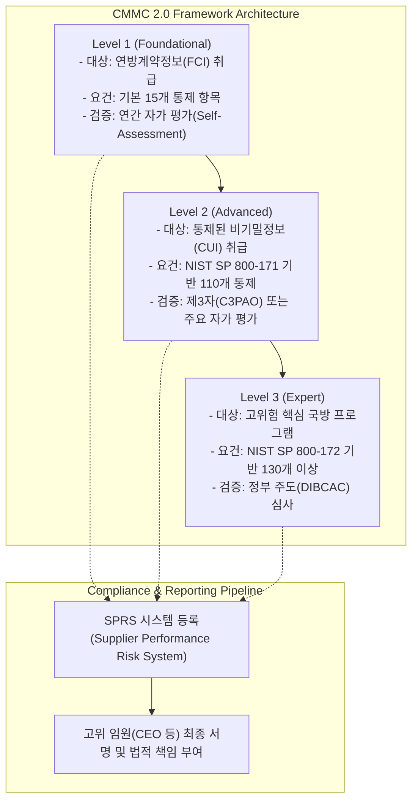

# 사이버 보안 성숙도 모델 인증 (CMMC, Cybersecurity Maturity Model Certification)

---

## I. 방산 공급망 보안 검증, 사이버 보안 성숙도 모델 인증의 개요

* **정의**: 미국 국방부(DoD)가 방위산업체(DIB) 공급망 전반의 사이버 보안 수준을 객관적으로 검증하고 보호하기 위해 정립한 표준화된 성숙도 평가 및 인증 [[프레임워크]]
* **등장배경**: 기존 계약업체의 자가 진단(Self-Attestation) 방식의 한계로 인한 기밀 정보 유출 방지, 공급망(Supply Chain)을 겨냥한 지능형 지속 위협(APT) 대응 필요성 대두
* **특징**: 정보 수준별 3단계 등급 체계 적용, NIST SP 800-171/172 등 국가 표준 보안 통제 항목 연계, 인증 취득 여부가 미 국방부 계약 입찰의 필수 요건으로 작용

---

## II. CMMC의 아키텍처 및 핵심 구성 요소

### 가. CMMC 2.0 3단계 등급 체계 및 검증 아키텍처

* 취급하는 정보의 민감도(FCI, CUI)에 따라 Level 1부터 Level 3까지 차등화된 보안 요건을 부과하며, 결과는 SPRS 시스템에 등록되어 계약 심사에 활용됨

### 나. CMMC 2.0의 핵심 기술 및 구성 요소

| 분류 | 요소기술(키워드) | 세부 설명 |
| --- | --- | --- |
| **평가 기준** | NIST SP 800-171 | Level 2의 뼈대가 되는 14개 도메인, 총 110개의 보안 요구사항 (Access Control, Incident Response 등) |
| **인증 주체** | C3PAO (제3자 인증기관) | Level 2 인증을 위해 독립적으로 방산 업체의 보안 통제 이행 여부를 정밀 감사하는 공인 기관 |
| **등록 시스템** | SPRS [[데이터베이스]] | 방산업체의 사이버 보안 점수 및 평가 결과를 공식 등록하고 계약 담당자가 조회하는 국방 시스템 |
| **예외 관리** | POA&M (조치계획 및 이정표) | 미비된 통제 항목에 대해 180일 이내 개선을 전제로 조건부 인증을 허용하는 보완 관리 절차 |
| **책임 소재** | 최고 경영자 서명 (Affirmation) | 자가 평가 또는 인증 시 기업의 고위 임원이 직접 정확성을 보증하고 법적 책임을 부담하는 제도 |
| **대상 정보** | FCI 및 CUI 식별 | 계약 수행 중 생성되는 연방계약정보(FCI)와 보호가 필요한 비기밀 통제정보(CUI)의 철저한 격리 및 [[암호화]] |
| **심사 조직** | DIBCAC | 국방부 산하 방산사이버보안평가센터로 Level 3 등 최고등급의 정부 직접 심사 수행 |
| **최신 제도** | 48 CFR 최종 규칙 | DFARS 규정과 연계하여 국방부 계약 시 CMMC 준수 여부를 계약 요건으로 강제하는 연방 조달 규칙 |

---

## III. 전통적 보안 인증과의 비교 및 최신 동향

### 가. CMMC와 전통적 정보보호 인증(예: ISO 27001) 비교

| 비교 항목 | ISO/IEC 27001 | CMMC (Cybersecurity Maturity Model Certification) |
| --- | --- | --- |
| **적용 영역** | 범용 정보보호 경영시스템 국제 표준 | 미국 국방부(DoD) 공급망 및 방위산업체 특화 규제 |
| **검증 방식** | 인증기관의 문서 및 현장 심사 | 등급별 차등화 (자가 평가, 제3자 감사(C3PAO), 정부 직접 심사) |
| **계약 연계성** | 권고사항 또는 기업 자율 도입 | 미 국방부 계약 입찰 및 수주를 위한 **법적 필수 선결 조건** |
| **개선 허용** | 사후 시정조치 중심 | POA&M 허용 범위 엄격 제한 (Level 2 기준 180일 내 개선 필수) |

### 나. 최신 동향 및 향후 전망

* **규제 유연화 및 종합 검토 추진**: 미 국방부(전쟁부)는 CMMC Level 2 제3자 인증(C3PAO) 의무화 일정과 관련하여 중소기업의 규제 장벽을 낮추고 획득 체계를 효율화하기 위한 종합 검토 및 단계적 유예·조정 조치를 병행하고 있음
* **글로벌 방산 공급망 확산**: 미국뿐만 아니라 동맹국과의 방산 협력 확대에 따라 국내 방산 기업 및 협력사들도 CMMC 규격에 준하는 체계적인 보안 통제 시스템과 SPRS 대응 역량 확보가 필수적인 과제로 자리 잡고 있음

---

### 🔗 연관 토픽

- **소속 도메인**: [[00_보안_MOC|🛡️ 보안]]
- **세부 분류**: `4. 웹 & 애플리케이션 보안 · 취약점 점검`
- **핵심 연관 토픽**:
  - [[프레임워크]]
  - [[암호화|암호화 (Encryption)]]
  - [[공급망 공격|공급망 공격(Supply Chain Attack)]]
  - [[시큐어코딩]]
  - [[스마트카 보안 취약점 및 대응방안|스마트카 보안 취약점 및 대응방안 (Smart Car Security)]]
