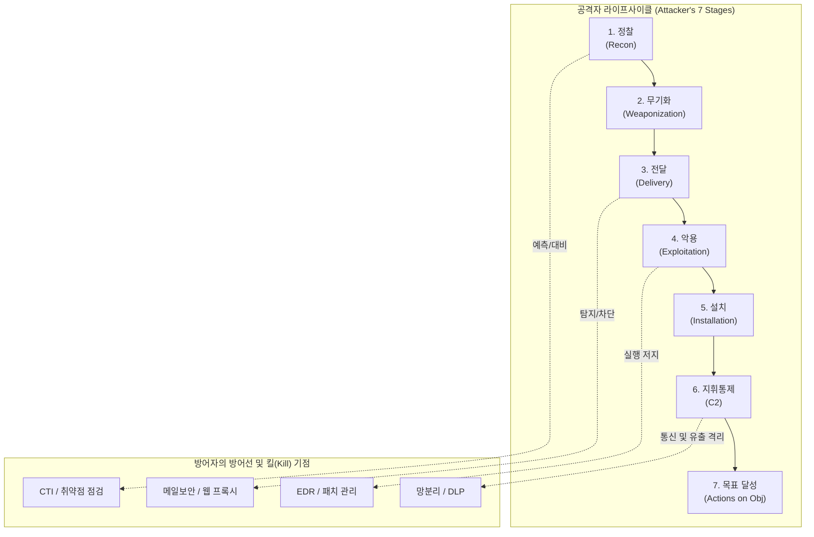

# 사이버 킬 체인 (Cyber Kill Chain)

---

## I. 지능형 위협 선제 방어 프레임워크, 사이버 킬 체인의 개요

* **정의**: 공격자가 대상 시스템에 침투하여 목표를 달성하기까지의 일련의 과정을 7단계로 모델링하고, 각 단계 중 하나라도 차단(Kill)하여 전체 공격을 무력화하는 사이버 방어 [[프레임워크]]
* **등장배경**: 록히드 마틴(Lockheed Martin)이 군사 전술 개념을 차용하여 고도화된 APT(지능형 지속 위협) 공격에 대응하기 위해 고안함,
* **특징**: 선형적 공격 단계 인지, 단일 노드 방어의 한계 극복, 방어자 우위의 비대칭성 활용(공격자는 모든 단계를 성공해야 하나 방어자는 한 단계만 차단해도 방어 성공)

---

## II. 사이버 킬 체인의 개념도 및 핵심 기술 요소

### 가. 사이버 킬 체인의 단계별 동작 개념도

* 공격의 진행 과정을 7단계로 시각화하여 특정 단계에서 공격의 연결 고리를 끊어내는 선제적 방어 체계로 동작함

### 나. 사이버 킬 체인의 단계별 핵심 구성 요소

| 구분 | 요소기술(키워드) | 세부 설명 |
| --- | --- | --- |
| **1. 정찰** | OSINT 스캐닝 분석 | 공격 대상의 네트워크, 이메일, 직원 정보 등 취약점을 수집하는 단계 (방어: 가시성 확보) |
| **2. 무기화** | 악성 페이로드 제작 | 수집된 취약점을 타격하기 위해 익스플로잇([[Exploit]])과 원격 접속 트로이목마(RAT) 등을 결합함 |
| **3. 전달** | 스피어 피싱 / 워터홀 | 제작된 악성코드를 이메일, 악성 URL, USB 등을 통해 타겟 사용자에게 전달함 (방어: 메일/웹 필터링), |
| **4. 악용** | 제로데이 공격 실행 | 전달된 페이로드가 시스템이나 애플리케이션의 취약점을 이용해 악성 코드를 실행하는 단계 |
| **5. 설치** | 백도어 / [[루트킷]] | 시스템 재부팅 후에도 지속적인 접근(Persistence)이 가능하도록 악성코드를 은닉 및 설치함 |
| **6. C2** | DGA(도메인 생성) | 침해된 시스템과 공격자 서버(C2) 간의 암호화된 통신 채널을 구축하여 원격 제어를 수행함 |
| **7. 목표 달성** | [[랜섬웨어]] / 유출 | 공격자의 최종 목표인 데이터 [[암호화]], 파괴, 기밀 정보 유출(Exfiltration)을 실행하는 최종 단계, |
| **대응 체계** | 통합 보안 오케스트레이션 | 각 단계를 끊어내기 위해 [[SIEM]], [[SOAR (Security Orchestration, Automation and Response)|SOAR]], [[EDR(Endpoint Detection and Response)|EDR]] 등 이기종 보안 솔루션을 상호 연동하여 자동 대응 |

---

## III. 위협 대응 프레임워크 비교 및 향후 전망

### 가. 사이버 킬 체인과 MITRE ATT&CK 프레임워크 비교

| 비교 항목 | 사이버 킬 체인 (Cyber Kill Chain) | [[MITRE ATT&CK (Adversarial Tactics, Techniques & Common Knowledge)|MITRE ATT&CK]] 프레임워크 |
| --- | --- | --- |
| **개발 주체** | 록히드 마틴 (Lockheed Martin) | 마이터 (MITRE Corporation) |
| **관점 및 구조** | **공격의 진행 순서(선형적 7단계)** 모델, | **전술과 세부 기법(TTPs) 중심의 매트릭스** 구조 |
| **주요 목적** | 공격 흐름의 직관적 이해 및 조기 차단 지점 도출 | 실제 관측된 공격 기법을 기반으로 실무적 방어 전략 수립 |
| **활용 분야** | 고위 경영진 보고 및 보안 전략 수립의 거시적 프레임 | SOC(보안 관제 센터), [[위협 헌팅]], 보안 솔루션 탐지 룰 매핑 |
| **상호 보완** | 큰 틀에서의 킬 체인 단계 식별용으로 활용 | 킬 체인의 각 단계 내에서 발생하는 구체적 기법으로 매핑 |

### 나. 사이버 킬 체인의 최신 동향 및 진화

* **클라우드 환경에 맞춘 변형 (Cloud Kill Chain)**: 전통적인 네트워크 침투 단계(전달, 설치)를 건너뛰고 자격증명 도용 및 API 취약점을 악용하는 [[클라우드 네이티브]] 공격에 맞춰 '수익화(Monetization)' 단계를 추가한 변형 모델로 진화 중임,.
* **행위 기반 분석과 자동화 융합**: 공격자가 기존 정상 도구를 악용하는 기법(Living off the Land)이 증가함에 따라, 킬 체인의 특정 단계 차단을 위해 AI/ML 기반의 이상 행위 탐지([[XDR]]) 및 SOAR를 통한 자동 차단 기술이 필수적으로 적용되고 있음,.

---

### 🔗 연관 토픽

- **소속 도메인**: [[00_보안_MOC|🛡️ 보안]]
- **세부 분류**: `5. 사이버 공격 기법 & 침해사고 대응`
- **핵심 연관 토픽**:
  - [[루트킷|루트킷(Rootkit)]]
  - [[랜섬웨어]]
  - [[EDR(Endpoint Detection and Response)]]
  - [[XDR|XDR(eXtended Detection Response)]]
  - [[SIEM]]
