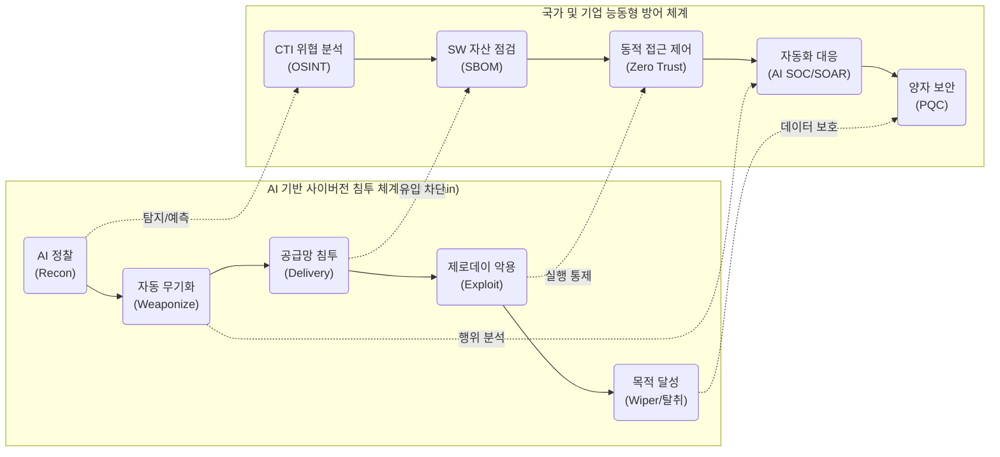

# 사이버전 (Cyber Warfare)

---

## I. 초연결 사회의 하이브리드 위협, 사이버전의 개요

* **정의**: 국가 또는 해커 단체가 적국의 정보통신망, OT/ICS 등 주요 기반시설에 침투하여 시스템을 파괴·교란하고 데이터 탈취 및 사회적 혼란을 유발하는 지능형 비대칭 전쟁
* **특징 및 등장배경**:
* **비대칭성 및 익명성**: 물리적 무력 대비 저비용·고효율 타격이 가능하며, 공격 원점(Attribution) 역추적 회피 용이
* **하이브리드(Hybrid) 전술**: 파괴형 와이퍼(Wiper)와 [[딥페이크]] 기반 정보전, 물리적 군사 타격이 결합된 복합 양상으로 진화
* **초연결성 악용**: 오픈소스 의존성 및 IoT·OT 등 단일 공급망 취약점을 통해 전 국가적 마비 파급

---

## II. 사이버전의 공격/방어 개념도 및 핵심 기술 요소

### 가. 사이버전의 개념도 및 대응 아키텍처

* **공격 측면**: AI를 활용해 취약점 탐지부터 맞춤형 악성코드 생성, 측면 이동(Lateral Movement)까지 전 과정을 자율화하여 은닉성 극대화
* **방어 측면**: 위협 인텔리전스([[CTI]]) 기반 사전 탐지, 제로 트러스트 아키텍처, [[SBOM]] 기반 공급망 검증 등 다계층 심층 방어(Defense in Depth) 수행

### 나. 사이버전의 핵심 기술 및 구성 요소

| 구분 | 핵심 기술 요소 | 세부 설명 및 특징 |
| --- | --- | --- |
| **공격 기술** | **AI 자율 공격 시스템** | 피싱, 취약점 스캐닝, [[다형성]] 페이로드 빌드 등 공격 체인의 전 과정을 AI가 자동화 |
| **공격 기술** | **Wiper 악성코드** | 금전 요구([[랜섬웨어]])가 아닌, MBR 파괴 등 시스템 복구 불가 및 파괴를 목적으로 하는 전략적 무기 |
| **공격 기술** | **SW [[공급망 공격]]** | 오픈소스 레지스트리, [[형상 관리 도구]](CI/CD) 등에 침투하여 연쇄적 대규모 감염 유발 |
| **공격 기술** | **HNDL 전략** | 'Harvest Now, Decrypt Later', 향후 [[양자컴퓨터]] 도입 시 해독을 목적으로 현재 암호화된 데이터를 선제 수집 |
| **방어 기술** | **[[제로 트러스트 보안모델|Zero Trust]] Architecture** | 'Never Trust, Always Verify', 식별된 주체에 대해 CARTA 기반의 지속적이고 동적인 최소 권한 부여 체계 |
| **방어 기술** | **SBOM (SW Bill of Materials)** | 소프트웨어 내포 오픈소스 및 서드파티 라이브러리 구성 명세서 작성으로 취약점 선제 대응 |
| **방어 기술** | **[[SOAR (Security Orchestration, Automation and Response)|SOAR]] 및 AI SOC** | 이기종 보안 솔루션 간 연동(Orchestration) 및 Playbook 기반 위협 탐지·분석·대응(Response) 자동화 |
| **방어 기술** | **[[양자내성암호]] (PQC)** | 격자, 다변수, 해시 기반 수학적 난제를 활용하여 양자 컴퓨팅의 쇼어(Shor) [[알고리즘]] 해독 방어 |

---

## III. 사이버전의 최신 위협 동향 및 향후 대응 전망

### 가. 최신 하이브리드 사이버전 동향 및 방어 전략

| 구분 | 주요 이슈 및 트렌드 | 해결 방안 및 산업 적용 방향 |
| --- | --- | --- |
| **동향** | **복합 하이브리드전 양상 심화** | - 단순 사이버 영역을 넘어 군사·정치·물리적 파괴와 결합- 위성 통신망 교란 및 전력, 통신망 동시 타격 |
| **동향** | **IT/OT 융합 환경의 공격 표면 확대** | - 스마트 팩토리, 폐쇄망(ICS) 내 Air-Gap 우회 공격 증가- IT 영역 침해 후 OT 망으로 전이되는 측면 이동 가속 |
| **전략** | **사이버 복원력(Resilience) 확보** | - 침해를 기정 사실화(Assume Breach)하고, 사고 발생 시 격리 및 핵심 비즈니스 연속성([[BCP]]/DR) 중심의 복구 체계 마련 |
| **전략** | **국제 공조 및 능동적 방어(Active Defense)** | - 국가 간 [[MITRE ATT&CK (Adversarial Tactics, Techniques & Common Knowledge)|MITRE ATT&CK]] 기반 TTPs 및 CTI 정보 실시간 공유 체계 구축- 선제적 Threat Hunting 및 Deception(HoneyPot) 기술 고도화 적용 |

* 최근 지정학적 갈등 지역에서 사이버전 양상이 격화됨에 따라, 기업과 공공 부문은 단일 솔루션 기반의 경계 방어에서 벗어나 **제로 트러스트 기반의 공급망 보안 및 AI 기반의 자율 방어 체계로의 패러다임 전환이 필수적임**

---

### 🔗 연관 토픽

- **소속 도메인**: [[00_보안_MOC|🛡️ 보안]]
- **세부 분류**: `5. 사이버 공격 기법 & 침해사고 대응`
- **핵심 연관 토픽**:
  - [[MITRE ATT&CK (Adversarial Tactics, Techniques & Common Knowledge)]]
  - [[제로 트러스트 보안모델|제로 트러스트 (Zero Trust) 보안모델]]
  - [[랜섬웨어]]
  - [[CTI]]
  - [[공급망 공격|공급망 공격(Supply Chain Attack)]]
