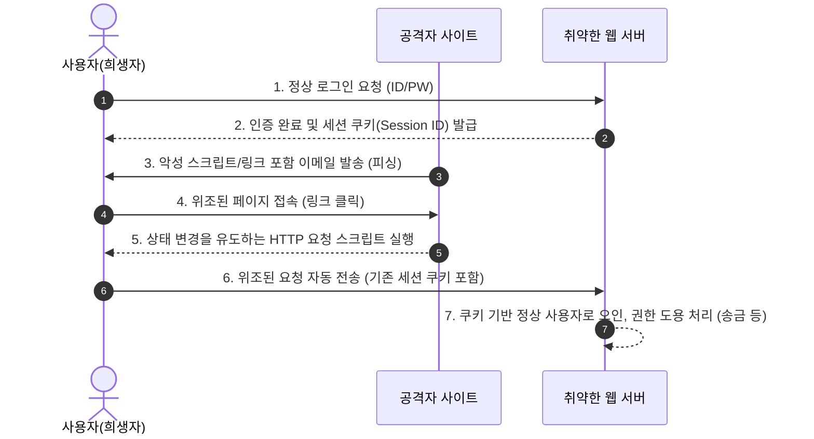

# 사이트 간 요청 위조 (CSRF; Cross-Site Request Forgery)

---

## I. [사용자 권한 도용], 사이트 간 요청 위조(CSRF)의 개요

* **정의**: 인증된 사용자가 자신의 의지와 무관하게 공격자가 의도한 비정상적인 행위(정보 수정, 송금, 탈퇴 등)를 취약한 웹 서버에 요청하도록 만드는 웹 해킹 기법
* **발생 원인 및 특징**:
* **[[쿠키]] 자동 전송 악용**: 브라우저가 HTTP 요청 시 도메인에 해당하는 [[세션]] 쿠키를 자동으로 포함하는 특성 악용
* **신뢰 관계 역이용**: 서버가 인증된 브라우저(사용자)의 요청을 정상적인 것으로 무조건 신뢰하는 취약점 공략
* **상태 변화(State-Changing) 유발**: 데이터 조회보다는 서버의 상태나 데이터를 변경하는 [[트랜잭션]] 공격에 집중

---

## II. CSRF의 공격 메커니즘 및 방어 기술 요소

### 가. CSRF의 공격 메커니즘 및 동작 원리

* 로그인된 세션이 유지되고 있는 상태에서 공격자의 악성 폼(Form)이나 스크립트가 실행되어, 브라우저가 자동으로 쿠키를 첨부하여 서버에 상태 변경을 요청함

### 나. CSRF의 방어 및 핵심 기술 요소

| 구분 | 요소 기술 (키워드) | 세부 설명 및 특징 |
| --- | --- | --- |
| **방어 기술** | **[[CSRF]] Token (Synchronizer Token)** | 세션 당 임의의 난수 값을 생성하여 폼(Form) 요청 시마다 토큰 일치 여부 검증 |
| **방어 기술** | **SameSite Cookie** | 브라우저의 쿠키 전송 정책 제어 (Strict: 동일 도메인만 전송, Lax: 안전한 GET만 허용) |
| **방어 기술** | **Double Submit Cookie** | 세션 저장 없이 요청 파라미터의 토큰과 쿠키에 저장된 토큰 값이 일치하는지 검증 |
| **방어 기술** | **Referer / Origin 검증** | HTTP 헤더를 확인하여 요청이 승인된 도메인(출처)에서 발생했는지 서버 단에서 필터링 |
| **방어 기술** | **CAPTCHA / 추가 인증** | 송금, 비밀번호 변경 등 주요 트랜잭션 수행 시 사용자의 능동적 개입(재인증) 요구 |
| **공격 기술** | **Hidden Form / Image Tag 악용** | 0x0 픽셀 이미지 태그나 숨겨진 폼을 통해 사용자의 인지 없이 자동 GET/POST 요청 유도 |
| **공격 기술** | **Predictable Parameters** | 공격자가 서버의 요청 URL, 파라미터 구조를 쉽게 예측할 수 있는 취약점 악용 |
| **공격 기술** | **Social Engineering (사회공학)** | 피싱 이메일, 자극적인 게시물 등을 통해 사용자가 악성 링크를 클릭하도록 유도 |

---

## III. CSRF와 XSS 비교 및 최신 보안 동향

### 가. CSRF와 XSS(Cross-Site Scripting) 비교

| 비교 항목 | CSRF (사이트 간 요청 위조) | [[XSS]] (교차 사이트 스크립팅) |
| --- | --- | --- |
| **공격 대상** | **웹 서버** (서버의 데이터 변경 유도) | **클라이언트/브라우저** (사용자 PC) |
| **신뢰 관계 악용** | **서버가 클라이언트(브라우저)를 신뢰**하는 것을 악용 | **클라이언트가 서버(웹사이트)를 신뢰**하는 것을 악용 |
| **공격 목적** | 권한 도용, 무단 상태 변경(송금, 결제 등) | 세션 쿠키 탈취, 브라우저 내 악성코드 실행 |
| **주요 대응 방안** | CSRF Token, SameSite 쿠키, Referer 검증 | 입력값 검증(필터링), Output Encoding, [[CSP]] |

### 나. 최신 동향 및 향후 전망

* **브라우저 정책 강화**: Chrome 80 버전 이후 `SameSite=Lax` 정책이 기본 적용됨에 따라 타 도메인 간의 무분별한 쿠키 전송이 제한되어 전통적인 CSRF 공격 위험성 대폭 감소
* **SPA 및 REST API 환경의 변화**: 쿠키 대신 Authorization 헤더(JWT, Bearer Token)를 사용하는 인증 아키텍처가 보편화되면서, 쿠키 자동 전송 취약점을 노리는 CSRF 공격의 표적이 줄어드는 추세
* **CORS 정책 연계**: 최신 웹 환경에서는 CSRF 단일 방어뿐만 아니라 CORS(교차 출처 리소스 공유) 정책을 엄격하게 구성하여 API 엔드포인트의 무단 접근을 원천 차단하는 심층 방어(Defense in Depth) 구성이 필수적임

---

### 🔗 연관 토픽

- **소속 도메인**: [[00_보안_MOC|🛡️ 보안]]
- **세부 분류**: `2. 현대 암호학 & 키 관리 · 전자서명`
- **핵심 연관 토픽**:
  - [[XSS]]
  - [[CSRF]]
  - [[쿠키]]
  - [[세션]]
  - [[크로스 사이트 스크립팅]]
