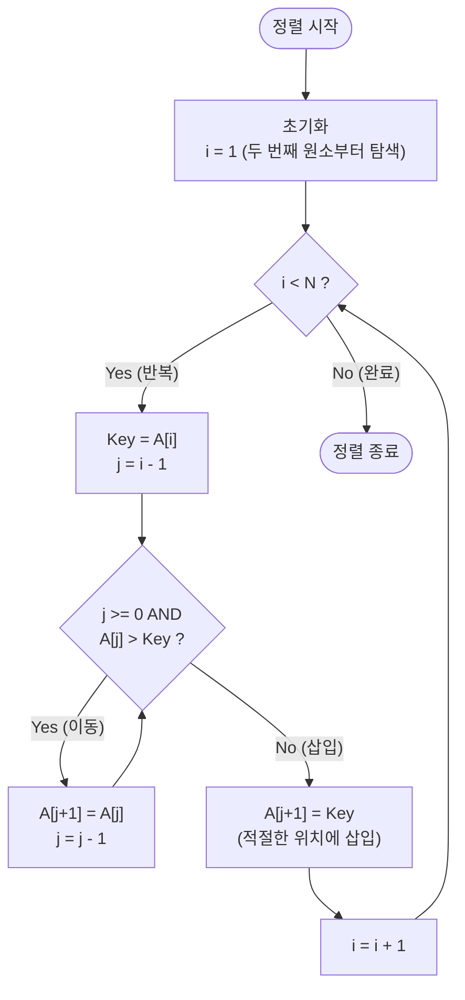

# 삽입 정렬 (Insertion Sort)

---

## I. 안정적인 제자리 정렬, 삽입 정렬의 개요

* **정의**: 두 번째 원소부터 시작하여 그 앞의 이미 정렬된 배열 부분과 비교한 뒤, 자신의 알맞은 위치를 찾아 삽입(Insert)함으로써 정렬을 완성하는 [[알고리즘]]
* **특징**:
* **제자리 정렬 (In-place)**: 별도의 추가 메모리 공간이 거의 필요 없음 (공간복잡도 O(1))
* **안정 정렬 (Stable Sort)**: 중복된 값을 가진 데이터의 초기 상대적 순서가 보장됨
* **적응성 (Adaptive)**: 배열이 이미 부분적으로 정렬되어 있는 경우 최적의 성능(O(N)) 발휘

---

## II. 삽입 정렬의 개념도 및 핵심 기술 요소

### 가. 삽입 정렬의 동작 원리

* 외부 루프(i)는 두 번째 원소부터 끝까지 순회하며 Key 값을 선택함
* 내부 루프(j)는 Key 값보다 큰 원소를 우측으로 한 칸씩 이동(Shift)시켜 빈 공간을 확보한 후 Key를 삽입함

### 나. 삽입 정렬의 핵심 기술 및 구성 요소

| 구분 | 요소기술(키워드) | 세부 설명 |
| --- | --- | --- |
| **성능 특성** | **최악 시간복잡도 O(N^2)** | 역순으로 정렬된 배열의 경우 모든 요소와 비교 및 교환 발생 |
| **성능 특성** | **최선 시간복잡도 O(N)** | 이미 정렬된 배열의 경우 내부 루프의 비교 1회 후 즉시 종료 (Adaptive) |
| **메모리 특성** | **In-place Sorting** | 추가적인 메모리 할당 없이 입력 배열 내부에서 교환 수행 (공간복잡도 O(1)) |
| **안정성** | **Stable Sort** | 비교 조건(`A[j] > Key`)에 의해 동일 값의 기존 순서가 역전되지 않음 |
| **동작 메커니즘** | **Key 버퍼** | 현재 정렬 위치의 값을 임시 보관하여 덮어쓰기로 인한 데이터 유실 방지 |
| **동작 메커니즘** | **Shift 연산** | Swap(교환) 연산 대신 단순 대입 연산을 사용하여 오버헤드 최소화 |
| **데이터 처리** | **Online Sorting** | 전체 데이터가 주어지지 않고 실시간으로 추가되는 환경에서도 즉시 정렬 가능 |
| **최신 활용** | **하이브리드 서브루틴** | 분할 정복의 임계값(예: 16~64개) 이하 배열에서 퀵/[[병합 정렬]] 대신 사용 |

---

## III. 삽입 정렬과 유사 알고리즘 비교 및 최신 활용 동향

### 가. O(N^2) 기본 정렬 알고리즘 간 비교

| 비교 항목 | 삽입 정렬 (Insertion) | 선택 정렬 (Selection) | [[버블 정렬]] (Bubble) |
| --- | --- | --- | --- |
| **동작 방식** | 알맞은 위치를 찾아 **삽입** | 최솟값을 찾아 맨 앞으로 **교환** | 인접한 두 원소를 비교 후 **교환** |
| **최선 시간복잡도** | **O(N)** (부분 정렬 시 고효율) | O(N^2) (항상 전체 탐색) | O(N^2) (플래그 사용 시 O(N)) |
| **안정성(Stable)** | 안정 정렬 (유지됨) | 불안정 정렬 (깨짐) | 안정 정렬 (유지됨) |
| **이동 연산 횟수** | 상대적으로 적음 (대입) | 항상 N-1회 교환 | 매우 많음 (잦은 Swap 발생) |

### 나. 최신 활용 동향 및 향후 전망

* **하이브리드 정렬의 핵심 기반**: 대규모 데이터 정렬 시 순수 삽입 정렬은 비효율적이나, 오버헤드가 작다는 장점을 살려 **Timsort**(Python, Java의 기본 정렬) 및 **Introsort**(C++ STL)에서 작은 크기의 [[파티셔닝|파티션]](통상 32~64개 이하)을 정렬하는 최적화 서브루틴으로 널리 활용됨
* **메모리 계층 구조 최적화**: 배열 크기가 작을 경우 [[CPU]] 캐시(L1/L2) 히트율이 극대화되어, O(N log N) 알고리즘의 재귀 호출 오버헤드보다 삽입 정렬의 물리적 실행 속도가 더 빠른 최신 컴퓨터 아키텍처의 특성을 적극 활용함

---

### 🔗 연관 토픽

- **소속 도메인**: [[00_컴퓨터구조_MOC|💻 컴퓨터구조]]
- **세부 분류**: `2. 캐시 & 메모리 계층 구조 · 스토리지`
- **핵심 연관 토픽**:
  - [[병합 정렬|병합 정렬 (Merge Sort)]]
  - [[버블 정렬|버블 정렬 (Bubble Sort)]]
  - [[퀵 정렬|퀵 정렬 (Quick Sort)]]
  - [[알고리즘]]
  - [[O-Notation (O-표기법)]]
