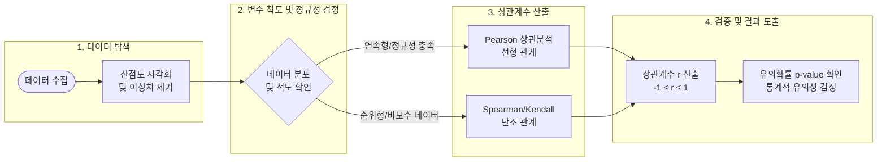

# 상관분석 (Correlation Analysis)

---

## I. 데이터 간 연관성 측정, 상관분석의 개요

* **정의**: 두 개 이상의 연속형 또는 범주형 변수 사이의 선형적(Linear) 또는 비선형적 연관성의 방향과 강도를 통계적으로 측정하는 데이터 분석 기법
* **배경 및 특징**:
* **계수 기반 정량화**: -1(완전 음의 상관)에서 +1(완전 양의 상관) 사이의 값으로 연관성의 크기를 정량적으로 표현
* **머신러닝 전처리 필수**: 모델 학습 전 탐색적 데이터 분석([[EDA]]), [[다중공선성]] 진단, 피처 선택(Feature Selection)의 핵심 도구로 활용
* **해석의 한계**: 두 변수가 수학적 연관성이 있더라도, 인과관계(Causation)를 의미하지는 않음 (제3의 변수 통제 필요)

---

## II. 상관분석의 분석 절차 및 핵심 기술 요소

### 가. 상관분석의 프로세스 및 판별 흐름도

* 산점도(Scatter Plot)를 통한 시각적 사전 분석 후, 변수의 척도(모수/비모수) 및 정규성 충족 여부에 따라 적합한 상관계수를 산출하고 p-value로 유의성을 검증함.

### 나. 상관분석의 핵심 기술 및 구성 요소

| 구분 | 요소 기술 (키워드) | 세부 설명 |
| --- | --- | --- |
| **분석 기법** | **Pearson 상관계수 (r)** | 등간/비율 척도 기반 연속형 변수 간의 **선형 관계** 측정 (정규성 가정 충족 시 사용) |
| **분석 기법** | **Spearman 상관계수 (ρ)** | 서열 척도 변수 간의 **단조(Monotonic) 관계** 측정 (비정규 분포, [[이상치]] 존재 시 유리한 비모수 검정) |
| **분석 기법** | **Kendall의 Tau (τ)** | 부합(Concordant) 쌍과 비부합 쌍의 비율을 기반으로 한 순위 상관관계 측정 (표본이 작을 때 유용) |
| **시각화 도구** | **산점도 (Scatter Plot)** | 두 변수의 값을 좌표평면에 점으로 표출하여 군집, 이상치, 선형성 등 데이터 패턴 시각화 |
| **시각화 도구** | **히트맵 (Heatmap)** | 다수 변수 간의 상관계수 행렬(Correlation Matrix)을 색상 명도로 시각화하여 다차원 연관성 직관적 파악 |
| **통계 검증** | **[[유의확률|유의확률 (p-value)]]** | 귀무가설(상관관계가 0이다)이 참일 확률, 통상 0.05 미만일 때 도출된 상관계수가 통계적으로 유의미하다고 판단 |
| **ML 활용** | **다중공선성 (Multicollinearity)** | 독립변수 간 상관관계가 매우 높아 회귀계수 추정치 분산이 커지는 현상 (VIF 지수로 진단 후 변수 제거) |
| **ML 활용** | **피처 선택 (Filter Method)** | 타겟 종속변수와 상관성이 높은 독립변수만 우선적으로 선별하여 [[차원 축소]] 및 모델 과적합 방지 |

---

## III. 상관분석과 회귀분석 비교 및 최신 동향

### 가. 상관분석(Correlation)과 회귀분석(Regression) 비교

| 비교 항목 | 상관분석 (Correlation Analysis) | [[회귀분석]] (Regression Analysis) |
| --- | --- | --- |
| **분석 목적** | 변수 간 상호 연관성(방향, 강도) 파악 | 특정 변수가 다른 변수에 미치는 영향 및 미래 예측 |
| **변수 역할** | 두 변수가 동등한 위치 (독립/종속 구분 없음) | 독립변수(X, 원인)와 종속변수(Y, 결과) 명확히 구분 |
| **산출 지표** | 상관계수 ($r$) | 회귀계수 (기울기 $\beta$, 절편, 결정계수 $R^2$) |
| **인과성 여부** | **인과관계 설명 불가** | 수리적 **인과관계 추정 및 모형화** 가능 |
| **선형 변환** | 척도 변화(단위 변환)에 상관계수 불변 | 척도 변화 시 회귀계수 값 변동 발생 |

### 나. 최근 활용 트렌드 및 산업 적용 방향

* **비선형 [[연관성 분석]] 고도화**: 피어슨 상관계수가 탐지하지 못하는 복잡한 비선형 관계를 포착하기 위해 **MIC(Maximal Information Coefficient)** 등 정보 이론 기반의 지표 활용 확대
* **[[초거대 언어 모델|LLM]] 및 AI 임베딩 모델 평가 지표**: 텍스트 데이터의 의미적 유사도를 측정하는 코사인 [[유사도]](Cosine Similarity)는 벡터 정규화 시 피어슨 상관계수와 수학적으로 동일한 특성을 가지며, RAG(검색 증강 생성) 시스템의 검색 품질(Relevance) 평가에 핵심적으로 사용됨
* **오토머신러닝([[AutoML (Automated Machine Learning)|AutoML]]) 내재화**: 파이프라인 구성 시 상관분석을 자동화하여 다중공선성을 유발하는 피처를 사전에 드롭(Drop)하거나 [[PCA(Principal Component Analysis)|PCA]](주성분 분석)로 차원을 축소하는 전처리 자동화가 보편화됨

---

### 🔗 연관 토픽

- **소속 도메인**: [[00_인공지능_MOC|🤖 인공지능]]
- **세부 분류**: `1. 수학 · 통계학 & 데이터 전처리`
- **핵심 연관 토픽**:
  - [[다중공선성|다중공선성 (Multicolinearity)]]
  - [[유사도|유사도(Similarity)]]
  - [[PCA(Principal Component Analysis)]]
  - [[차원 축소|차원 축소(Dimensionality Reduction)]]
  - [[회귀분석|회귀분석(Regression Analysis)]]
