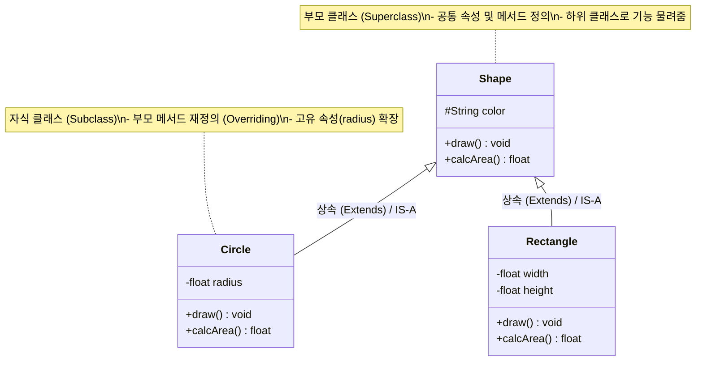

# 상속성 (Inheritance)

---

## I. 객체지향 재사용성의 핵심, 상속성(Inheritance)의 개요

* **정의**: 기존 상위 [[클래스]](부모)가 가진 속성과 메서드를 하위 클래스(자식)가 물려받아 코드를 재사용하고 새로운 기능을 확장하는 [[객체지향]] 프로그래밍(OOP)의 핵심 메커니즘
* **등장배경 및 특징**:
* **코드 [[재사용]] 및 중복 제거**: 공통된 속성과 행위를 상위 클래스에 한 번만 정의하여 유지보수성 향상
* **다형성([[다형성|Polymorphism]]) 기반 제공**: 오버라이딩(Overriding)과 업캐스팅을 통해 동일한 메시지로 다양한 객체 동작 유도
* **계층적 모델링**: 실세계의 객체 간 'IS-A(is a kind of)' 관계를 논리적인 계층 구조로 매핑

---

## II. 상속성의 개념도 및 핵심 기술 요소

### 가. 상속성의 개념도 (클래스 다이어그램)

* 하위 클래스(Circle, Rectangle)는 상위 클래스(Shape)의 특징을 물려받으며, 자신만의 고유한 속성을 추가하거나 기존 행위를 재정의(Overriding)하여 확장함.

### 나. 상속성의 핵심 기술 및 구성 요소

| 구분 | 요소기술(키워드) | 세부 설명 |
| --- | --- | --- |
| **관계** | **IS-A 관계** | 하위 객체가 상위 객체의 일종임을 의미 (예: Rectangle is a Shape) |
| **행위 재정의** | **Overriding (오버라이딩)** | 부모 클래스로부터 상속받은 메서드를 자식 클래스의 목적에 맞게 내부 로직을 재정의 |
| **바인딩** | **동적 바인딩 (Dynamic Binding)** | 런타임 시 참조 변수가 가리키는 실제 객체 타입에 따라 오버라이딩된 메서드가 호출됨 |
| **접근 제어** | **Protected 접근 제어자** | 클래스 외부에서의 접근은 차단하되, 상속 관계에 있는 자식 클래스에게는 접근을 허용 |
| **객체 참조** | **Super / Base** | 자식 클래스 내에서 부모 클래스의 멤버 변수나 생성자를 명시적으로 호출할 때 사용 |
| **설계 원칙** | **LSP (리스코프 치환 원칙)** | 자식 클래스는 언제나 부모 클래스를 대체할 수 있어야 함 (SOLID 원칙 중 하나) |
| **다중 상속** | **다이아몬드 문제 (Diamond Problem)** | 2개 이상의 부모 상속 시 발생하는 모호성 문제로, Java/C# 등은 인터페이스로 이를 대체 |
| **[[추상화]]** | **Abstract Class / Interface** | 하위 클래스에서 반드시 구현해야 할 메서드의 표준 규격을 정의하여 강제성 부여 |

---

## III. 상속성과 합성(Composition)의 비교 및 최신 동향

### 가. 상속성(Inheritance)과 합성(Composition) 비교

| 비교 항목 | 상속성 (Inheritance) | 합성 (Composition / Delegation) |
| --- | --- | --- |
| **객체 간 관계** | **IS-A** (은/는 ~의 한 종류이다) | **HAS-A** (은/는 ~을 가지고 있다) |
| **재사용 방식** | **화이트박스(White-box) 재사용** (내부 구현 노출) | **블랙박스(Black-box) 재사용** (인터페이스만 노출) |
| **[[결합도]]** | **강한 결합** (부모 클래스 변경 시 자식에 영향 큼) | **약한 결합** (독립적 구성으로 영향 최소화) |
| **유연성** | 컴파일 타임에 관계 결정 (정적) | 런타임에 의존성 주입(DI)으로 교체 가능 (동적) |
| **주요 단점** | [[캡슐화]] 파괴 가능성, 계층 구조 복잡도 증가 | 구현 시 위임(Delegation)을 위한 추가 코드 발생 |

### 나. 객체지향 설계의 최신 트렌드 및 향후 전망

* **"상속보다는 합성(Favor Composition over Inheritance)" 원칙 대두**: GoF 디자인 패턴에서도 강조하듯, 상속이 초래하는 강한 결합도와 캡슐화 파괴(부모의 내부 구현에 의존) 문제를 피하기 위해 현대 객체지향 설계에서는 주로 인터페이스와 합성(Composition)을 활용한 설계 지향
* **모던 프로그래밍 언어의 진화**: 단일 상속의 한계와 다이아몬드 문제를 우회하면서도 코드 재사용성을 극대화하기 위해, 다형적 기능 결합을 지원하는 **Trait (Rust, Scala), Mixin (Dart, Python), 인터페이스 디폴트 메서드 (Java 8+)** 등의 메커니즘이 현대 아키텍처의 핵심 요소로 자리잡음

---

### 🔗 연관 토픽

- **소속 도메인**: [[00_소프트웨어공학_MOC|🏗️ 소프트웨어공학]]
- **세부 분류**: `4. 아키텍처 스타일 & 객체지향 설계 원리`
- **핵심 연관 토픽**:
  - [[객체지향]]
  - [[캡슐화|캡슐화 (encapsulation)]]
  - [[다형성|다형성 (Polymorphism)]]
  - [[결합도]]
  - [[재사용]]
