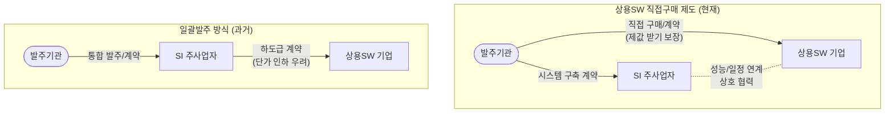

# 상용 소프트웨어 직접구매 제도

---

## I. 공공 정보화 생태계 보호, 상용 소프트웨어 직접구매 제도의 개요

* **정의**: 공공 정보화 사업 추진 시, 발주기관이 시스템 통합(SI) 사업에 상용소프트웨어를 포함하지 않고 별도로 발주, 평가, 선정, 계약하여 직접 구매하는 제도 (구, 분리발주 제도)
* **등장배경**: SI 주사업자의 단가 후려치기 방지, 하도급 종속 심화에 따른 SW 기업의 수익성 악화 및 품질 저하 문제 해결 필요
* **특징**: 상용SW 제값 받기 보장, 공정한 SW 산업 생태계 조성, 중소 SW 기업의 자생력 및 기술 경쟁력 강화 도모

---

## II. 상용SW 직접구매의 개념도 및 핵심 기술 요소

### 가. 상용SW 직접구매의 개념도 및 동작 원리

* 발주기관이 직접 상용SW 원수급자와 계약을 체결하여 대등한 지위를 부여하고 정당한 대가를 지급함
* SI 주사업자와 SW 공급 기업 간에는 시스템의 정상적인 연계 및 통합을 위한 상호 협력 체계(R&R)가 수반됨

### 나. 상용SW 직접구매 제도의 핵심 기준 및 구성 요소

| 구분 | 요소기술(키워드) | 세부 설명 |
| --- | --- | --- |
| **법적 근거** | **SW 진흥법 제54조** | 국가기관 등의 상용소프트웨어 구매 의무화 및 법적 근거 명시 |
| **적용 대상 1** | **총 사업규모 3억원 이상** | 부가가치세(VAT)를 포함한 공공 정보화 사업 예산이 3억원 이상인 경우 (1차 조건) |
| **적용 대상 2** | **단가 5천만원 이상** | SW 단일 가격 또는 동일 SW 다량 구매 합산 금액이 5천만원 이상인 경우 |
| **적용 대상 3** | **인증 및 조달 등록 SW** | 조달청 종합쇼핑몰 등록 SW이거나 GS, CC, NEP, NET 등 국가 품질인증 획득 SW |
| **제외 사유** | **통합 불가 및 현저한 지연** | 기존/신규 시스템과 통합 불가능, 현저한 비용 상승, 사업기간 지연 등 비효율 발생 시 |
| **사전 절차** | **미리검토 (사전검토)** | 직접구매 예외(제외) 사유 적용 시 과업심의위원회, 상위기관, 조달청에 사전 승인 요청 必 |
| **품질 평가** | **BMT (품질성능평가)** | 1억원 이상 상용SW 경쟁 입찰 시 지정 기관을 통한 BMT 의무 실시 및 결과 반영 |
| **구매 채널** | **디지털서비스몰** | 조달청을 통해 클라우드(SaaS) 및 상용SW를 신속하게 검색·구매할 수 있는 전문 쇼핑몰 |

---

## III. 일괄발주와의 비교 및 최신 동향

### 가. 상용SW 직접구매와 일괄발주 비교

| 비교 항목 | 일괄발주 (통합발주) | 상용SW 직접구매 (분리발주) |
| --- | --- | --- |
| **발주 및 계약 형태** | SI 사업에 상용SW 포함하여 일괄 발주 | SI 사업과 별도로 분리하여 독립 발주 |
| **계약 당사자** | 발주기관 - SI 주사업자 | 발주기관 - 상용SW 기업 (원도급 계약) |
| **SW 기업의 지위** | SI 주사업자의 하도급 (을/병 구조) | 발주기관과 대등한 원수급자 지위 확보 |
| **행정적 부담** | 단일 사업자 관리로 행정 절차 및 부담 낮음 | 복수 사업자 계약 및 연계 관리로 발주처 부담 증가 |
| **주요 리스크/이슈** | SW 단가 후려치기, 수익 악화로 산업 생태계 훼손 | SI 구축 사업자와 SW 기업 간 일정/성능 연계 이슈 발생 가능 |

### 나. 최신 동향 및 향후 전망

* **공공SW 가이드라인 고도화**: 과학기술정보통신부의 '공공SW사업 법제도 가이드'에 따라 상용SW 직접구매 비율을 지속적으로 확대(목표 60% 이상) 추진 중임
* **SaaS 및 [[클라우드 네이티브]] 전환**: 기존 패키지형 상용SW 직접 구매를 넘어, 디지털서비스 전문계약제도를 활용한 클라우드(SaaS) 형태의 직접 구매 및 이용 활성화 가속화
* **발주 역량 및 [[PMO]] 강화**: 다수 사업자 간의 인터페이스 충돌 및 통합 지연 리스크를 해소하기 위해, 발주처의 요구사항 명확화, 과업심의위원회의 실효성 제고, 전문 PMO(프로젝트 관리 조직) 도입 확대를 통한 사업 관리 역량 확보가 필수적임

---

### 🔗 연관 토픽

- **소속 도메인**: [[00_소프트웨어공학_MOC|🏗️ 소프트웨어공학]]
- **세부 분류**: `6. 소프트웨어 테스팅 & 품질 보증 (QA/QC)`
- **핵심 연관 토픽**:
  - [[감리 PMO 비교표|감리/PMO 비교표]]
  - [[클라우드 네이티브]]
  - [[SBOM]]
  - [[PMO|(E)PMO]]
  - [[무중단 배포]]
