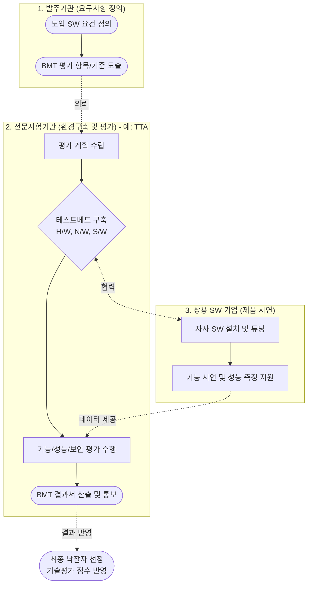

# 상용 소프트웨어 품질성능 평가 시험 (BMT)

---

## I. 객관적 기술 평가의 척도, 상용 소프트웨어 품질성능 평가 시험(BMT)의 개요

* **정의**: 발주기관이 도입하고자 하는 상용 소프트웨어를 대상으로, 실제 운영 환경과 동일하거나 유사한 테스트베드를 구축하여 기능, 성능, 보안성 등을 객관적으로 비교·평가하는 시험 (BMT: Benchmark Test)
* **도입 배경 및 특징**:
* **법적 의무화**: SW진흥법에 따라 공공 정보화 사업에서 단가 5천만 원 이상의 상용SW 경쟁 입찰 시 BMT 수행 의무화
* **평가의 실효성 제고**: 기존 제안서 중심의 서면 평가에서 벗어나, 실제 구동 및 성능 검증 중심의 기술 평가로 전환
* **도입 리스크 최소화**: 시스템 도입 후 발생할 수 있는 호환성 결여, 성능 저하 등 치명적인 장애 요인을 사전에 차단

---

## II. 상용SW BMT의 수행 체계 및 핵심 평가 요소

### 가. 상용SW BMT의 수행 절차 및 아키텍처

* 발주기관의 요구사항을 바탕으로 TTA 등 국가 지정 전문시험기관이 주관하여 공정한 테스트베드를 구축함
* 경쟁 참여 기업들의 SW를 동일한 환경에서 구동시키고, 모니터링/부하 테스트 도구를 통해 산출된 정량적 결과서를 기술평가에 반영함

### 나. 상용SW BMT의 핵심 평가 및 기술 요소

| 구분 | 요소기술(키워드) | 세부 설명 |
| --- | --- | --- |
| **평가 기준** | **기능 적합성 (Functional Suitability)** | 명세된 요구사항(RFP) 기능의 정상 동작 여부, 데이터 정합성 및 정확성 검증 |
| **평가 기준** | **성능 효율성 (Performance Efficiency)** | 특정 부하 상태에서의 [[응답시간]](Response Time), [[처리량]](TPS), 자원 사용률 측정 |
| **평가 기준** | **보안성 및 [[신뢰성]] (Security & Reliability)** | 접근 통제, [[암호화]] 적용 여부 및 장시간 부하 시 결함률, 시스템 복구력(Resilience) 평가 |
| **시험 환경** | **Testbed (테스트베드)** | 실제 운영망과 물리적/논리적으로 동일하게 구성된 H/W, OS, [[DBMS]] 독립 평가 환경 |
| **성능 도구** | **Load Generator (부하 생성기)** | JMeter, LoadRunner 등을 활용하여 동시 접속자 수 및 대량 트랜잭션을 가상으로 생성 |
| **성능 도구** | **APM (어플리케이션 성능 관리)** | Scouter, Jennifer 등을 통해 SW 구동 시 [[CPU]], Memory, 쿼리 응답 지연 등 병목구간 탐지 |
| **품질 표준** | **ISO/IEC 25010** | SW 제품 품질 평가를 위한 국제 표준 모델 (기능성, 신뢰성, 사용성, 유지보수성 등 8대 특성) |
| **평가 방식** | **Blind Test (블라인드 테스트)** | 평가의 공정성을 극대화하기 위해 제품명과 제조사를 숨기고 식별기호로만 성능을 측정 |

---

## III. BMT와 GS(Good Software) 인증 비교 및 최신 동향

### 가. BMT와 GS 인증의 핵심 항목 비교

| 비교 항목 | BMT (품질성능 평가 시험) | GS (Good Software) 인증 |
| --- | --- | --- |
| **수행 목적** | 특정 공공/민간 사업 도입을 위한 **경쟁 제품 간 비교 평가** | 자사 개발 SW의 전반적인 **품질 증명 및 조달 등록** |
| **평가 주체/시점** | 발주기관 (SW 도입 시점) | SW 개발 기업 (제품 출시/마케팅 시점) |
| **평가 대상** | 해당 사업 입찰에 참여한 복수의 경쟁 상용SW | 인증을 신청한 단일 상용SW |
| **평가 기준** | 발주기관의 구체적 **RFP 요구사항 맞춤형 기준** | ISO 국제 표준에 기반한 **범용적 품질 기준** |
| **결과 활용** | 제안서 기술평가 점수에 직접 반영 (당락 결정) | 우선구매제도 적용, 기술평가 가산점(일부), 마케팅 활용 |

### 나. 최신 동향 및 향후 전망

* **[[클라우드 네이티브]] 및 SaaS BMT 수요 급증**: 공공기관의 클라우드 전환 가속화에 따라, 기존 온프레미스 설치형 테스트를 넘어 디지털서비스 전문계약제도와 연계된 SaaS 형태의 성능, 오토스케일링, 멀티테넌트 격리성 검증 BMT가 핵심 이슈로 대두됨
* **AI 기반 평가 자동화 도입**: 테스트 케이스 자동 생성, 결과 로그 이상탐지, 반복 테스트([[Regression Test]]) 수행 시 AI 및 RPA(Robotic Process Automation) 도구를 결합하여 BMT 수행 기간을 단축하고 평가 신뢰도를 높이는 방향으로 진화 중임

---

### 🔗 연관 토픽

- **소속 도메인**: [[00_소프트웨어공학_MOC|🏗️ 소프트웨어공학]]
- **세부 분류**: `6. 소프트웨어 테스팅 & 품질 보증 (QA/QC)`
- **핵심 연관 토픽**:
  - [[응답시간]]
  - [[처리량]]
  - [[신뢰성]]
  - [[정보시스템 운영 성과관리]]
  - [[정보시스템 운영 유지보수 감리|정보시스템 운영/유지보수 감리]]
