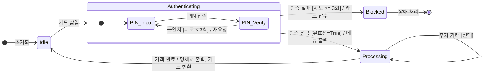

# 상태 머신 다이어그램 (State Machine Diagram)

---

## I. 객체의 동적 행위 모델링, 상태 머신 다이어그램의 개요

* **정의**: 시스템 내부 객체의 라이프사이클 동안 발생하는 상태(State) 변화와 상태 간의 전이(Transition) 과정을 외부 이벤트(Event) 기반으로 시각화한 [[UML]] 행위(Behavioral) 다이어그램
* **등장배경 및 특징**:
* **복잡성 통제**: 유한 상태 기계(FSM; Finite State Machine) 이론을 바탕으로 객체의 복잡한 동적 행위를 직관적으로 모델링
* **이벤트 주도 반응성**: 시스템 외부의 입력(Trigger)과 조건(Guard)에 따른 객체의 상태 변화 및 반응(Action)을 명확히 규명
* **활용성 확장**: 전통적인 임베디드 제어 시스템 모델링에서 최신 프론트엔드 상태 관리 및 클라우드 워크플로우 오케스트레이션 설계로 확장 적용

---

## II. 상태 머신 다이어그램의 개념도 및 핵심 구성 요소

### 가. 상태 머신 다이어그램의 개념도 및 동작 원리

* 객체는 시작 상태(`[*]`)에서 출발하여 이벤트(`카드 삽입`, `PIN 입력`)가 발생하면 조건(`[유효성=True]`)을 검사한 후 결과 행위(`/메뉴 출력`)를 수행하며 다음 상태로 전이(Transition)됨

### 나. 상태 머신 다이어그램의 핵심 구성 요소

| 구분 | 요소기술(키워드) | 세부 설명 |
| --- | --- | --- |
| **기본 요소** | **상태 (State)** | - 특정 시점에 객체가 만족하는 조건, 속성값, 대기 상황을 의미 (둥근 사각형 표기) |
| **기본 요소** | **시작/종료 상태** | - 객체의 생명주기 시작(Initial Pseudostate, 검은 원) 및 종료(Final State, 이중 원) |
| **전이 로직** | **전이 (Transition)** | - 이벤트 발생 시 한 상태에서 다른 상태로 이동하는 흐름 (화살표 표기) |
| **전이 로직** | **이벤트 (Event/Trigger)** | - 상태 전이를 유발하는 자극 (타이머, 외부 신호, 조건 변경, 메서드 호출 등) |
| **제어 로직** | **가드 조건 (Guard)** | - 이벤트 발생 시 전이를 수행하기 위해 반드시 충족되어야 하는 논리 조건 (`[ ]` 표기) |
| **제어 로직** | **액션 (Action/Effect)** | - 상태 전이 과정이나 상태 진입/탈출 시 수행되는 즉각적이고 단일한 작업 (`/` 뒤 표기) |
| **확장 요소** | **복합 상태 (Composite)** | - 내부 하위 상태(Sub-state)들을 포함하는 상태로, 복잡한 다단계 로직을 그룹화하여 표현 |
| **확장 요소** | **직교 상태 (Orthogonal)** | - 하나의 객체 내에서 동시에 독립적으로 진행되는 다중(병렬) 상태 흐름을 분할하여 표현 |

---

## III. 상태 머신 다이어그램과 활동 다이어그램 비교 및 최신 동향

### 가. 상태 머신 다이어그램 vs 활동 다이어그램 (Activity Diagram) 비교

| 비교 항목 | 상태 머신 다이어그램 (State Machine) | 활동 다이어그램 (Activity) |
| --- | --- | --- |
| **분석 관점** | **객체의 상태 변화 중심** (동적 라이프사이클) | **업무/제어 흐름 중심** ([[프로세스]] 실행 순서) |
| **핵심 요소** | 상태(State), 이벤트(Event), 전이(Transition) | 활동(Action), 제어 노드(Fork/Join, Decision) |
| **전이 유발체 (Trigger)** | **외부 이벤트 및 메세지** 발생 시 전이 | 이전 단계 **활동(Action)의 내부 처리 완료 시** 전이 |
| **주요 모델링 대상** | 실시간 시스템, 통신 [[프로토콜]], UI/UX 상태 | 비즈니스 프로세스, 유스케이스 실현 흐름, [[알고리즘]] |
| **시스템 시각** | 객체 지향적 (단일 객체의 관점) | 절차 지향적 (전체 시스템 로직 관점) |

### 나. 최신 활용 사례 및 산업 적용 동향

* **프론트엔드 상태 관리의 정형화 (XState)**: React, Vue 등 모던 웹 개발에서 UI 상태의 복잡성이 기하급수적으로 증가함에 따라, 상태 간 예측 불가능한 전이 버그(Impossible States)를 원천 차단하기 위해 유한 상태 기계(XState 라이브러리) 기반의 시각적 모델링 적용 확산
* **[[MSA (Micro Service Architecture)|MSA]] 기반 클라우드 워크플로우 오케스트레이션**: AWS Step Functions, Azure Logic Apps와 같은 서버리스 오케스트레이션 서비스들은 분산 시스템의 보상 [[트랜잭션]](Saga Pattern) 및 에러 핸들링 처리를 위해 상태 머신 다이어그램 구조를 시각적 편집기로 채택하여 개발 생산성 극대화

---

### 🔗 연관 토픽

- **소속 도메인**: [[00_소프트웨어공학_MOC|🏗️ 소프트웨어공학]]
- **세부 분류**: `3. 요구사항 공학 & UML 객체지향 분석/설계`
- **핵심 연관 토픽**:
  - [[UML|UML (정적, 동적 다이어그램)]]
  - [[MSA (Micro Service Architecture)]]
  - [[트랜잭션]]
  - [[ATAM]]
  - [[유즈케이스 다이어그램]]
