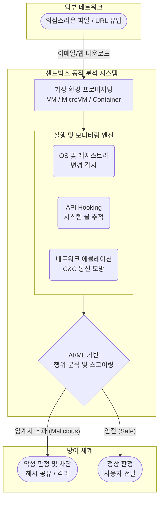

# 샌드박스 (Sandbox)

---

## I. 안전한 격리 실행 환경, 샌드박스의 개요

* **정의**: 신뢰할 수 없는 외부 프로그램이나 악성 의심 코드를 호스트 시스템과 완벽히 분리된 가상 공간(격리 환경)에서 실행시켜, 시스템 파괴나 정보 유출을 사전에 차단하는 동적 보안 및 테스트 기술
* **필요성 및 배경**:
* **시그니처 기반 방어의 한계**: 알려지지 않은 제로데이(Zero-day) 공격 및 APT(지능형 지속 위협) 공격의 급증
* **동적 행위 분석 필요**: 정적 분석을 우회하는 [[난독화]](Obfuscation) 및 패킹(Packing)된 악성코드의 실제 동작 유도 및 탐지
* **시스템 [[무결성]] 보호**: 원본 호스트 OS에 영향을 주지 않고 안전하게 코드를 검증하기 위한 격리 계층 요구

---

## II. 샌드박스의 개념도 및 핵심 기술 요소

### 가. 샌드박스의 아키텍처 및 동작 원리

* 미상의 파일을 가상 환경에서 직접 실행한 뒤, API 호출, 파일 시스템 변경, 네트워크 통신 시도 등 행위(Behavior)를 실시간으로 모니터링하여 악성 여부를 판별함

### 나. 샌드박스의 핵심 기술 및 구성 요소

| 구분 | 요소기술(키워드) | 세부 설명 |
| --- | --- | --- |
| **격리 환경** | **하이퍼바이저 / MicroVM** | 호스트 OS 시스템과 독립된 가상 머신(VM) 또는 경량 [[컨테이너]] 기반의 런타임 폭발(Detonation) 공간 제공 |
| **행위 수집** | **API Hooking (후킹)** | 악성코드가 [[커널]](OS)에 요청하는 주요 시스템 콜(파일 생성, [[프로세스]] 인젝션 등)을 중간에서 가로채어 행위 기록 |
| **행위 수집** | **네트워크 에뮬레이션** | 외부 인터넷 유출을 차단하면서도, 정상적인 C&C 서버 통신처럼 가짜 응답(Fake Response)을 주어 추가 악성 행위 유도 |
| **행위 수집** | **메모리 포렌식 (Dump)** | 실행 중 메모리에 적재된 프로세스를 덤프(Dump)하여, 디코딩되거나 압축 해제된 실제 페이로드(Payload) 추출 |
| **분석/판별** | **AI/ML 행위 스코어링** | 수집된 프로세스 트리 및 행위 로그(Log) 패턴을 머신러닝 모델에 적용하여 악성 확률(Score)을 정량적으로 산출 |
| **분석/판별** | **정적 사전 분석 (Pre-filter)** | 샌드박스 실행 전, YARA 룰 및 알려진 해시값을 통해 기지(Known)의 위협을 선제 필터링하여 동적 분석 부하 감소 |
| **통합 연동** | **[[CTI]] 및 [[SOAR (Security Orchestration, Automation and Response)|SOAR]] 연동** | 도출된 침해지표(IoC)를 위협 인텔리전스(CTI) 플랫폼과 연동하고 SOAR를 통해 전사적 자동 격리 워크플로우 수행 |
| **우회 대응** | **환경 난독화 (Cloaking)** | 가상 머신 고유의 [[MAC]] 주소, BIOS 정보, [[CPU]] 아티팩트 등을 숨겨 악성코드가 샌드박스 환경임을 인지하지 못하게 위장 |

---

## III. 샌드박스의 회피 기법 비교 및 최신 동향

### 가. 샌드박스 회피(Anti-Sandbox) 기법 및 방어 동향 비교

| 구분 | 샌드박스 회피 기법 (공격자 관점) | 최신 방어 및 대응 방안 (방어자 관점) |
| --- | --- | --- |
| **시간 지연** | **Sleep / Stalling 기법**: 샌드박스 타임아웃(통상 5분) 대기 후, 모니터링이 종료되면 악성 행위를 지연 실행 | **Time Acceleration (시간 가속)**: 가상 환경 내 OS의 API 시간을 조작하여 강제로 대기 시간을 단축시키고 행위 촉발 |
| **환경 탐지** | **VM 지문(Fingerprint) 식별**: 고유 MAC 대역, 가상 드라이버, 레지스트리 키를 검사하여 샌드박스임을 식별 후 실행 중단 | **지문 은닉 및 클로킹 (Cloaking)**: 실제 물리적 하드웨어와 동일한 프로파일(지문)을 제공하여 악성코드의 환경 인지 무력화 |
| **상호 작용** | **사용자 개입(Human Interaction) 요구**: 마우스 스크롤이나 특정 횟수의 클릭이 발생해야만 페이로드 작동 | **자동화된 행위 에뮬레이션**: 랜덤한 마우스 이동, 키보드 입력 스크립트를 주기적으로 발생시켜 실제 사용자 행위 모방 |

* **동향 및 전망**: 전통적인 단일 샌드박스 어플라이언스의 구조적 한계(분석 시간 지연, 회피 기술 고도화)를 극복하기 위해, **클라우드 기반 샌드박스(SaaS)** 인프라와 엔드포인트의 **[[EDR(Endpoint Detection and Response)|EDR]]/[[XDR]] 내 행위 기반 실시간 AI 탐지**를 결합하는 다계층 하이브리드 통합 보안 플랫폼으로 진화 중임.

---

### 🔗 연관 토픽

- **소속 도메인**: [[00_보안_MOC|🛡️ 보안]]
- **세부 분류**: `3. 네트워크 & 엔드포인트 · 인프라 보안`
- **핵심 연관 토픽**:
  - [[EDR(Endpoint Detection and Response)]]
  - [[커널|커널(Kernel)]]
  - [[행위기반 탐지기법|행위기반 탐지기법 (Behavior-based Detection)]]
  - [[휴리스틱 탐지기법|휴리스틱 탐지기법 (Heuristic Detection)]]
  - [[SOAR (Security Orchestration, Automation and Response)]]
