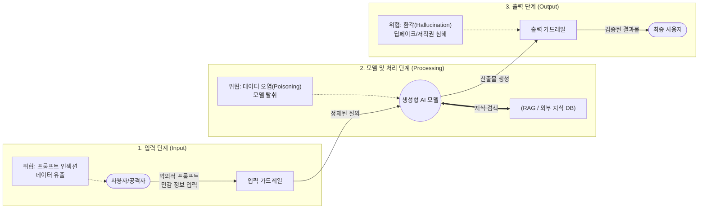

# 생성형 AI 위협 및 대응방안

---

## I. 초거대 AI 시대의 양날의 검, 생성형 AI 위협 및 대응방안의 개요

* **정의**: 생성형 AI 모델의 도입 및 활용(프롬프트 입력, 모델 처리, 결과 출력) 전 과정에서 발생하는 데이터 유출, 악의적 조작, 가짜 정보 생성 등의 보안 위협과 이를 완화하기 위한 기술적·관리적 대응 체계
* **등장배경 및 특징**:
* **공격 표면(Attack Surface) 변화**: 기존 코드/패킷 기반 공격에서 자연어(프롬프트) 기반의 새로운 우회 공격(Jailbreaking) 기법 등장
* **섀도우 AI(Shadow AI) 확산**: 임직원의 무분별한 퍼블릭 AI 활용으로 인한 기업 내 민감 정보 및 소스코드 유출 리스크 심화
* **사회적 파급력 증대**: 정교한 [[딥페이크|딥페이크(Deepfake)]] 및 환각(Hallucination) 현상으로 인한 허위 정보 확산 및 [[신뢰성]] 훼손

---

## II. 생성형 AI 위협 아키텍처 및 핵심 대응 기술

### 가. 생성형 AI 위협 단계별 메커니즘 및 대응 개념도

* 사용자 입력부터 결과물 출력까지 전 구간에 걸쳐 취약점이 존재하며, 양방향 프롬프트 가드레일(Guardrails)과 RAG를 통한 교차 검증 아키텍처가 필수적임

### 나. 생성형 AI 핵심 위협 요소 및 대응 기술

| 구분 | 주요 위협 / 대응 기술 (키워드) | 세부 설명 |
| --- | --- | --- |
| **위협 (입력)** | **[[프롬프트 인젝션]] (Prompt Injection)** | 악의적인 자연어 지시어를 삽입하여 모델의 기존 규칙을 우회(Jailbreak)하고 통제권을 탈취하는 공격 |
| **위협 (입력)** | **민감 데이터 유출 (Data Leakage)** | 퍼블릭 AI 서비스에 기업의 소스코드나 개인정보(PII)를 입력하여 학습 데이터로 흡수·유출되는 현상 |
| **위협 (모델)** | **데이터 오염 (Data Poisoning)** | 모델의 파인튜닝(학습) 단계에서 조작되거나 편향된 데이터를 주입하여 모델의 고의적 오작동 유발 |
| **위협 (출력)** | **[[할루시네이션|환각 현상]] (Hallucination)** | AI가 학습 데이터의 한계나 편향으로 인해 사실이 아닌 정보를 논리적이고 그럴듯하게 생성하는 현상 |
| **대응 (필터링)** | **프롬프트 가드레일 (Guardrails)** | 입출력 데이터 스트림을 실시간 감시하여 민감정보 마스킹 처리 및 유해/악성 프롬프트 사전 차단 |
| **대응 (아키텍처)** | **RAG (검색 증강 생성)** | 모델의 내부 가중치에만 의존하지 않고, 신뢰할 수 있는 기업 내부의 벡터 DB를 참조하여 환각 최소화 |
| **대응 (식별화)** | **AI 워터마킹 / [[C2PA]]** | 산출물에 비가시적 식별자(SynthID 등)를 삽입하고 이력 메타데이터를 암호화하여 AI 생성 여부 증명 |
| **대응 (관리적)** | **사내 온프레미스 [[sLLM (Smaller Large Language Model)|sLLM]] 구축** | 퍼블릭 클라우드 [[초거대 언어 모델|LLM]] 의존도를 낮추고, 기업 내부 망에 폐쇄형 소형언어모델(sLLM)을 구축하여 보안성 확보 |

---

## III. 기존 IT 보안 위협과의 비교 및 향후 산업 대응 전망

### 가. 기존 IT 보안 위협과 생성형 AI 보안 위협 비교

| 비교 항목 | 기존 IT 보안 위협 | 생성형 AI 보안 위협 (OWASP for LLM) |
| --- | --- | --- |
| **공격 매개체** | 시스템 코드, 네트워크 패킷, 악성 스크립트 | **자연어(프롬프트)**, 학습용 말뭉치(Corpus) |
| **주요 타겟** | OS, DB, 웹 애플리케이션 파괴 및 권한 탈취 | **LLM 오작동 유도**, 딥페이크 생성, 편향성 조장 |
| **방어 체계** | [[방화벽]](FW), IPS, 시그니처 기반 백신, WAF | **가드레일(Guardrails)**, 데이터 필터링(Sanitization), RAG |
| **보안 기준** | [[CVE]], [[CWE]], OWASP Top 10 | **OWASP Top 10 for LLMs** (프롬프트 인젝션 등) |
| **책임 소재** | 해커 및 시스템 관리자 | 악성 프롬프트 입력자, 기반 모델 개발사 (복합적) |

### 나. 최신 동향 및 향후 산업 적용 방향

* **AI 레드팀(Red Teaming) 내재화**: 서비스 배포 전 해커의 관점에서 의도적인 취약점 공격(모의 해킹)을 수행하여 모델의 방어력과 윤리적 편향성을 사전에 검증하는 [[프로세스]] 의무화
* **글로벌 AI 규제 컴플라이언스 대응**: 'EU AI Act' 등 법적 규제 본격화에 따라, 고위험 AI로 분류되는 서비스에 대한 투명성 의무(산출물 고지, 학습 데이터 출처 공개) 및 위험 관리 체계([[AI 거버넌스]]) 구축이 기업 생존의 핵심 경쟁력으로 대두됨

---

### 🔗 연관 토픽

- **소속 도메인**: [[00_인공지능_MOC|🤖 인공지능]]
- **세부 분류**: `4. 거대언어모델 (LLM) & 생성형 AI`
- **핵심 연관 토픽**:
  - [[sLLM (Smaller Large Language Model)]]
  - [[프롬프트 인젝션|프롬프트 인젝션(Prompt Injection)]]
  - [[할루시네이션|할루시네이션(Hallucination)]]
  - [[AI 거버넌스|AI 거버넌스 (AI Governance)]]
  - [[초거대 언어 모델|초거대 언어 모델(Large Language Model)]]
