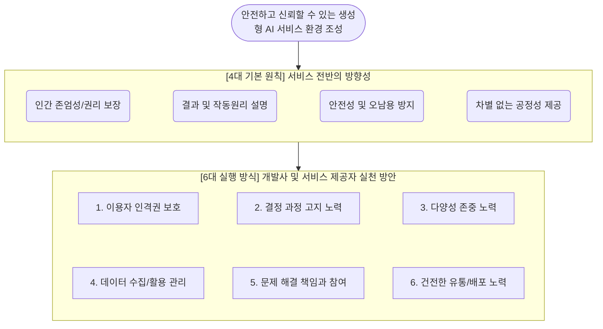

# 생성형 인공지능 서비스 이용자 보호 가이드라인

---

## I. 안전한 AI 생태계 조성, 생성형 인공지능 서비스 이용자 보호 가이드라인의 개요

**가. 생성형 [[인공지능]] 서비스 이용자 보호 가이드라인의 정의**

* 텍스트, 이미지 등 생성형 인공지능 서비스 이용 과정에서 발생 가능한 잠재적 위험을 예방하고 이용자의 권익을 보호하기 위해 방송통신위원회가 제정한 실천 지침 (2025년 2월 28일 발표)
* 개발사 및 서비스 제공자가 서비스 기획부터 운영 전반에 걸쳐 준수해야 할 4대 기본 원칙과 6대 실행 방식을 제시하는 민간 자율규제 기반의 가이드라인

**나. 가이드라인의 제정 배경 및 특징**

* **제정 배경**: [[딥페이크]] 악용, 허위정보 유포, 차별적 편향성 등 AI 역기능 확산에 따른 선제적 보호 조치 필요성 증대 및 '인공지능기본법' 제정과 연계된 이용자 보호 체계 마련 요구
* **주요 특징**: 법적 구속력이 없는 연성 규범(Soft Law)이나, 실제 서비스 모범 사례(Best Practice)를 구체적으로 포함하여 사업자의 실질적 자율규제 및 내부 정책 수립의 표준 역할 수행

---

## II. 가이드라인의 프레임워크 및 핵심 구성 요소

### 가. 생성형 인공지능 서비스 이용자 보호 가이드라인의 개념도

* 안전한 AI 생태계라는 지향점 달성을 위해 4대 기본 원칙을 수립하고, 이를 현장에 적용하기 위한 6가지 구체적 실행 방식(프랙티스)을 개발사와 제공자에게 요구함.

### 나. 가이드라인의 핵심 실천 요소 (6대 실행 방식 중심)

| 구분 | 핵심 실천 요소 (키워드) | 세부 설명 |
| --- | --- | --- |
| **실행 방식 1** | **이용자 인격권 보호** | 타인의 권리 침해 요소를 발견 및 통제할 [[알고리즘]] 구축, 모니터링 체계와 직관적 이용자 신고 [[프로세스]] 마련 |
| **실행 방식 2** | **결정·과정 알림 (투명성)** | 산출물이 AI로 생성되었음을 알리는 워터마크 고지, 결정 과정 이해를 돕기 위한 출처 표기 및 설명 제공 |
| **실행 방식 3** | **다양성 존중 ([[편향]] 최소화)** | 알고리즘 설계 시 차별과 편향 감소 노력, 부적절한 결과에 대한 필터링 기능 제공 및 편향성 신고 채널 운영 |
| **실행 방식 4** | **데이터 수집·활용 관리** | 이용자의 프롬프트(입력) 데이터를 학습용으로 활용 시 사전 고지 및 동의/거부([[OPT|Opt]]-out) 선택 절차 의무화 |
| **실행 방식 5** | **책임 및 참여 (문제 해결)** | 서비스 제공자와 이용자 간의 명확한 책임 범위 정의, 이용약관 내 오남용으로 인한 문제 발생 시 이용자 책임 명시 |
| **실행 방식 6** | **건전한 유통 및 배포** | 딥페이크, 음란물 등 청소년 유해 정보 차단, 프롬프트 입력값 및 산출물에 대한 윤리적 기준 점검 및 관리 |
| **관리 체계** | **위험관리 전담 조직** | 인지하지 못한 피해 최소화를 위해 위험관리를 전담하는 내부 책임자 선정 및 상시 점검(모니터링) 시스템 구축 |
| **사후 점검** | **주기적 타당성 검토** | 방송통신위원회는 시행일(2025.3.28) 기준 매 2년마다 기술 발전 속도를 반영하여 가이드라인 타당성 검토 후 개선 |

---

## III. 가이드라인의 향후 전망 및 산업 대응 방안

**가. 가이드라인의 한계점 및 규제 보완 전망**

* **연성 규범의 한계**: 본 가이드라인은 법적 강제성이 없어 기업의 자발적 이행에 의존하므로, 중소규모 AI 사업자의 실효성 있는 참여 유도와 제재 조치에 한계가 존재함
* **하드 로(Hard Law) 전환 가속화**: 방통위의 '인공지능 서비스 이용자보호법(가칭)' 제정 추진 및 기 통과된 '인공지능기본법'과 연계하여, 향후 고위험 인공지능에 대해서는 강제성 있는 법적 규제 체계로 발전할 전망임

**나. 기업의 AI 기술 적용 및 컴플라이언스 대응 방향**

* **[[AI 거버넌스]] 전 주기 내재화**: 모델 기획 및 운영 단계에서 레드팀(Red Teaming) 구성, 편향성 모의 해킹, 유해 [[프롬프트 인젝션]] 방어 등 자체 위험 평가 프로세스 의무화
* **PET(프라이버시 강화 기술) 및 필터링 강화**: 이용자 프롬프트 내 개인정보(PII) 자동 마스킹 기술 적용, 유해 콘텐츠 생성 차단을 위한 입출력 양방향 필터링(Guardrails) 시스템 적극 도입 필요

---

### 🔗 연관 토픽

- **소속 도메인**: [[00_인공지능_MOC|🤖 인공지능]]
- **세부 분류**: `4. 거대언어모델 (LLM) & 생성형 AI`
- **핵심 연관 토픽**:
  - [[AI 거버넌스|AI 거버넌스 (AI Governance)]]
  - [[프롬프트 인젝션|프롬프트 인젝션(Prompt Injection)]]
  - [[편향]]
  - [[알고리즘]]
  - [[인공지능]]
