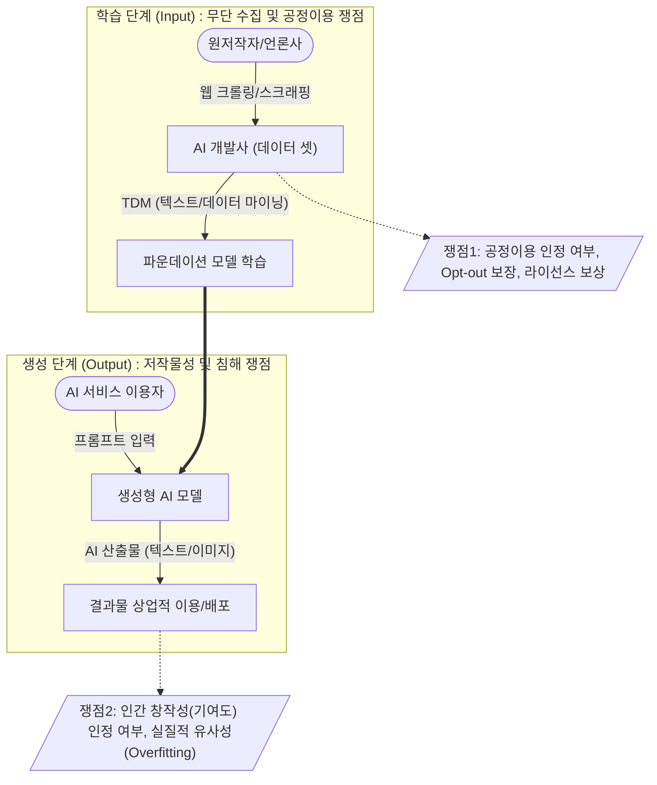

# 생성형 인공지능(Generative AI) 저작권 이슈 및 대응방안

---

## I. 창작 생태계와 AI 혁신의 충돌, 생성형 인공지능 저작권 이슈의 개요

* **정의**: 생성형 AI 모델의 데이터 학습(Input) 과정에서 발생하는 무단 수집 논란과, AI 산출물(Output)의 저작물성 인정 및 타인 저작권 침해 여부를 둘러싼 법적·기술적 분쟁 현상
* **주요 쟁점 및 발생 배경**:
* **학습(Input) 단계 충돌**: 대규모 웹 크롤링을 통한 [[파운데이션 모델]] 학습에 대해 AI 기업의 '공정이용(Fair Use)' 주장과 저작권자의 '침해' 주장이 대립 (예: NYT vs OpenAI 소송)
* **생성(Output) 단계 한계**: 비인간(AI) 산출물에 대한 저작권 불인정 원칙 고수 및 기존 저작물과의 실질적 유사성(Overfitting) 발생에 따른 침해 위험 증가
* **제도적 규제화**: EU AI Act 등 글로벌 규제 법안 발효로 학습 데이터 출처 명시 및 AI 생성물 식별(워터마킹) 의무화 추세

---

## II. 생성형 인공지능 저작권 분쟁 메커니즘 및 핵심 대응 기술

### 가. 생성형 인공지능 저작권 쟁점 개념도

* Input 단계에서는 대규모 데이터 마이닝(TDM)의 합법성과 [[OPT|Opt]]-out 권리가 핵심 쟁점임
* Output 단계에서는 산출물의 원본 종속성(암기 현상) 방지 및 창작적 기여도 인정 범위가 핵심 쟁점임

### 나. 생성형 인공지능 저작권 대응 핵심 기술 및 제도 요소

| 구분 | 요소기술/제도 (키워드) | 세부 설명 |
| --- | --- | --- |
| **법적/제도** | **TDM (Text & [[데이터 마이닝|Data Mining]]) 예외** | 비상업적/상업적 목적의 데이터 분석 시 저작권 침해 예외를 허용하는 규정 (국가별 상이) |
| **법적/제도** | **공정이용 (Fair Use)** | 저작권자의 허락 없이도 변형적 목적, 비영리성 등 요건 충족 시 저작물 이용을 허용하는 권리 |
| **사전 방어** | **Opt-out (옵트아웃)** | robots.txt 및 HTML 메타태그를 통해 외부 AI 크롤러(예: GPTBot)의 자사 데이터 수집 기술적 차단 |
| **사전 방어** | **데이터 정제 (Data Sanitization)** | 모델 학습용 데이터셋 구축 시 저작권 민감 데이터 및 개인정보(PII)를 사전 식별하여 필터링 |
| **사후 식별** | **[[C2PA]] / CAI (출처 증명)** | 콘텐츠의 생성, 편집, 유통 전 과정의 이력(Provenance)을 암호화된 메타데이터로 기록하는 표준 규격 |
| **사후 식별** | **AI 워터마킹 (Watermarking)** | 비가시적 픽셀 패턴이나 노이즈를 산출물에 삽입하여 AI 생성 여부를 시스템적으로 검증 (예: SynthID) |
| **아키텍처** | **RAG (검색 증강 생성)** | 외부 저작물을 모델 가중치(Weight)에 직접 학습시키지 않고, 벡터 DB 검색을 통해 참조하여 침해 우회 |
| **제어/통제** | **프롬프트 가드레일 (Guardrails)** | 사용자의 입력값이나 AI의 출력물 중 타인의 저작권을 침해할 소지가 있는 콘텐츠 생성을 실시간 차단 |

---

## III. 생성형 AI 학습(Input) vs 산출(Output) 쟁점 비교 및 향후 전망

### 가. 학습 단계(Input)와 산출 단계(Output) 저작권 쟁점 비교

| 비교 항목 | 학습 단계 (Input Copyright) | 산출 단계 (Output Copyright) |
| --- | --- | --- |
| **주요 쟁점** | 훈련 데이터 무단 수집 및 활용, 보상 체계 부재 | AI 산출물의 저작권(재산권/인격권) 부여 여부 |
| **핵심 판단 기준** | 공정이용(Fair Use), TDM(정보해석) 면책 성립 여부 | 인간의 창작적 개입(기여도), 실질적 유사성 유무 |
| **법적 분쟁 주체** | **AI 모델 개발사** vs **원저작권자** (언론사, 작가 등) | **AI 서비스 이용자** vs **제3자 (또는 기존 저작자)** |
| **기술적 대응 방안** | Opt-out(robots.txt), 라이선스 필터링, 망각 학습 | AI 워터마킹, C2PA, 프롬프트 가드레일 |

### 나. 산업 대응 동향 및 향후 전망

* **AI 투명성 의무화 및 법제화**: EU AI Act의 발효에 따라 파운데이션 모델 학습에 사용된 저작물 목록 요약본 공개 의무화가 글로벌 스탠다드로 자리잡고 있으며, 국내도 '인공지능기본법' 및 저작권법 개정을 통한 제도적 기반 마련 중임
* **합법적 라이선싱 모델 부상 (Data Partnership)**: 고품질 학습 데이터 확보와 법적 리스크 해소를 위해 AI 빅테크 기업과 대형 언론사, 스톡 이미지 플랫폼(Getty Images 등) 간의 대규모 유상 라이선스 계약 체결 가속화
* **안전한 엔터프라이즈 AI 아키텍처 확산**: 기업 환경에서는 퍼블릭 [[초거대 언어 모델|LLM]]의 저작권 침해 및 내부 정보 유출 방지를 위해, 검증된 자사 데이터 중심의 폐쇄형 [[sLLM (Smaller Large Language Model)|sLLM]](소형언어모델)과 RAG(검색 증강 생성)를 결합한 'Safe AI' 구축이 필수 요건으로 대두됨

---

### 🔗 연관 토픽

- **소속 도메인**: [[00_인공지능_MOC|🤖 인공지능]]
- **세부 분류**: `4. 거대언어모델 (LLM) & 생성형 AI`
- **핵심 연관 토픽**:
  - [[sLLM (Smaller Large Language Model)]]
  - [[파운데이션 모델|파운데이션 모델(Foundation Model)]]
  - [[초거대 언어 모델|초거대 언어 모델(Large Language Model)]]
  - [[Fine-Tuning]]
  - [[생성형 인공지능 저작권]]
