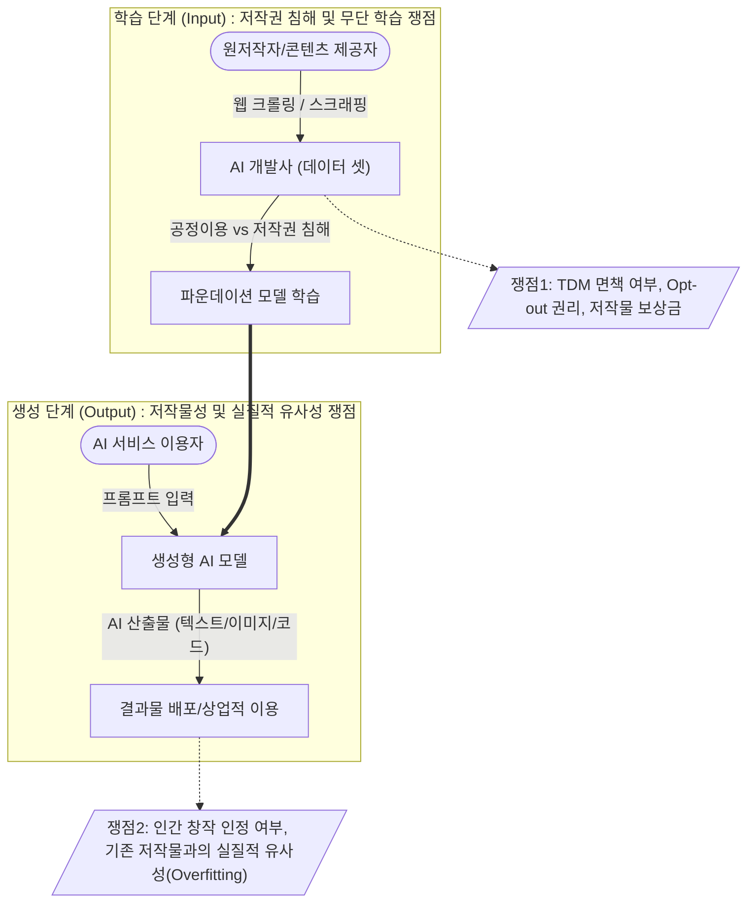

# 생성형 인공지능 저작권

---

## I. [AI 산업 발전과 창작자 권리 보호의 딜레마], 생성형 인공지능 저작권의 개요

* **정의**: 생성형 AI의 [[파운데이션 모델]] 학습(Input)을 위한 데이터 수집 과정에서의 무단 도용 문제와, AI 산출물(Output)에 대한 저작물성 인정 및 타인 저작권 침해 여부를 둘러싼 법적·기술적 충돌 현상
* **등장배경 및 특징**:
* **학습(Input) 단계 충돌**: 대규모 웹 크롤링 기반 학습에 대해 AI 기업은 '공정이용(Fair Use)'을 주장하나, 언론사·창작자는 '저작권 침해'라며 대규모 소송 제기 (NYT vs OpenAI 등)
* **생성(Output) 단계 한계**: 저작권법상 저작물은 '인간의 사상과 감정을 표현한 창작물'로 한정되므로, 프롬프트 입력만으로 생성된 AI 결과물은 원칙적으로 저작권 불인정
* **기술적 규제화**: EU AI Act 등 글로벌 규제법안 통과로 학습 데이터 투명성(출처 공개) 확보 및 AI 생성물 식별(워터마킹) 의무화 추세

---

## II. 생성형 인공지능 저작권의 쟁점 개념도 및 핵심 기술/제도 요소

### 가. 생성형 인공지능 저작권 쟁점 개념도

* Input 단계에서는 대규모 데이터 마이닝(TDM)의 합법성과 [[OPT|Opt]]-out 보장이 핵심 쟁점임
* Output 단계에서는 산출물의 원본 종속성(암기 현상) 및 사용자 창작적 기여도 인정 범위가 핵심 쟁점임

### 나. 생성형 인공지능 저작권의 핵심 제도 및 기술 요소

| 구분 | 요소기술/제도 (키워드) | 세부 설명 |
| --- | --- | --- |
| **법적·제도** | **TDM (Text & [[데이터 마이닝|Data Mining]]) 예외** | 비상업적/상업적 목적의 데이터 분석 시 저작권 침해 예외를 인정하는 조항 (국가별 법제화 상이) |
| **법적·제도** | **공정이용 (Fair Use)** | 저작권자의 허락 없이도 저작물을 이용할 수 있는 권리 (변형적 이용, 영리성 여부 기준) |
| **법적·제도** | **실질적 유사성 / 의거성** | AI 산출물이 기존 저작물과 고도로 유사(Overfitting)하고 원본을 참조했음이 인정될 경우 침해 성립 |
| **보호 기술** | **Opt-out (옵트아웃)** | robots.txt 설정 및 HTML 메타태그를 통해 AI 크롤러(예: GPTBot)의 데이터 수집 접근을 기술적으로 차단 |
| **보호 기술** | **[[C2PA]] / CAI (출처 증명)** | 콘텐츠의 생성, 편집, 유통 전 과정의 이력(Provenance)을 암호화하여 메타데이터로 기록하는 표준 규격 |
| **보호 기술** | **AI 워터마킹 (Watermarking)** | 사람의 눈에 띄지 않는 픽셀 패턴(비가시적 워터마크)을 산출물에 삽입하여 AI 생성 여부 식별 (예: SynthID) |
| **회피 기술** | **데이터 정제 (Data Sanitization)** | 학습 데이터 구축 시 PII(개인정보) 및 저작권 민감 데이터를 AI 모델로 식별하여 사전 제거 |
| **대체 기술** | **RAG (검색 증강 생성)** | 모델 자체에 저작물을 직접 학습(Weights 업데이트)시키지 않고, 필요 시 외부 DB 검색을 통해 참조하여 생성 |

---

## III. 생성형 인공지능 학습(Input) vs 산출(Output) 저작권 쟁점 비교 및 동향

### 가. 학습 단계(Input)와 산출 단계(Output) 저작권 쟁점 비교

| 비교 항목 | 학습 단계 (Input Copyright) | 산출 단계 (Output Copyright) |
| --- | --- | --- |
| **주요 쟁점** | 훈련 데이터 무단 수집 및 활용, 보상 체계 부재 | AI 산출물의 저작권(재산권/인격권) 인정 여부 |
| **핵심 판단 기준** | 공정이용(Fair Use), TDM(정보해석) 면책 성립 여부 | 인간의 창작적 개입(기여도), 실질적 유사성 유무 |
| **법적 분쟁 주체** | **AI 모델 개발사** vs **원저작권자** (언론사, 작가, 화가) | **AI 서비스 이용자** vs **제3자(또는 기존 저작자)** |
| **기술적 대응 방안** | Opt-out(robots.txt), C2PA, 라이선스 필터링, 망각 학습 | AI 워터마킹, [[딥페이크]] 탐지 모델, 프롬프트 가드레일 |

### 나. 최근 글로벌 규제 동향 및 산업 적용 방향

* **AI 투명성 의무화 (EU AI Act 등)**: AI 학습에 사용된 저작물 목록 요약본을 대중에 공개하도록 법제화하여, 저작권자의 정당한 보상 청구 및 권리 구제 기반 마련
* **AI 라이선싱 및 수익 분배 비즈니스 부상**: 언론사, 이미지 스톡 기업(Getty Images 등)과 AI 빅테크 기업 간의 대규모 학습 데이터 합법적 유상 라이선스 계약(Data Partnership) 체결 가속화
* **기업 보안 및 저작권 침해 방지 아키텍처 도입**: 기업 내 엔터프라이즈 AI 도입 시, 퍼블릭 [[초거대 언어 모델|LLM]]을 통한 내부 데이터 유출 및 저작권 침해를 막기 위해 폐쇄형 SLM([[sLLM (Smaller Large Language Model)|sLLM]])과 RAG 아키텍처를 결합한 안전한(Safe) AI 구축이 필수적으로 요구됨

---

### 🔗 연관 토픽

- **소속 도메인**: [[00_인공지능_MOC|🤖 인공지능]]
- **세부 분류**: `4. 거대언어모델 (LLM) & 생성형 AI`
- **핵심 연관 토픽**:
  - [[sLLM (Smaller Large Language Model)]]
  - [[파운데이션 모델|파운데이션 모델(Foundation Model)]]
  - [[초거대 언어 모델|초거대 언어 모델(Large Language Model)]]
  - [[Fine-Tuning]]
  - [[딥페이크|딥페이크(Deepfake)]]
