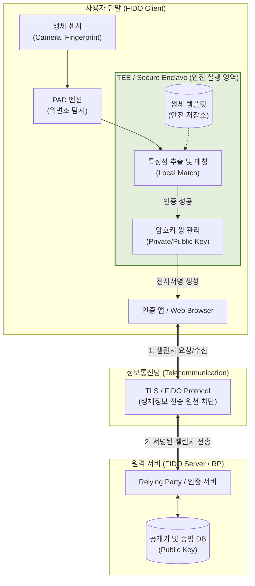

# 생체 인증(텔레바이오 인증)

---

## I. 안전한 비대면 인증의 핵심, 텔레바이오 인증(Telebiometric Authentication)의 개요

### 가. 텔레바이오 인증의 정의

* 정보통신망(Telecommunication)을 통해 원격지에서 사용자의 생체정보(Biometrics)를 획득, 전송, 처리하여 신원을 확인하는 국제 표준 기술(ITU-T X.1081 기반)
* 인증 서버에 원시 생체정보를 전송하지 않고 단말 내 분산 저장 및 전자서명([[FIDO]]) 기술을 결합하여 프라이버시를 보호하는 차세대 인증 [[프레임워크]]

### 나. 텔레바이오 인증의 등장배경 및 특징

* **등장배경**: 크리덴셜 스터핑(Credential Stuffing) 등 기존 패스워드 인증의 한계 극복, [[딥페이크|딥페이크(Deepfake)]] 기반의 위변조 공격(Presentation Attack) 방어 필요성 대두
* **특징**: 보안성(생체정보 유출 차단, TEE 활용), 편의성(Passwordless, 다중 모달리티 지원), [[신뢰성]](생체신호 및 행위 기반 지속 검증)

---

## II. 텔레바이오 인증의 개념도 및 핵심 기술 요소

### 가. 텔레바이오 인증의 아키텍처 및 동작 원리

* 사용자 단말 내부 보안영역(TEE)에서 생체 특징점 추출 및 매칭을 독립적으로 수행
* 네트워크 구간에서는 탈취가 무의미한 비대칭키 기반의 암호학적 전자서명 값만 전송하여 유출 위험 원천 차단

### 나. 텔레바이오 인증의 핵심 기술 요소

| 구분 | 요소기술(키워드) | 세부 설명 |
| --- | --- | --- |
| **생체 획득** | Multi-Modal Sensor | 지문, 안면뿐 아니라 홍채, 정맥 등 2개 이상의 복합 생체정보 수집 기술 |
| **위변조 방어** | PAD (Presentation Attack Detection) | 딥페이크, 3D 마스크 등 인공적인 위조 생체정보 유입을 판별하는 활성 탐지(Liveness) 기술 |
| **보안 환경** | TEE / Secure Enclave | OS와 분리된 하드웨어 기반 안전 실행 영역으로 템플릿 보호 및 [[알고리즘]] 실행 |
| **템플릿 보호** | Cancelable Biometrics | 생체 템플릿 유출 시 역변환이 불가능한 함수를 적용해 폐기 및 재발급이 가능한 기술 |
| **차세대 매칭** | [[동형 암호|동형 암호 (Homomorphic Encryption)]] | 생체 템플릿을 암호화한 상태 그대로 복호화 없이 특징점을 비교/매칭하는 기술 |
| **신규 규격** | 생체신호 인증 (ITU-T X.1094) | 심전도(ECG), 뇌파(EEG) 등 신체 내부의 생체신호를 활용한 복제 불가 인증 기술 |
| **네트워크** | FIDO2 / WebAuthn | 단말 밖으로 생체정보를 전송하지 않고 공개키 기반으로 원격 인증을 수행하는 표준 [[프로토콜]] |
| **지속 검증** | Continuous Authentication | 최초 1회 인증 외에 사용자의 키보드 압력, 마우스 궤적 등 행위를 지속적으로 분석하여 인증 유지 |

---

## III. 텔레바이오 인증의 처리 모델 비교 및 향후 전망

### 가. 텔레바이오 인증 처리 모델 비교 (서버 매칭 vs 단말 매칭)

| 비교 항목 | 서버 매칭 (Server-side Matching) | 단말 매칭 (On-device Matching, FIDO) |
| --- | --- | --- |
| **동작 원리** | 단말에서 추출된 특징점을 서버로 전송하여 매칭 | 단말(TEE) 내부 매칭 후 암호학적 전자서명만 전송 |
| **생체정보 저장** | 중앙 집중형 (원격 인증 서버 DB 내 보관) | 분산형 (개인 스마트폰, 인증 매체의 TEE 내 보관) |
| **네트워크 전송** | 암호화된 생체 템플릿 (특징점 데이터) | 서버가 보낸 챌린지에 대한 서명 (전자서명 값) |
| **유출 위험도** | 원격 서버 침해 시 대규모 정보 유출 (복구 치명적) | 단일 기기에 한정 (생체정보는 기기 외부로 유출 안 됨) |
| **주요 활용처** | 출입국 관리(e-Passport), 사내 물리적 출입 통제 | 모바일 간편 결제, 인터넷 뱅킹, 웹 브라우저(WebAuthn) |

### 나. 텔레바이오 인증의 발전 동향 및 향후 전망

* **인증의 다각화**: 단순 신체 특징을 넘어 고도화된 딥페이크를 무력화하기 위한 심전도, 뇌파 등 차세대 텔레바이오 생체신호 인증(ITU-T X.1094) 도입 가속
* **[[제로 트러스트 보안모델|Zero Trust]] Architecture(ZTA) 융합**: 단발성 인증을 넘어 사용자 행위 패턴 기반의 지속적 인증(Continuous Authentication) 프레임워크와 결합하여 제로 트러스트의 핵심 접근 통제 수단으로 발전
* **응용 분야 확장**: 사람 중심의 인증에서 나아가 축산/반려동물 비박피 개체식별 기술(ITU-T X.pet_auth) 등 텔레바이오 모델의 적용 대상이 비인간 [[엔티티]](Entity)까지 확장 중

---

### 🔗 연관 토픽

- **소속 도메인**: [[00_보안_MOC|🛡️ 보안]]
- **세부 분류**: `2. 현대 암호학 & 키 관리 · 전자서명`
- **핵심 연관 토픽**:
  - [[FIDO]]
  - [[동형 암호|동형 암호 (Homomorphic Encryption)]]
  - [[해시 솔트와 키 스트레칭|해시 솔트(Salt)와 키 스트레칭(Key Stretching)]]
  - [[스니핑, 스푸핑|스니핑(Sniffing) & 스푸핑(Spoofing)]]
  - [[제로 트러스트 보안모델|제로 트러스트 (Zero Trust) 보안모델]]
