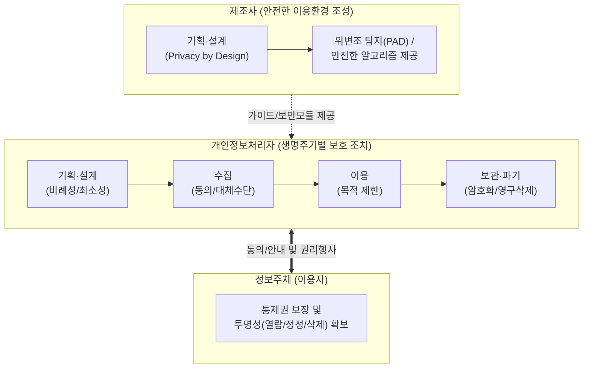

# 생체정보 보호 안내서

---

## I. 안전한 생체정보 활용의 이정표, 생체정보 보호 안내서의 개요

### 가. 생체정보 보호 안내서의 정의

* 지문, 얼굴, 음성 등 생체인식정보의 고유성 및 불변성 특성을 반영하여 기획부터 파기까지 전 단계에 걸쳐 개인정보처리자가 준수해야 할 원칙을 규정한 지침(2024.12, 개인정보보호위원회 개정)
* 설계 단계부터 정보주체의 프라이버시를 보호(PbD)하고, 제조사와 개인정보처리자의 책임과 역할을 구체화한 실무 가이드라인

### 나. 생체정보 보호 안내서의 개정 배경 및 필요성

* **활용 범위 확대**: 기존 출입통제를 넘어 스마트폰 잠금해제, AI 음성비서 등 정보통신 분야 전반으로 인증·식별 활용 급증
* **보안 위협 증가**: 고유한 생체정보 유출 시 복구가 불가능한 치명적 피해 발생 및 [[딥페이크]] 등 위·변조 기술 공격 방어 필요
* **제도적 정비**: 「개인정보 보호법」 개정 사항(2024.3 시행) 반영 및 기존 산발적인 코로나19 열화상 카메라 수칙 등을 통합·현행화

---

## II. 생체정보 보호 생명주기 모델 및 핵심 보호 조치

### 가. 생체정보 보호 생명주기 및 아키텍처

* 개인정보처리자는 기획-수집-이용-보관-파기의 Life-Cycle에 맞춰 기술적·관리적 통제 방안을 구현함
* 제조사는 기기·알고리즘의 안전성을 제공하며, 정보주체에게는 대체수단 및 통제권이 지속적으로 보장되어야 함

### 나. 생체정보 보호 핵심 조치 요소

| 구분 | 요소기술(키워드) | 세부 설명 |
| --- | --- | --- |
| **기획·설계** | PbD ([[개인정보보호 중심 설계|Privacy by Design]]) | 서비스 기획 단계부터 프라이버시 침해 요인 분석, 최소한의 정보만 수집하도록 통제 체계 설계 |
| **수집** | 명확한 동의 / 대체 수단 | 별도 동의 획득 의무화 및 동의 거부 시 비밀번호, 패턴 등 대체 인증 수단(Fallback) 필수 제공 |
| **이용** | 목적 외 이용 금지 | 최초 인증·식별 목적으로 수집한 정보를 다른 용도(예: 무단 AI 학습 데이터 전용 등)로 활용 금지 |
| **보관** | 단방향 [[암호화]] / 분리 보관 | 생체 특징점 정보는 복원 불가한 단방향 [[알고리즘]] 적용, 원시 정보와 특징점 정보는 안전하게 분리 보관 |
| **보관** | 안전 영역(TEE/SE) 활용 | 단말기 내부 처리 시, 일반 OS와 격리된 하드웨어 기반 신뢰 실행 환경(TEE) 내에 생체 템플릿 저장 |
| **파기** | 복구 불가능한 영구 파기 | 인증 목적 달성 또는 보유기간 경과 시 지체 없이 파기하며, 복원 불가능한 기술적 삭제 절차 수행 |
| **제조사 역할** | 위변조 탐지 (PAD) | 딥페이크, 3D 마스크 등 인공적인 위조 생체정보 유입을 판별하는 활성 탐지(Liveness) 기술 적용 권장 |
| **상시 점검** | 맞춤형 자율점검표 운영 | 개인정보처리자, 제조사, 이용자 대상별 특화된 자율점검표를 통한 상시 취약점 통제 및 법규 준수 확인 |

---

## III. 생체정보의 본원적 한계 극복 및 안전성 강화 방안(전망)

### 가. 생체정보 한계 극복을 위한 차세대 보안 기술 동향

* **Cancelable Biometrics (폐기 가능한 생체인식)**: 생체 템플릿 유출 시 변경 불가능한 한계를 극복하기 위해, 템플릿을 역변환 불가능한 형태로 변환 저장하여 유출 시 즉각적인 폐기 및 재발급이 가능한 구조 적용
* **On-Device 기반 분산 인증([[FIDO]] 확산)**: 생체정보를 원격 서버로 전송하지 않고 사용자 단말 내(TEE)에서 매칭 후, 비대칭키 전자서명값만 인증 서버(RP)로 전송하여 대규모 서버 해킹 시 유출 원천 차단
* **동형암호([[동형 암호|Homomorphic Encryption]]) 도입**: 클라우드 기반 서버 매칭이 불가피한 환경에서, 생체 템플릿을 암호화한 상태 그대로 복호화 없이 특징점을 비교·매칭하여 내부자 위협 최소화
* **행위 기반 지속 인증(Continuous Authentication)**: 제로 트러스트(ZTA) 사상에 기반하여 단발성 인증을 넘어, 키보드 압력·마우스 궤적 등 동적 행위 텔레바이오 정보를 [[세션]] 유지 동안 지속 검증하여 도용 방지

---

### 🔗 연관 토픽

- **소속 도메인**: [[00_보안_MOC|🛡️ 보안]]
- **세부 분류**: `6. 개인정보보호 & 프라이버시 강화 기술`
- **핵심 연관 토픽**:
  - [[암호화|암호화 (Encryption)]]
  - [[동형 암호|동형 암호 (Homomorphic Encryption)]]
  - [[개인정보보호법]]
  - [[FIDO]]
  - [[개인정보보호 중심 설계|개인정보보호 중심 설계(Privacy by Design)]]
