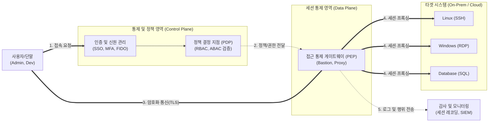

# 서버 접근 통제 (Server Access Control)

---

## I. 안전한 IT 인프라 보호의 핵심, 서버 접근 통제의 개요

* **정의**: 비인가자의 불법적인 접근을 차단하고, 인가된 사용자(관리자, 개발자 등)에게만 서버(OS, DB, 애플리케이션)에 대한 접근 권한을 부여하여 모든 접속 이력을 통제 및 감사하는 보안 체계
* **등장배경**: 내부자 위협 및 크리덴셜 스터핑 공격 증가, 클라우드 확산에 따른 네트워크 경계 소멸, [[ISMS-P]] 등 컴플라이언스 준수 요구 강화
* **특징**: 최소 권한의 원칙(Need-to-Know), AAA(Authentication, Authorization, Accounting) [[프레임워크]] 기반, 제로 트러스트([[제로 트러스트 보안모델|Zero Trust]]) 사상 적용

---

## II. 서버 접근 통제의 개념도 및 핵심 기술 요소

### 가. 서버 접근 통제의 아키텍처 및 동작 원리

* 사용자의 요청은 중앙화된 정책 서버(PDP)에서 신원 및 맥락 기반으로 평가됨
* 프록시/[[게이트웨이]](PEP)를 통해서만 타겟 서버로의 세션이 성립되며, 모든 명령어 및 화면은 감사 서버에 기록됨

### 나. 서버 접근 통제의 핵심 기술 요소

| 구분 | 요소기술(키워드) | 세부 설명 |
| --- | --- | --- |
| **신원 인증** | MFA (Multi-Factor Auth) | 패스워드 외에 OTP, 생체인증 등을 결합한 다중 인증 체계 |
| **신원 인증** | SSO (Single Sign-On) | 한 번의 인증으로 여러 서버 및 시스템에 접근 가능한 기술 |
| **권한 인가** | [[RBAC]] (Role-Based) | 사용자의 직무 및 역할(Role)을 기반으로 정적 접근 권한 부여 |
| **권한 인가** | ABAC (Attribute-Based) | 사용자, 환경, 시간 등 다양한 속성(Context) 기반 동적 권한 제어 |
| **접근 통제** | Bastion Host / Proxy | 내부망과 외부망 사이에서 일종의 관문 역할을 수행하는 통제 서버 |
| **접근 통제** | JIT (Just-in-Time) Access | 상시 권한 부여 대신, 접근이 필요한 특정 시간에만 임시 권한 할당 |
| **추적 감사** | [[Session Layer|Session]] Recording | RDP 화면 녹화 및 SSH 입력 명령어(Keystroke)에 대한 로깅 및 저장 |
| **추적 감사** | 금칙어 통제 | `rm -rf`, `drop table` 등 위험 명령어 사전 차단 및 [[세션]] 강제 종료 |

---

## III. 서버 접근 통제 모델 비교 및 최신 동향

### 가. 전통적 접근 통제 vs 제로 트러스트 기반 접근 통제(ZTNA)

| 비교 항목 | 전통적 서버 접근 통제 (Perimeter-based) | 제로 트러스트 기반 접근 통제 (ZTNA) |
| --- | --- | --- |
| **신뢰 기준** | 네트워크 위치 (내부망 접속 시 신뢰) | 신원 및 디바이스 상태 (항상 검증) |
| **접근 방식** | [[VPN]] + Bastion Host 방식 | Identity-Aware Proxy를 통한 직접 통제 |
| **권한 부여** | 광범위한 서브넷 및 네트워크 접근 허용 | 애플리케이션/서버 단위의 마이크로 [[세그멘테이션]] |
| **권한 수명** | 상시(Standing) 권한 유지 | JIT (Just-In-Time) 임시 권한 부여 |

### 나. 향후 전망 및 도입 동향

* **클라우드 인프라 권한 관리(CIEM) 부상**: 멀티 클라우드 환경에서 과도하게 부여된 클라우드 리소스 및 서버 권한을 식별하고 최소 권한으로 회수하는 CIEM(Cloud Infrastructure Entitlements Management) 연동 필수적
* **패스워드리스(Passwordless) 접근**: 자격 증명(Credential) 탈취 원천 차단을 위해 서버 접속 시 패스워드를 없애고 공개키 기반(FIDO2) 및 인증서 기반의 투명한 인증 메커니즘 확산
* **AI 기반 이상 행위 탐지(UEBA)**: 감사 로그의 양적 증가에 대응하여, 관리자의 평소 서버 접속 시간, 명령어 사용 패턴을 AI로 학습하여 이상 징후 발생 시 즉각 차단하는 능동형 보안으로 진화

---

### 🔗 연관 토픽

- **소속 도메인**: [[00_보안_MOC|🛡️ 보안]]
- **세부 분류**: `1. 정보보안 원칙 & 거버넌스 · 인증`
- **핵심 연관 토픽**:
  - [[제로 트러스트 보안모델|제로 트러스트 (Zero Trust) 보안모델]]
  - [[RBAC]]
  - [[VPN|VPN(Virtual Private Network)]]
  - [[ISMS-P]]
  - [[기밀성]]
