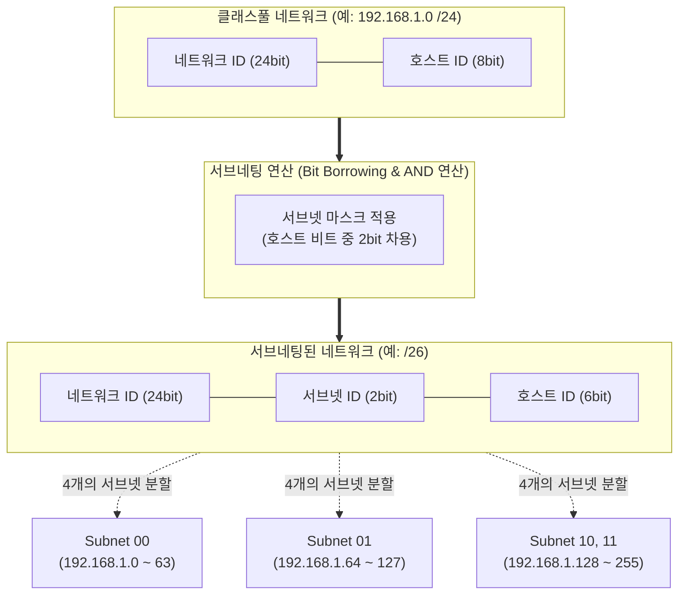

# 서브네팅 (Subnetting)

---

## I. 네트워크 주소 공간의 효율적 활용, 서브네팅(Subnetting)의 개요

### 가. 서브네팅의 정의

* IP 주소 고갈 방지 및 라우팅 효율성을 위해 하나의 커다란 논리적 네트워크(Class)를 여러 개의 독립된 하위 네트워크(Subnet)로 분할하는 네트워크 설계 기술
* 호스트 ID 영역의 일부 비트를 서브넷 ID로 차용(Borrowing)하여 네트워크 영역을 확장하는 아키텍처

### 나. 서브네팅의 필요성 및 특징

* **효율적 주소 할당**: [[IPv4]] 주소 공간의 낭비를 최소화하고 필요한 단말 규모에 맞게 IP 주소 분배
* **성능 및 보안 향상**: 브로드캐스트 도메인(Broadcast Domain) 축소를 통한 불필요한 트래픽 감소 및 부서/용도별 논리적 망 분리로 보안성 강화
* **라우팅 최적화**: 라우팅 테이블 축소(Route Summarization)를 통한 [[라우터]] 부하 경감 및 패킷 처리 속도 향상

---

## II. 서브네팅의 개념도 및 핵심 기술 요소

### 가. 서브네팅의 아키텍처 및 동작 원리

* 호스트 ID 비트의 일부를 서브넷 식별 비트로 편입시켜 단일 네트워크를 다수의 독립된 서브넷으로 분할함
* 단말의 IP 주소와 서브넷 마스크를 이진 AND 연산하여 최종적으로 소속된 네트워크 ID를 산출함

### 나. 서브네팅의 핵심 기술 및 구성 요소

| 구분 | 요소기술(키워드) | 세부 설명 |
| --- | --- | --- |
| **주소 체계** | 서브넷 마스크 (Subnet Mask) | IP 주소에서 네트워크 영역과 호스트 영역을 구분하기 위해 1과 0으로 구성된 32비트 마스크 값 |
| **연산 기법** | 비트 논리곱 (Bitwise AND) | 목적지 IP 주소와 서브넷 마스크의 논리 AND 연산을 수행하여 목적지 서브넷 네트워크 ID 도출 |
| **주소 할당** | 서브넷 ID (Subnet ID) | 기존 호스트 비트 중 최상위 비트(MSB)부터 차용하여 생성한 하위 네트워크 단위 식별자 |
| **식별 주소** | 네트워크 주소 (Network IP) | 호스트 비트가 모두 '0'으로 채워진 주소로, 해당 서브넷 공간 자체를 대표하는 식별 주소 |
| **식별 주소** | 브로드캐스트 주소 (Broadcast IP) | 호스트 비트가 모두 '1'로 채워진 주소로, 동일 서브넷 내 전체 호스트에게 패킷을 동시 전송 |
| **할당 규칙** | 가용 호스트 산식 ($2^n - 2$) | 서브넷 당 실제 단말에 부여 가능한 IP 개수 (n=호스트 비트 수, 네트워크/브로드캐스트 주소 제외) |
| **표기 방식** | CIDR (Classless Inter-Domain Routing) | IP 주소 뒤에 슬래시(/)와 네트워크 비트 길이를 명시하여 서브넷 [[클래스]] 제약 없이 유연하게 표기 |
| **할당 기법** | VLSM (Variable Length Subnet Mask) | 단일 네트워크 영역 내에서 각 서브넷에 필요한 호스트 규모에 따라 서로 다른 크기의 마스크 적용 |

---

## III. 서브네팅 분할 기법 비교 및 클라우드 활용 동향

### 가. 서브네팅 분할 기법 비교 (FLSM vs VLSM)

| 비교 항목 | FLSM (Fixed Length Subnet Mask) | VLSM (Variable Length Subnet Mask) |
| --- | --- | --- |
| **분할 방식** | 단일 마스크로 **모두 동일한 크기** 분할 | 필요 호스트 수에 맞춰 **가변적 크기** 분할 |
| **IP 주소 활용** | 고정 할당으로 인한 주소 **낭비 심함** | 요구사항에 최적화하여 주소 **낭비 최소화** |
| **계층화 설계** | 플랫(Flat)한 서브넷 구조로 계층화 한계 | 트리(Tree) 구조의 **유연한 계층적 설계** 가능 |
| **지원 라우팅** | Classful (RIPv1, IGRP) | **Classless (RIPv2, OSPF, EIGRP, [[BGP]])** |
| **특징 및 한계** | 설계가 단순하나 확장성 및 효율성 저하 | 경로 요약(Route Summarization) 최적화에 유리 |

### 나. 서브네팅의 최신 활용 동향 및 향후 전망

* **클라우드 VPC (Virtual Private Cloud) 아키텍처의 근간**: AWS, Azure 등 퍼블릭 클라우드 환경에서 네트워크 리소스 구성 시, CIDR 블록 및 VLSM 기반의 엄격한 서브넷 분할을 통해 퍼블릭(웹)/프라이빗(DB) 티어를 격리하는 ZTA([[제로 트러스트 보안모델|Zero Trust]] Architecture) 실현
* **가용 영역(AZ) 이중화**: 장애 격리(Fault Tolerance)를 위해 여러 가용 영역에 서브넷을 논리적/물리적으로 분산 배치하여 [[HA(High Availability)|고가용성]] 분산 시스템 설계의 핵심 기술로 활용
* **[[IPv6]]로의 진화**: IPv6 환경에서는 주소 고갈 문제는 해결되었으나, 관리의 편의성, 보안 통제 구역(Security Zone) 설정, 및 라우팅 효율화를 위해 [[SLA]] ID(Subnet-Level Aggregation) 기반의 [[Subnetting (서브네팅)|서브네팅]] 체계가 지속적으로 적용됨

---

### 🔗 연관 토픽

- **소속 도메인**: [[00_네트워크_MOC|🌐 네트워크]]
- **세부 분류**: `2. 네트워크 계층 & 라우팅 프로토콜 (L3)`
- **핵심 연관 토픽**:
  - [[IPv4]]
  - [[Subnetting (서브네팅)]]
  - [[라우터]]
  - [[IPv6]]
  - [[BGP|BGP(Border Gateway Protocol)]]
