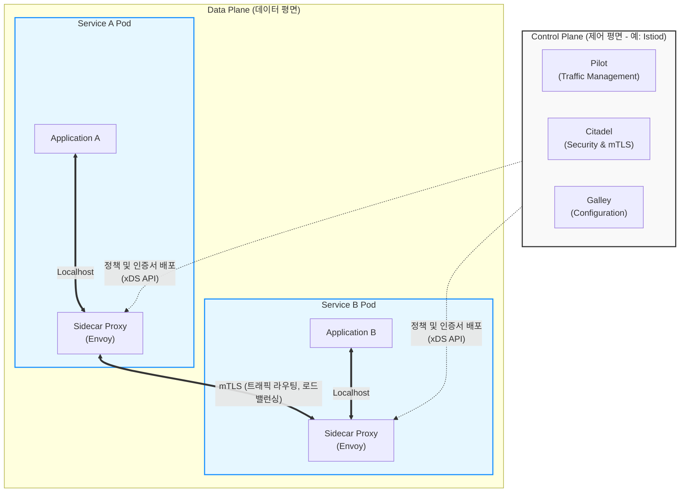

# 서비스 매쉬 (Service Mesh)

---

## I. MSA 통신 복잡성 해결의 핵심, 서비스 매쉬(Service Mesh)의 개요

### 가. 서비스 매쉬의 정의

* 마이크로서비스 아키텍처([[MSA (Micro Service Architecture)|MSA]]) 환경에서 서비스 간 통신(네트워크, 보안, 관측성)을 비즈니스 로직과 분리하여 전담 처리하는 독립적인 인프라 계층
* 애플리케이션 코드 변경 없이 사이드카(Sidecar) 프록시를 통해 분산 시스템의 트래픽 제어 및 가시성을 확보하는 아키텍처 패턴

### 나. 서비스 매쉬의 등장배경 및 특징

* **등장배경**: MSA 전환에 따른 동서(East-West) 트래픽 급증, 다국어(Polyglot) 환경에서의 공통 통신 모듈 구현 한계, 장애 추적의 어려움
* **특징**: 비침투성(사이드카 패턴 적용), 중앙 집중화된 제어(Control Plane), 트래픽 라우팅 및 보안(mTLS) 자동화, 분산 추적(Observability) 지원

---

## II. 서비스 매쉬의 개념도 및 핵심 기술 요소

### 가. 서비스 매쉬의 아키텍처 및 동작 원리

* 서비스 인스턴스마다 사이드카 프록시(Envoy)를 배치하여 모든 인바운드/아웃바운드 트래픽을 가로채어 처리함
* 제어 평면(Control Plane)은 데이터 평면(Data Plane)의 프록시들에게 동적으로 라우팅 룰, 보안 정책, 인증서를 중앙에서 배포함

### 나. 서비스 매시의 핵심 기술 요소

| 구분 | 요소기술(키워드) | 세부 설명 |
| --- | --- | --- |
| **아키텍처 패턴** | Sidecar Proxy | 앱 컨테이너와 동일한 Pod 내에 네트워크 프록시를 독립적으로 배치 |
| **데이터 평면** | Envoy Proxy | C++ 기반 고성능 분산 L4/L7 프록시, 동적 설정 API(xDS) 지원 |
| **제어 평면** | Istiod | 트래픽 라우팅, 보안 정책 관리, 상호 인증서(mTLS) 발급 및 [[프로비저닝]] |
| **트래픽 제어** | Circuit Breaker | 서비스 지연 및 장애 발생 시 임계치 기반 연쇄 장애 전파 차단 기술 |
| **보안 통신** | mTLS | 마이크로서비스 간 양방향(Client-Server) 인증 및 네트워크 페이로드 [[암호화]] |
| **관찰성(가시성)** | Distributed Tracing | Jaeger, Zipkin 등을 활용한 MSA 분산 구간 [[트랜잭션]] 흐름 추적 |
| **확장성** | WASM (WebAssembly) | 프록시 재기동 및 빌드 과정 없이 사용자 정의 필터 로직을 동적으로 주입 |
| **차세대 구조** | eBPF / Ambient Mesh | [[커널]] 레벨 네트워크 패킷 처리로 사이드카 리소스 오버헤드 및 지연시간 제거 |

---

## III. API 게이트웨이와 서비스 매시 비교 및 향후 전망

### 가. API 게이트웨이와 서비스 매시 비교

| 비교 항목 | [[API Gateway]] | Service Mesh |
| --- | --- | --- |
| **통신 방향** | North-South (외부 클라이언트 ↔ 내부 시스템) | East-West (내부 마이크로서비스 ↔ 마이크로서비스) |
| **주요 목적** | API 통합, 외부 노출 엔드포인트 관리, 클라이언트 인증 | 서비스 간 라우팅 제어, 내부 보안(mTLS), 가시성 확보 |
| **적용 위치** | MSA 클러스터 시스템 경계 ([[EDGE|Edge]]) | 클러스터 내부 각 서비스 엔드포인트(Pod 내부) |
| **주요 기능** | API 라우팅, Rate Limiting, API 과금/모니터링 | 서비스 디스커버리, 서킷 브레이커, 카나리 배포 제어 |
| **대표 솔루션** | AWS API Gateway, Kong, NGINX | Istio, Linkerd, Consul Connect |

### 나. 서비스 매시 기술 전망 및 최신 동향

* **Sidecar-less 아키텍처 전환**: 기존 사이드카 구조의 리소스 낭비와 네트워크 홉(Hop) 증가 한계를 극복하기 위해 eBPF 기반의 사이드카리스(예: Istio Ambient Mesh, Cilium) 구조로 기술 패러다임 변화 중
* **멀티/하이브리드 클라우드 확장**: 이기종 클러스터 및 클라우드 환경 간 통일된 트래픽 관리 및 보안 정책 적용을 위한 연합(Federation) 매시 아키텍처 도입 가속화
* **Gateway API 통합**: 쿠버네티스의 차세대 인그레스 표준인 K8s Gateway API와 결합하여 북남(North-South) 및 동서(East-West) 트래픽을 단일 프레임워크에서 통합 통제하는 방향으로 발전

---

### 🔗 연관 토픽

- **소속 도메인**: [[00_소프트웨어공학_MOC|🏗️ 소프트웨어공학]]
- **세부 분류**: `4. 아키텍처 스타일 & 객체지향 설계 원리`
- **핵심 연관 토픽**:
  - [[MSA (Micro Service Architecture)]]
  - [[API Gateway]]
  - [[모듈화|모듈화 (Modularity)]]
  - [[성능 테스트 도구]]
  - [[Proxy Pattern|Proxy (대리자, 최근 기출)]]
