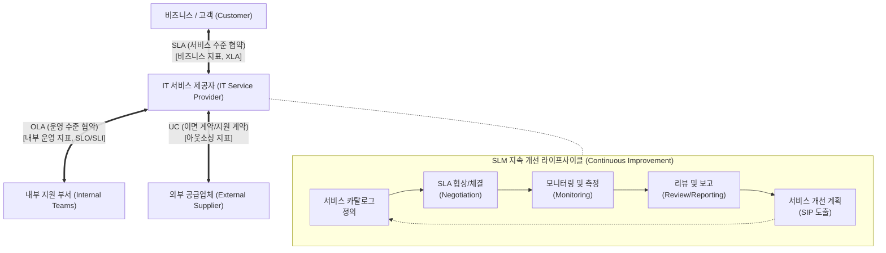

# 서비스 수준 관리 (SLM)

---

## I. 비즈니스와 IT의 가치 연계, 서비스 수준 관리(SLM)의 개요

* **정의**: 비즈니스 요구사항을 충족하기 위해 IT 서비스의 품질을 정량적으로 측정하고, 고객과 합의된 수준([[SLA]])을 유지 및 지속 개선하는 일련의 관리 활동 체계
* **필요성 및 특징**:
* **가시성 확보**: 모호한 IT 서비스 품질에 대한 객관적 측정 및 평가 기준 마련
* **기대치 조정**: 비즈니스 요구사항(고객)과 IT 서비스 역량(제공자) 간의 간극(Gap) 해소
* **패러다임 변화**: 가동률(Uptime) 중심에서 [[SRE (Site Reliability Engineering)|SRE]](사이트 [[신뢰성]] 공학) 기반의 에러 예산(Error Budget) 및 고객 체감 중심의 XLA(경험 수준 협약)로 진화 중

---

## II. SLM의 개념도 및 핵심 구성 요소

### 가. SLM의 아키텍처 및 동작 원리

* 고객과 IT조직 간의 SLA 달성을 위해, 내부 부서 간 OLA 및 외부 업체와의 UC를 구조적으로 매핑하여 [[End-to-End]] 서비스 품질을 관리

### 나. SLM의 핵심 구성 요소

| 구분 | 핵심 구성 요소 | 세부 설명 |
| --- | --- | --- |
| **목표 협약** | **SLA** (Service Level Agreement) | IT 서비스 제공자와 고객 간의 공식적인 서비스 수준 합의 문서 |
| **운영 협약** | **OLA** (Operational Level Agreement) | SLA 달성을 위해 IT 조직 내부 부서(네트워크, DB팀 등) 간 맺는 이면 협약 |
| **외부 계약** | **UC** (Underpinning Contract) | IT 조직과 외부 공급업체([[ISP (Information Strategy Plan)|ISP]], 벤더사 등) 간에 체결하는 아웃소싱 지원 계약 |
| **서비스 기준** | **Service Catalog** (서비스 카탈로그) | 제공 가능한 IT 서비스의 목록, 기본 수준, 비용 등을 정의한 포트폴리오 |
| **정량 목표** | **SLO** (Service Level Objective) | SLA를 준수하기 위해 IT 내부적으로 설정하는 구체적인 성능 목표치 (예: 99.9% 가동) |
| **측정 지표** | **SLI** (Service Level Indicator) | SLO 달성 여부를 파악하기 위해 시스템에서 실제 측정하는 정량적 지표 (예: [[응답시간]], 에러율) |
| **운영 유연성** | **Error Budget** (오류 예산) | SRE 환경에서 허용 가능한 최대 다운타임 예산 (신규 기능 배포 속도와 안정성의 균형점 역할) |
| **개선 체계** | **SIP** (Service Improvement Plan) | 미달된 서비스 수준의 근본 원인을 분석하고 품질을 향상시키기 위한 구체적 개선 계획 |

---

## III. SLM의 최신 진화 동향 (전통적 SLM vs SRE 기반 현대적 SLM)

### 가. 전통적 SLM과 현대적 SLM 비교

| 비교 항목 | 전통적 SLM (ITIL v3 기반) | 현대적 SLM (SRE, ITIL 4 기반) |
| --- | --- | --- |
| **핵심 목표** | 합의된 시스템 [[HA(High Availability)|가용성]](Uptime) 보장 | 서비스 안정성과 신규 배포(Agility) 속도의 균형 |
| **핵심 지표** | SLA (협약 중심) | SLO, SLI, Error Budget (측정/데이터 중심) |
| **품질 관점** | 시스템 관점 (서버 다운 여부, 장애 시간) | 고객 경험 관점 (체감 속도, XLA 도입) |
| **관리 주체** | 서비스 관리자 (Service Manager) | 사이트 신뢰성 엔지니어 (SRE), 플랫폼 엔지니어 |
| **위반 시 조치** | 페널티 부과 및 보고서 작성 | 신규 기능 배포 중단 및 안정성(버그 픽스)에 자원 집중 |

### 나. SLM 향후 전망 및 활용 방향

* **XLA(eXperience Level Agreement)의 부상**: 단순한 시스템 가동률을 넘어 UX/UI 만족도, 비즈니스 목표 달성률 등 고객 체감 경험 중심의 지표로 진화.
* **AIOps 기반의 Predictive SLM**: AI와 머신러닝을 활용한 모니터링 체계(Observability)를 결합하여, SLA 위반을 사전에 예측하고 선제적으로 자원을 할당(Auto-Scaling)하는 자율형 서비스 관리 체계로 발전 중.

---

### 🔗 연관 토픽

- **소속 도메인**: [[00_경영전략_MOC|📈 경영전략]]
- **세부 분류**: `3. 비즈니스 프로세스 혁신 & 디지털 전환 (DX)`
- **핵심 연관 토픽**:
  - [[SLA|SLA (Service Level Agreement)]]
  - [[SRE (Site Reliability Engineering)]]
  - [[신뢰성]]
  - [[End-to-End]]
  - [[ISP (Information Strategy Plan)]]
