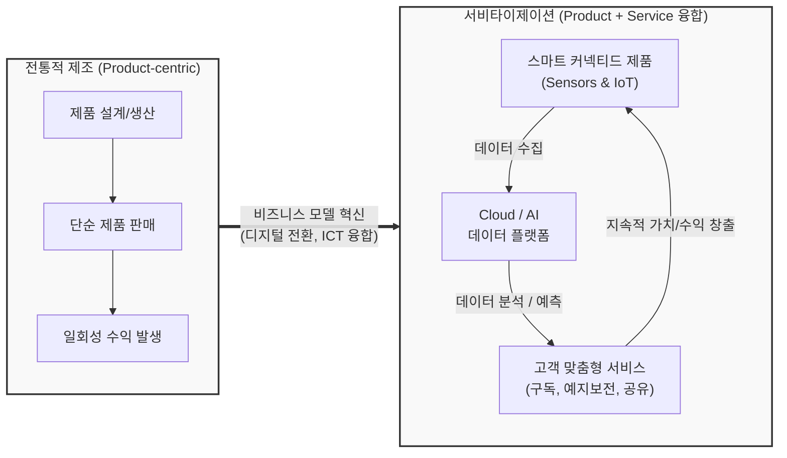

# 서비타이제이션 (Servitization)

---

## I. 제조업의 패러다임 전환, 서비타이제이션의 개요

* **정의**: 기존 단순한 제품(Product)의 생산 및 판매 중심 모델에서 벗어나, 제품과 서비스(Service)를 융합하여 새로운 비즈니스 모델을 창출하고 고객 가치를 극대화하는 경영 혁신 전략
* 물리적 제품에 IoT, AI 등 디지털 기술을 결합하여 제품의 서비스화(Product-as-a-Service)를 구현하는 전략적 전환(Shift)
* **특징**: 소유(Ownership)에서 사용(Usage) 및 결과(Result) 중심으로 전환, 일회성 판매에서 지속적 수익(Recurring Revenue) 창출, 고객 락인(Lock-in) 효과 강화

---

## II. 서비타이제이션의 개념도 및 핵심 기술 요소

### 가. 서비타이제이션의 개념도 및 동작 원리

* 단순 제품 판매에서 벗어나, 스마트 제품을 통해 수집된 데이터를 클라우드와 AI로 분석하여 지속적인 맞춤형 서비스(예측 정비, 구독 모델 등)를 제공하는 순환 가치 사슬

### 나. 서비타이제이션의 비즈니스 유형 및 핵심 기술 요소

| 분류 | 요소기술(키워드) | 세부 설명 |
| --- | --- | --- |
| **비즈니스 모델** | 제품 지향 (Product-oriented) | 소유권은 고객에게 이전하되, 제품 판매 시 [[유지보수]], 소모품 관리 등 부가 서비스를 결합하여 제공 |
| **비즈니스 모델** | 사용 지향 (Use-oriented) | 제품 소유권은 제공자가 유지하고, 고객에게 렌탈, 리스, 카셰어링 등의 형태로 사용권만 부여 |
| **비즈니스 모델** | 결과 지향 (Result-oriented) | 특정 제품의 사용이 아닌, 고객이 원하는 최종 '결과(성과)'에 대해 과금 (예: 롤스로이스 엔진 가동시간당 과금) |
| **핵심 기술** | IoT (사물인터넷) | 스마트 커넥티드 제품(SCP)에 내장된 센서를 통해 기기 상태, 주변 환경, 고객 사용 패턴을 실시간 수집 |
| **핵심 기술** | 예지 보전 (Predictive Maintenance) | 빅데이터 및 AI 알고리즘을 활용하여 기기의 고장 징후를 사전에 탐지하고 조치하여 가동률(Uptime) 극대화 |
| **핵심 기술** | Digital Twin ([[디지털 트윈]]) | 물리적 자산의 가상 복제본을 생성하여 사전 시뮬레이션, 실시간 모니터링 및 서비스 운영 최적화 수행 |
| **핵심 기술** | Cloud Computing | 대규모 디바이스에서 발생하는 데이터의 저장, 병렬 처리 및 [[XaaS]] 기반의 유연한 서비스 배포 인프라 제공 |
| **과금/관리** | 구독 경제 (Subscription) | 사용량 기반(Pay-per-use) 또는 정액제 기반의 과금 모델을 통해 안정적이고 예측 가능한 현금 흐름 확보 |

---

## III. 전통적 제조와 서비타이제이션 비교 및 향후 전망

### 가. 전통적 제조 vs 서비타이제이션 비교

| 비교 항목 | 전통적 제조 (Traditional Manufacturing) | 서비타이제이션 (Servitization) |
| --- | --- | --- |
| **가치 제안** | 제품의 우수한 기능, 성능 및 물리적 품질 | 제품 기반의 문제 해결, 서비스 경험, 결과 보장 |
| **소유권 형태** | 고객이 제품의 소유권을 가짐 (Ownership) | 제공자가 소유권 유지, 고객은 사용/결과 향유 |
| **수익 모델** | 제품 인도 시점의 일회성 판매 수익 | 구독, 렌탈, 사용량 비례 등 지속적 반복 수익 |
| **고객 관계** | 거래 중심의 단기적 관계 (Point-of-sale 중심) | 데이터 기반의 장기적, 지속적 파트너십 형성 |
| **핵심 역량** | 대량 생산 효율화, 원가 절감, 품질 관리 | 데이터 수집/분석, 서비스 플랫폼 운영 체계, 고객 경험 |

### 나. 향후 전망 및 주요 동향

* **XaaS(Everything-as-a-Service)로의 진화**: 소프트웨어(SaaS)를 넘어 모빌리티(MaaS), 로봇([[RaaS(Ransomware as a Service)|RaaS]]), 배터리(BaaS) 등 전 산업 영역으로 서비스화 모델 확장 가속
* **데이터 보안 및 프라이버시 이슈 대응**: 고객의 일상 및 기업 내부 환경에서 막대한 데이터가 수집됨에 따라, 제로 트러스트([[제로 트러스트 보안모델|Zero Trust]]) 아키텍처 도입 및 글로벌 컴플라이언스(GDPR 등) 준수 필수
* **에코시스템(Ecosystem) 구축**: 단일 기업의 제품-서비스를 넘어, 타 산업(금융, 보험, 통신 등)과 데이터를 공유하고 연계하는 범산업적 개방형 플랫폼 생태계로 발전 중

---

### 🔗 연관 토픽

- **소속 도메인**: [[00_경영전략_MOC|📈 경영전략]]
- **세부 분류**: `1. 경영 환경 분석 & 전략 수립 프레임워크`
- **핵심 연관 토픽**:
  - [[디지털 트윈|디지털 트윈 (Digital Twin)]]
  - [[XaaS|XaaS(Everything as a Service)]]
  - [[RaaS(Ransomware as a Service)]]
  - [[유지보수]]
  - [[제로 트러스트 보안모델|제로 트러스트 (Zero Trust) 보안모델]]
