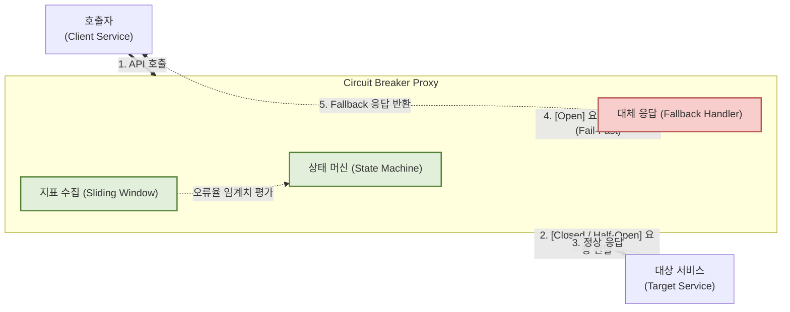

# 서킷 브레이커 (Circuit Breaker)

---

## I. 장애 연쇄 전파 차단, 서킷 브레이커(Circuit Breaker)의 개요

### 가. 서킷 브레이커의 정의

* 마이크로서비스([[MSA (Micro Service Architecture)|MSA]]) 환경에서 외부 서비스 호출 실패율이 임계치를 초과할 경우, 대상 서비스로의 연결을 차단(Open)하고 대체 응답(Fallback)을 제공하여 시스템 전체의 연쇄 장애를 방지하는 회복탄력성(Resiliency) 설계 패턴

### 나. 서킷 브레이커의 필요성 및 특징

* **등장배경**: 분산 시스템 환경에서 단일 서비스의 지연(Latency)이나 장애가 스레드 풀 고갈을 유발하여 전체 시스템으로 확산(Cascading Failure)되는 문제 해결 필요
* **특징**: 빠른 실패(Fail-Fast)를 통한 리소스 점유 방지, 상태 머신(Closed/Open/Half-Open) 기반의 트래픽 제어, 자가 치유(Self-Healing) 및 자동 복구

---

## II. 서킷 브레이커의 개념도 및 핵심 기술 요소

### 가. 서킷 브레이커의 아키텍처 및 동작 원리

* 호출자와 대상 서비스 사이에 프록시 형태로 위치하며, 상태 머신의 규칙에 따라 요청을 통과시키거나 즉시 차단함
* 오류율(Error Rate) 또는 지연(Slow Call Rate)이 설정된 임계치를 초과하면 상태를 변경하여 시스템을 보호함

### 나. 서킷 브레이커의 핵심 기술 요소

| 구분 | 요소기술(키워드) | 세부 설명 |
| --- | --- | --- |
| **상태 제어** | Closed (정상) | 서비스가 안정적인 상태로, 모든 클라이언트의 요청을 대상 서비스로 정상 전달 및 지표 수집 |
| **상태 제어** | Open (차단) | 장애 발생 상태로, 대상 서비스로의 접근을 즉시 차단(Fail-Fast)하고 Fallback 응답 처리 |
| **상태 제어** | Half-Open (복구 확인) | 대기 시간(Wait Duration) 경과 후, 제한된 수의 요청만 통과시켜 대상 서비스의 정상 복구 여부 검증 |
| **지표 수집** | Sliding Window | 최근 N개의 요청(Count-based) 또는 T초간의 요청(Time-based) 결과를 저장하여 실패율 계산 기준 마련 |
| **판단 기준** | Threshold (임계치) | 상태를 전환하기 위한 기준값 (예: 실패율 50% 이상, 또는 응답 지연율 50% 이상 시 Open 전환) |
| **장애 대응** | Fallback Method | 차단(Open) 상태 발생 시 클라이언트에게 반환할 대체 로직 (예: 기본값 반환, 캐시 데이터 활용, 에러 메시지) |
| **앱 레벨 구현** | Resilience4j | 기존 Netflix Hystrix를 대체하는 Java/Spring 기반의 경량화된 함수형 서킷 브레이커 라이브러리 표준 |
| **인프라 구현** | Service Mesh (Envoy) | 애플리케이션 코드 수정 없이 이스티오(Istio) 등 사이드카 프록시 단에서 인웃바운드 트래픽에 대한 차단 수행 |

---

## III. 서킷 브레이커 구현 방식 비교 및 활용 동향

### 가. 애플리케이션 레벨 vs 인프라 레벨 구현 비교

| 비교 항목 | 애플리케이션 레벨 (Resilience4j 등) | 인프라 레벨 (Service Mesh / Istio 등) |
| --- | --- | --- |
| **적용 위치** | 애플리케이션 코드 내부 (메서드 레벨) | 인프라스트럭처 (사이드카 프록시 레벨) |
| **언어 종속성** | 종속성 높음 (Java, Go 등 각 언어별 라이브러리 필요) | 종속성 없음 (Polyglot 지원, 애플리케이션 언어 무관) |
| **Fallback 처리** | 매우 정교함 (비즈니스 로직과 결합하여 맞춤형 데이터 제공) | 단순함 (주로 503 Service Unavailable 등 HTTP 에러 코드 반환) |
| **운영 주체** | 개발자 (코드 컴파일 및 배포 필요) | 인프라/플랫폼 엔지니어 (YAML 기반 선언적 동적 변경) |

### 나. 서킷 브레이커 최신 적용 동향 및 전망

* **Hybrid 믹스 매치 전략**: 인프라 레벨(Service Mesh)에서는 네트워크 타임아웃 및 원초적인 연결 장애를 차단하고, 애플리케이션 레벨(Resilience4j)에서는 비즈니스 로직에 특화된 정교한 Fallback 처리를 담당하는 이중 방어 체계 선호
* **Adaptive Circuit Breaking**: 고정된 임계치(Threshold) 설정의 한계를 극복하기 위해, 머신러닝이나 통계적 기법을 활용하여 트래픽 패턴에 따라 임계치를 동적으로 자동 조절하는 적응형 서킷 브레이커 연구 활발
* **Spring Cloud 생태계 통합**: Spring Cloud CircuitBreaker [[추상화]] 레이어를 통해 향후 기반 라이브러리가 변경되더라도 비즈니스 코드의 수정 없이 유연하게 교체할 수 있는 아키텍처 도입 보편화

---

### 🔗 연관 토픽

- **소속 도메인**: [[00_소프트웨어공학_MOC|🏗️ 소프트웨어공학]]
- **세부 분류**: `2. 애자일(Agile) & 지속적 통합/배포(CI/CD)`
- **핵심 연관 토픽**:
  - [[추상화|추상화 (Abstraction)]]
  - [[MSA (Micro Service Architecture)]]
  - [[소프트웨어 테스트|소프트웨어 테스트 (Software Test)]]
  - [[SRE (Site Reliability Engineering)]]
  - [[Clean Architecture]]
