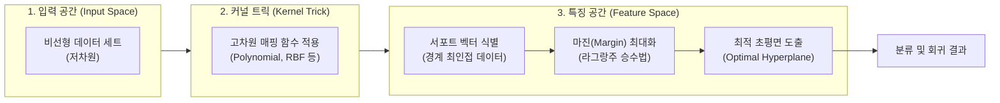

# 서포트 벡터 머신 (SVM; Support Vector Machine)

---
## I. 최적의 결정 경계 탐색을 위한 머신러닝 모델, 서포트 벡터 머신(SVM)의 개요

* **정의**: 데이터 공간에서 [[클래스]](Class) 간의 여백(Margin)을 최대화하는 최적의 결정 경계(Hyperplane, 초평면)를 도출하여 새로운 데이터를 분류(Classification)하거나 회귀(Regression)를 수행하는 [[지도학습]] [[알고리즘]]
* **등장배경**: 기존 선형 분류기의 한계(비선형 데이터 분류 불가)를 극복하고, 훈련 데이터에 대한 과적합(Overfitting)을 방지하여 [[일반화]](Generalization) 성능을 향상시키기 위해 등장
* **특징**:
* 구조적 위험 최소화(Structural Risk Minimization) 기반의 강력한 일반화 성능
* 커널 트릭([[커널|Kernel]] Trick)을 통한 비선형 데이터의 효율적 처리
* 서포트 벡터(Support Vector) 데이터만 메모리에 유지하여 연산 및 메모리 효율성 확보

---

## II. SVM의 개념도 및 핵심 기술 요소

### 가. SVM의 동작 원리 및 개념도

* 저차원의 비선형 데이터를 커널 함수를 통해 고차원 특징 공간으로 사상(Mapping)한 후, 클래스 간 마진을 최대화하는 선형 결정 경계를 도출하는 구조

### 나. SVM의 핵심 구성요소 및 기술 요소

| 구분 | 요소기술 (키워드) | 세부 설명 |
| --- | --- | --- |
| **결정 경계** | 초평면 (Hyperplane) | 데이터를 두 개의 클래스로 분리하는 n차원 공간의 평면 (2차원: 선, 3차원: 면) |
| **기준 데이터** | 서포트 벡터 (Support Vector) | 초평면과 가장 가까이 위치한 데이터 포인트로, 결정 경계 형성에 직접적 영향을 미침 |
| **최적화 지표** | 마진 (Margin) | 결정 경계(초평면)와 서포트 벡터 간의 수직 거리 (이 거리를 최대화하는 것이 SVM의 목적) |
| **오류 허용** | 하드/소프트 마진 (Hard/Soft Margin) | [[이상치]](Outlier)에 의한 과적합을 막기 위해 약간의 오분류(Slack Variable)를 허용하는 기법 |
| **비선형 처리** | 커널 트릭 (Kernel Trick) | 계산 복잡도를 늘리지 않고 내적 연산을 통해 데이터를 고차원으로 매핑하는 수학적 기법 |
| **주요 커널** | RBF (Radial Basis Function) | 무한 차원 매핑이 가능한 가우시안 커널로 비선형 분류에 가장 널리 사용되는 커널 함수 |
| **최적화 기법** | 라그랑주 승수법 (Lagrange Multiplier) | 제약조건(KKT 조건 등)을 포함하는 마진 최대화 목적 함수를 풀기 위한 수학적 최적화 기법 |
| **파라미터** | C (Cost) & Gamma | **C**: 오분류 허용 범위 (작을수록 소프트 마진), **Gamma**: 데이터 셋의 영향 범위 (클수록 복잡한 경계) |

---

## III. SVM과 타 알고리즘 비교 및 향후 전망

### 가. SVM과 주요 머신러닝 알고리즘 비교

| 비교 항목 | 서포트 벡터 머신 (SVM) | 인공신경망 (ANN) | 로지스틱 회귀 (Logistic Regression) |
| --- | --- | --- | --- |
| **학습 원리** | 기하학적 거리(마진) 최대화 | [[역전파]] 기반 가중치 최적화 | 확률(Sigmoid) 기반 최대우도추정 |
| **적합한 데이터** | 중소규모, 고차원 데이터 | 대규모, 비정형 데이터 (이미지/자연어) | 선형 분리 가능 데이터, 이진 분류 |
| **해석력(Explainability)** | 중간 (수학적 도출 및 분석 가능) | 낮음 ([[블랙박스 모델]]) | 높음 (변수별 확률 및 가중치 해석) |
| **하이퍼파라미터 튜닝** | C, Gamma, 커널 타입 | Layer 수, Node 수, 학습률(LR) 등 | 규제(Regularization, L1/L2) 강도 |
| **장/단점** | 비선형 분리 우수 / 학습 시간 김 | 복잡한 패턴 인식 / 대량의 데이터 필요 | 빠르고 가벼움 / 비선형 데이터 취약 |

### 나. 향후 전망 및 동향

* **전통적 ML 베이스라인**: 대규모 데이터셋에서는 딥러닝이 주류를 이루나, 텍스트 마이닝, 바이오인포매틱스(유전자 분류) 등 특화된 중소규모 고차원 데이터 처리 영역에서는 여전히 강력한 베이스라인 모델로 활용됨
* **양자 컴퓨팅 결합**: 양자 컴퓨터의 병렬 처리 특성을 활용하여 커널 행렬 계산 속도를 기하급수적으로 단축하는 양자 서포트 벡터 머신(QSVM, Quantum SVM)에 대한 연구 활발히 진행 중

---

### 🔗 연관 토픽

- **소속 도메인**: [[00_인공지능_MOC|🤖 인공지능]]
- **세부 분류**: `1. 수학 · 통계학 & 데이터 전처리`
- **핵심 연관 토픽**:
  - [[이상치]]
  - [[PCA(Principal Component Analysis)]]
  - [[비지도 학습]]
  - [[클래스 불균형|클래스 불균형(Class Imbalance)]]
  - [[손실함수]]
