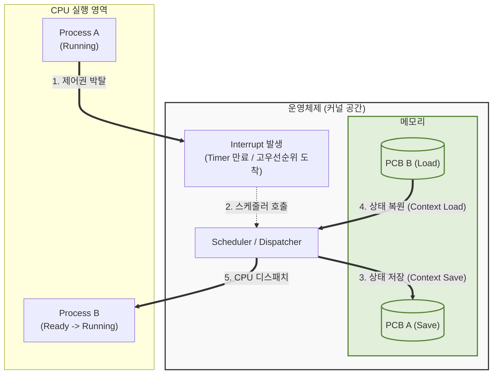

# 선점 스케줄링 (Preemptive Scheduling)

---

## I. 응답성 극대화와 시분할 처리의 핵심, 선점 스케줄링의 개요

* **정의**: [[OS(운영체제)|운영체제]](OS)가 실행 중인 프로세스의 [[CPU]] 제어권을 강제로 회수하여, 우선순위가 높거나 다음 순서의 프로세스에 할당하는 CPU [[스케줄링]] 기법
* **배경 및 특징**:
* **등장배경**: 다중 프로그래밍 환경에서 대화형 시스템(Time-sharing) 및 실시간(Real-time) 처리 요구 증대
* **주요특징**: 긴급 프로세스의 신속한 처리 보장, 시분할 처리 통한 빠른 응답성, [[문맥 교환]](Context Switching)에 따른 오버헤드 발생

---

## II. 선점 스케줄링의 개념도 및 핵심 기술 요소

### 가. 선점 스케줄링의 개념도 및 동작 원리

* 현재 실행 중인 [[프로세스]](Process A)에 타임 슬라이스 만료나 인터럽트가 발생하면, OS 스케줄러가 개입하여 PCB에 상태를 저장하고 대기 중인 프로세스(Process B)를 적재(Context Switching)하여 실행함.

### 나. 선점 스케줄링의 핵심 기술 요소

| 구분 | 요소기술(키워드) | 세부 설명 |
| --- | --- | --- |
| **핵심 [[알고리즘]]** | **RR (Round Robin)** | 각 프로세스에 동일한 할당 시간(Time Quantum)을 부여하고 만료 시 교대 |
| **핵심 알고리즘** | **SRT (Shortest Remaining Time)** | 남은 CPU 실행 시간이 가장 짧은 프로세스가 CPU를 선점 (SJF의 선점형) |
| **핵심 알고리즘** | **MLQ (Multi-Level [[Queue]])** | 준비 큐를 여러 개로 분할하여 큐마다 서로 다른 우선순위와 스케줄링 적용 |
| **핵심 알고리즘** | **MLFQ (Multi-Level Feedback Queue)** | 큐 간 프로세스 이동을 허용하여, 하위 큐로 갈수록 할당 시간을 늘려 효율성 극대화 |
| **제어 기법** | **Context Switching** | CPU 제어권 전환 시 기존 프로세스의 상태(레지스터, PC) 저장 및 새 상태 복원 |
| **제어 기법** | **Timer Interrupt** | RR 등의 알고리즘에서 정해진 타임 슬라이스가 끝났음을 OS에 알리는 하드웨어 신호 |
| **관리 구조** | **PCB ([[PCB(Process Control Block)|Process Control Block]])** | OS가 프로세스를 관리하기 위해 식별자, 상태, 우선순위, 레지스터 값 등을 저장하는 자료구조 |
| **해결 과제** | **Aging (에이징 기법)** | 우선순위가 낮은 프로세스가 CPU를 무한정 대기하는 [[기아|기아(Starvation)]] 방지를 위해 대기 시간에 비례해 우선순위 상향 |

---

## III. 선점형 vs 비선점형 스케줄링 비교 및 최신 동향

### 가. 선점 스케줄링과 비선점 스케줄링 비교

| 비교 항목 | 선점 스케줄링 (Preemptive) | 비선점 스케줄링 (Non-preemptive) |
| --- | --- | --- |
| **CPU 제어권** | OS가 강제로 회수 가능 (강제성) | 프로세스가 자발적으로 반환할 때까지 대기 (자율성) |
| **응답성 (반환 시간)** | 대화형 시스템에 적합 (응답 시간 예측 용이, 빠름) | 일괄 처리(Batch) 시스템에 적합 (응답 시간 예측 어려움) |
| **오버헤드** | 문맥 교환(Context Switching)이 빈번하여 오버헤드 높음 | 문맥 교환이 최소화되어 오버헤드 낮음 |
| **데이터 일관성** | 공유 자원 접근 시 동기화(Mutex/Semaphore) 복잡도 높음 | 실행 도중 중단되지 않으므로 상대적으로 일관성 유지 용이 |
| **대표 알고리즘** | RR, SRT, MLQ, MLFQ | FCFS, SJF, HRN (Highest Response-ratio Next) |

### 나. CPU 스케줄링의 최신 동향

* **완전 공정 [[스케줄러]] (CFS, Completely Fair Scheduler)**: 리눅스 [[커널]] 2.6.23 이후 기본 채택된 스케줄러로, 가상 런타임(vruntime)과 레드-블랙 트리를 활용하여 Time Slice 없이 모든 프로세스에 공정한 CPU 할당 시간 보장
* **에너지 인지 스케줄링 (EAS, Energy Aware Scheduling)**: 모바일(ARM big.LITTLE 구조 등) 및 IoT 환경에서 CPU 코어별 전력 소모량을 계산하여 성능과 배터리 효율을 동시에 최적화하는 스케줄링 기법 도입 확산
* **실시간 OS(RTOS) 패치 강화**: 산업용 IoT 및 자율주행차량 등 엄격한 지연 시간(Latency) 보장이 필요한 분야를 위해, 리눅스 커널 레벨의 선점성을 극대화하는 PREEMPT_RT 패치의 메인라인 통합 가속화

---

### 🔗 연관 토픽

- **소속 도메인**: [[00_운영체제_MOC|⚙️ 운영체제]]
- **세부 분류**: `1. 프로세스 & 스레드 관리`
- **핵심 연관 토픽**:
  - [[프로세스]]
  - [[커널|커널(Kernel)]]
  - [[OS(운영체제)]]
  - [[스케줄링]]
  - [[문맥 교환|문맥 교환 (Context Switching)]]
