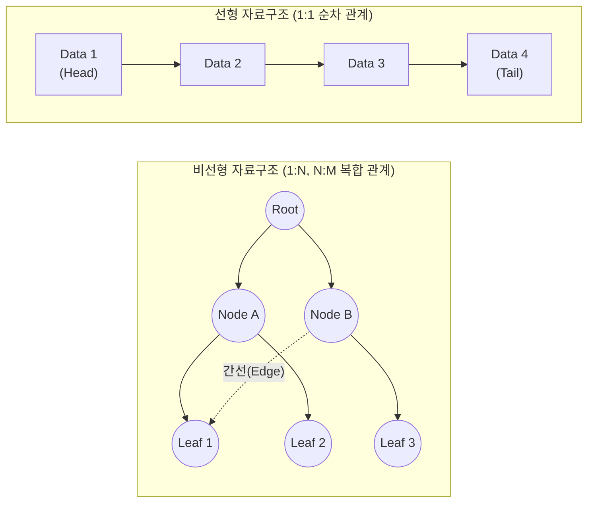

# 선형 자료구조와 비선형 자료구조
---
## I. 효율적 데이터 관리를 위한, 선형 자료구조와 비선형 자료구조의 개요

* **정의**: 컴퓨터 메모리 상에서 데이터의 논리적 저장 형태 및 관계에 따라, 1:1 순차적 구조로 나열하는 **선형 자료구조**와 1:N 또는 N:M의 계층적/망형 구조로 연결하는 **비선형 자료구조**의 데이터 조직화 방법론
* **필요성**: 시스템 자원의 한계 극복, [[알고리즘]] 시간/공간 복잡도 최소화, 대용량 데이터 탐색 및 조작(삽입/삭제) 성능 극대화
* **특징**:
* **선형 구조**: 순차 접근, 메모리 인접성(Locality), [[스케줄링]] 및 버퍼링에 유리
* **비선형 구조**: 다차원 관계 표현, 트리 탐색(DFS, BFS), 인덱싱 및 최단 경로 탐색에 특화

---

## II. 선형/비선형 자료구조의 개념도 및 핵심 기술 요소

### 가. 선형 및 비선형 자료구조의 아키텍처 및 동작 원리

* **선형 자료구조**: 시작(Head)과 끝(Tail)이 존재하며 데이터가 논리적으로 연속되어 단일 경로로 순회함.
* **비선형 자료구조**: 루트(Root) 노드나 임의의 정점(Vertex)에서 여러 갈래의 간선([[EDGE|Edge]])을 통해 다중 경로로 탐색함.

### 나. 선형 및 비선형 자료구조의 핵심 기술 요소

| 구분 | 요소기술(자료구조) | 세부 설명(핵심 키워드) |
| --- | --- | --- |
| **선형** | **배열 (Array)** | 연속된 메모리 주소 할당, 인덱스 기반 $O(1)$의 빠른 임의 접근(Random Access) 가능 |
| **선형** | **연결 리스트 (Linked List)** | 포인터 기반 동적 메모리 할당, 삽입/삭제 시 오버헤드 최소화 (단일/이중/원형 리스트) |
| **선형** | **스택 ([[Stack]])** | LIFO (Last In First Out), 후위 표기법 연산, 함수 호출(Call Stack), DFS 구현에 활용 |
| **선형** | **큐 ([[Queue]])** | [[FIFO]] (First In First Out), 선형/원형 큐, OS [[프로세스]] 스케줄링, BFS 구현에 활용 |
| **비선형** | **트리 (Tree)** | 1:N 계층 관계, 이진 트리(Binary Tree), 완전 이진 트리, 힙(Heap - 우선순위 큐) |
| **비선형** | **그래프 (Graph)** | N:M 망형 관계, 정점(Vertex)과 간선(Edge), 방향/무방향 그래프, 인접 행렬 및 인접 리스트 |
| **고급** | **B+ Tree / Trie** | [[RDBMS 인덱스(index)|RDBMS 인덱스]] 전용 자가 균형 트리(B+ Tree), 자연어 처리(NLP)용 문자열 탐색 트리(Trie) |
| **최신** | **HNSW** | Hierarchical Navigable Small World, [[초거대 언어 모델|LLM]] [[벡터 데이터베이스]](Vector DB)용 다층 그래프 구조 |

---

## III. 선형 자료구조와 비선형 자료구조의 비교 및 향후 전망

### 가. 선형 자료구조와 비선형 자료구조 상세 비교

| 비교 항목 | 선형 자료구조 (Linear) | 비선형 자료구조 (Non-Linear) |
| --- | --- | --- |
| **구조적 특징** | 데이터 간 1:1 관계 (전후 순차적 연결) | 데이터 간 1:N, N:M 관계 (계층적/망형 연결) |
| **메모리 할당** | 주로 정적 공간(배열) 및 단일 동적 연결 | 불연속적 동적 공간, 복잡한 포인터 기반 연결 |
| **데이터 순회** | 단일 순회 (for/while을 통한 순차 접근) | 복합 순회 (전위/중위/후위, DFS/BFS 탐색) |
| **탐색 시간복잡도** | $O(N)$ (단, 정렬된 배열의 이진탐색 제외) | $O(\log N)$ (균형 트리) ~ $O(V+E)$ (그래프) |
| **구현 난이도** | 구조가 직관적이고 구현이 단순함 | 재귀 호출 및 포인터 연산으로 구현 복잡도 높음 |
| **주요 활용 사례** | 버퍼 큐, Undo/Redo(스택), OS 스케줄링 | [[DBMS]] 인덱싱, 네트워크 라우팅(OSPF), 소셜 네트워크 |

### 나. 자료구조의 최신 동향 및 응용 전망

* **AI 및 빅데이터 시대의 비선형 자료구조 진화**: LLM(대규모 언어 모델)의 RAG(검색 증강 생성) 파이프라인에서 시맨틱 검색을 위해 **HNSW 기반 그래프 형태의 Vector DB 인덱싱** 구조가 필수 핵심 기술로 자리매김함.
* **초연결 [[데이터베이스]] 확장**: 개체 간 복잡한 관계 추론을 위해 Neo4j와 같은 속성 그래프 모델(Property Graph Model) 기반 **지식 그래프(Knowledge Graph)** 의 산업적 활용(추천 시스템, FDS)이 가속화되고 있음.
* **하드웨어 친화적(Hardware-Aware) 자료구조 최적화**: [[GPU]] 및 다중 코어 [[CPU]] 환경에서 캐시 [[지역성]](Cache Locality)을 극대화하기 위해, 전통적 포인터 기반 비선형 구조를 메모리 연속성을 갖는 형태(예: 배열 기반 묵시적 트리)로 변환하는 하이브리드 자료구조 연구가 활발함.

---

### 🔗 연관 토픽

- **소속 도메인**: [[00_컴퓨터구조_MOC|💻 컴퓨터구조]]
- **세부 분류**: `2. 캐시 & 메모리 계층 구조 · 스토리지`
- **핵심 연관 토픽**:
  - [[Stack]]
  - [[CPU]]
  - [[GPU]]
  - [[Queue]]
  - [[데이터베이스]]
