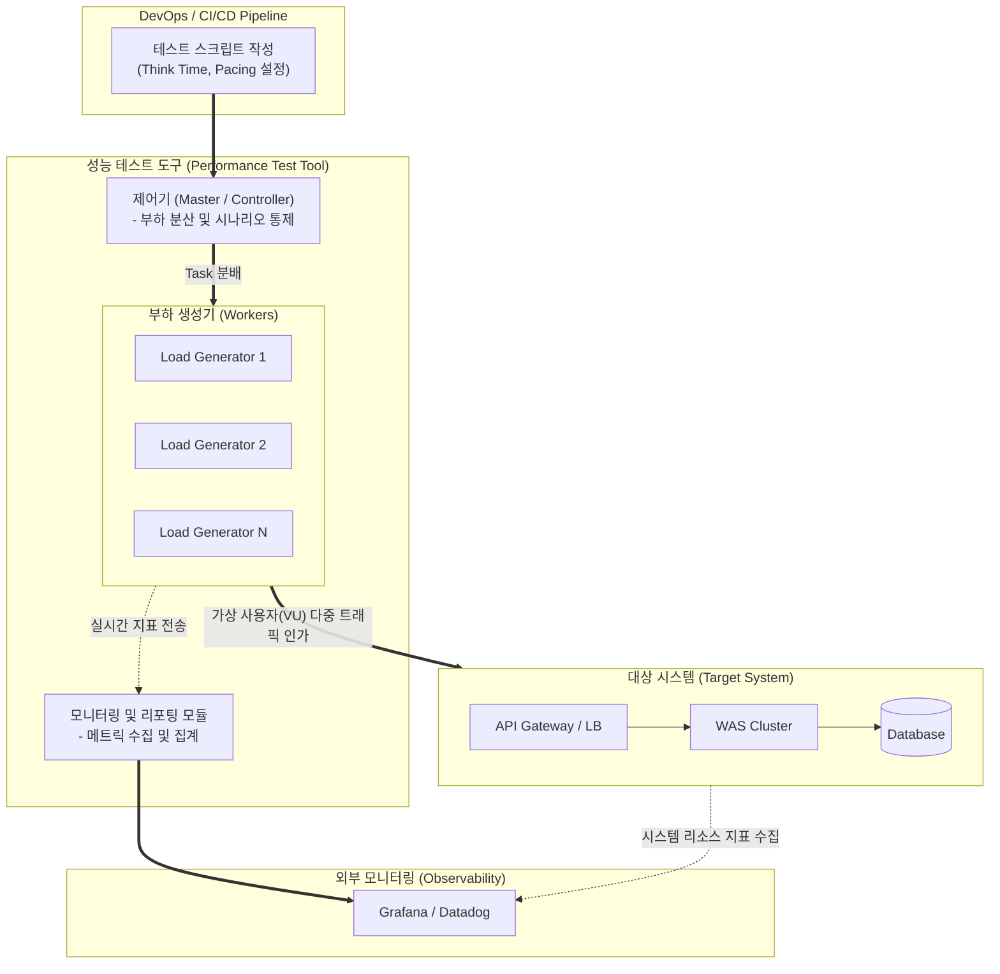

# 성능 테스트 도구

---

## I. 시스템 안정성 및 병목 식별의 핵심, 성능 테스트 도구의 개요

### 가. 성능 테스트 도구의 정의

* 시스템에 가상의 사용자 부하(Workload)를 인가하여 [[처리량]](TPS), [[응답시간]](Response Time), 자원 사용률 등을 측정하고 잠재적인 병목 구간을 식별하는 자동화 소프트웨어

### 나. 성능 테스트 도구의 등장배경 및 특징

* **등장배경**: 마이크로서비스([[MSA (Micro Service Architecture)|MSA]]) 아키텍처 도입으로 인한 시스템 복잡도 증가, 대규모 이벤트(티켓팅 등) 트래픽 폭증에 대비한 선제적 장애 예방 필요성 대두
* **특징**: 가상 사용자(VU) 분산 시뮬레이션, [[프로토콜]] 에뮬레이션, CI/CD 파이프라인 연동을 통한 지속적 테스트(Shift-Left) 지원

---

## II. 성능 테스트 도구의 아키텍처 및 핵심 구성 요소

### 가. 성능 테스트 도구의 아키텍처 및 동작 원리

* 마스터 역할을 하는 제어기가 다수의 부하 생성기(Worker)에 시나리오를 분배하여 대상 시스템에 대규모 분산 부하를 인가함
* 실행 중 수집된 TPS, 응답시간 등의 메트릭은 내부 리포팅 모듈 및 외부 APM(Grafana 등)과 연동하여 실시간 병목 분석에 활용됨

### 나. 성능 테스트 도구의 핵심 구성 요소

| 구분 | 요소기술(키워드) | 세부 설명 |
| --- | --- | --- |
| **시나리오 관리** | 스크립트 엔진 (Script Engine) | HTTP, gRPC, WebSocket 등 다양한 통신 프로토콜을 에뮬레이션하는 코드 작성 환경 |
| **시나리오 관리** | Think Time / Pacing | 실제 사용자의 화면 인지 대기시간(Think Time)과 [[트랜잭션]] 발생 간격(Pacing) 조절 기능 |
| **부하 제어** | 제어기 (Controller / Master) | 전체 테스트의 시작/종료 통제, 부하 생성기 [[스케줄링]] 및 분산된 테스트 결과의 중앙 집계 |
| **부하 인가** | 부하 생성기 (Load Generator) | 설정된 시나리오에 따라 다수의 가상 사용자(Virtual User) 스레드/코루틴을 생성하여 트래픽 발생 |
| **데이터 동인** | 데이터 파라미터화 (Parameterization) | 캐시 히트(Cache Hit) 오류를 방지하기 위해 테스트 시마다 고유한 CSV 등의 테스트 데이터 셋 주입 |
| **검증 및 통제** | 단언(Assertion) 및 임계치 제어 | 응답 코드(HTTP 200 등) 및 응답시간이 설정된 [[SLA]] 목표를 초과할 경우 테스트 강제 중단(Fail) 처리 |
| **관측성 연동** | 실시간 모니터링 (Monitoring) | 테스트 도중 발생하는 에러율, TPS, 지연 시간을 실시간으로 수집하여 대시보드에 [[프로비저닝]] |
| **자동화 연계** | CI/CD 플러그인 연동 | Jenkins, GitHub Actions 등과 통합되어 소스코드 병합(Merge) 시 자동으로 성능 [[리그레션 테스트|회귀 테스트]] 수행 |

---

## III. 성능 테스트 도구의 세대별 비교 및 최신 동향

### 가. GUI 기반 전통적 도구 vs Code 기반 모던 도구 비교

| 비교 항목 | GUI 기반 (전통적 테스트 도구) | Code 기반 (모던 [[성능 테스트]] 도구) |
| --- | --- | --- |
| **대표 도구** | **LoadRunner**, **JMeter** | **k6**, **Gatling**, **Locust** |
| **스크립트 작성** | UI/GUI 레코딩 중심 ([[XML]], 자체 스크립트) | 개발 언어 기반 (JavaScript, Scala, Python) |
| **수행 주체** | 전문 QA 엔지니어 및 성능 테스터 | 개발자(Developer) 및 [[DevOps]] 엔지니어 |
| **버전 관리** | 바이너리 또는 무거운 XML 파일 단위 (Git 관리 어려움) | 순수 코드(Plain Text) 형태로 Git 브랜치 관리 매우 용이 |
| **부하 생성 구조** | Thread 기반 (많은 메모리 리소스 소모) | 비동기 I/O 및 Goroutine/Actor 모델 (경량, 고성능) |
| **주요 적용 환경** | 시스템 통합(SI) 완료 후 빅뱅 방식의 릴리즈 전 테스트 | 애자일([[Agile]]) 및 CI/CD 파이프라인 내 **지속적 성능 테스트** |

### 나. 성능 테스트 도구의 최신 트렌드 및 향후 전망

* **Shift-Left 패러다임 확산**: 개발 초기 단계부터 단위 성능 테스트를 수행할 수 있도록 개발자 친화적인 코드 기반 도구(k6 등)의 채택이 급증함
* **AI 기반 자율 테스트(AIOps 연계)**: 과거 테스트 결과와 운영 환경의 트래픽 패턴을 AI가 분석하여, 자동으로 실제 사용자 환경과 유사한 부하 모델(Workload Model) 스크립트를 생성해 주는 방향으로 진화 중
* **[[카오스 엔지니어링]] 결합**: 성능 부하를 인가하는 동시에 고의적인 네트워크 지연이나 파드(Pod) 다운을 발생시켜 [[클라우드 네이티브]] 환경의 동적 확장성(Auto-scaling)과 회복탄력성(Resiliency)을 동시에 검증하는 복합 도구 체계로 발전

---

### 🔗 연관 토픽

- **소속 도메인**: [[00_소프트웨어공학_MOC|🏗️ 소프트웨어공학]]
- **세부 분류**: `4. 아키텍처 스타일 & 객체지향 설계 원리`
- **핵심 연관 토픽**:
  - [[카오스 엔지니어링|카오스 엔지니어링 (Chaos Engineering)]]
  - [[MSA (Micro Service Architecture)]]
  - [[응답시간]]
  - [[성능 테스트]]
  - [[클라우드 네이티브]]
