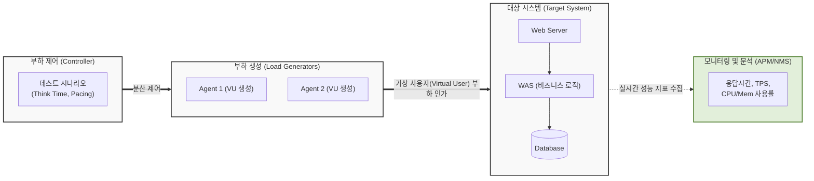

# 성능 테스트 (Performance Testing)

---

## I. 시스템 안정성 확보의 핵심, 성능 테스트의 개요

* **정의**: 시스템에 다양한 부하(Workload) 모델을 인가하여 [[응답시간]], [[처리량]](TPS), 자원 사용률 등 비기능적 요구사항의 충족 여부를 검증하는 테스트 기법
* **필요성 및 특징**:
* 대규모 이벤트 및 트래픽 폭증 시 시스템 장애 사전 예방
* 아키텍처 내 애플리케이션, [[데이터베이스]] 등의 병목(Bottleneck) 구간 식별
* 클라우드 환경의 오토스케일링(Auto-scaling) 임계치(Threshold) 설정 기준점 도출

---

## II. 성능 테스트의 개념도 및 핵심 구성 요소

### 가. 성능 테스트의 개념도 및 동작 원리

* 마스터 제어기(Controller)가 다수의 에이전트를 통해 가상 사용자(VU) 트래픽을 생성하고 대상 시스템에 인가함
* 부하 인가 중 APM(Application Performance Management) 도구를 활용하여 각 티어(Tier)별 구간 응답시간 및 병목 지점을 실시간 식별함

### 나. 성능 테스트의 핵심 기술 및 구성 요소

| 구분 | 요소기술(키워드) | 세부 설명 |
| --- | --- | --- |
| **핵심 지표** | TPS (Transaction Per Second) | 1초당 시스템이 처리할 수 있는 정상 트랜잭션의 수 (시스템 처리 용량의 핵심 기준) |
| **핵심 지표** | 응답 시간 (Response Time) | 사용자 요청 시작 시점부터 전체 결과 화면이 렌더링(또는 패킷 수신)되기까지의 총 시간 |
| **테스트 유형** | 부하 테스트 (Load Test) | 예상되는 시스템의 최대 임계치(목표치) 부하 상황에서 시스템이 정상 동작하는지 검증 |
| **테스트 유형** | 스트레스 테스트 (Stress Test) | 임계치를 초과하는 극한의 부하를 인가하여 시스템의 한계점 파악 및 장애 복구 능력 확인 |
| **테스트 유형** | 스파이크 테스트 (Spike Test) | 선착순 예매 등 단기간에 트래픽이 폭증(Spike)하는 상황을 모사하여 시스템 안정성 검증 |
| **테스트 유형** | 내구성 테스트 (Soak Test) | 장시간(수 시간~수 일) 부하를 지속 인가하여 메모리 누수(Memory Leak) 및 자원 고갈 여부 확인 |
| **수행 요소** | 가상 사용자 (Virtual User) | 실제 사용자의 행위를 스크립트로 구현하여 다수의 클라이언트 접속을 에뮬레이션하는 객체 |
| **수행 요소** | Think Time / Pacing | 사용자가 화면을 읽는 대기 시간(Think Time)과 [[트랜잭션]] 간 간격(Pacing)을 조절하여 현실성 부여 |

---

## III. 전통적 성능 테스트와 최신 성능 테스트 동향 비교

### 가. 폭포수 기반 테스트와 Shift-Left 기반 지속적 성능 테스트 비교

| 비교 항목 | 전통적 성능 테스트 (Traditional) | 지속적 성능 테스트 (CPT, Shift-Left) |
| --- | --- | --- |
| **수행 시점** | 릴리즈 직전, 시스템 통합 완료 후 (빅뱅 방식) | 코드 커밋 및 빌드 단계 등 CI/CD 파이프라인 전반 |
| **주요 도구** | LoadRunner, JMeter (GUI 환경 중심) | k6, Gatling, Locust (Code-based, 버전 관리 용이) |
| **테스트 환경** | 운영과 유사한 별도의 대규모 물리/가상 환경 구축 | [[클라우드 네이티브]] 기반 온디맨드 [[컨테이너]] 동적 생성 |
| **수행 목적** | 시스템 최종 오픈 전 성능 보증 목표 충족 여부 확인 | 코드 변경(Regression)으로 인한 성능 저하 조기 발견 |

### 나. 성능 테스트의 최신 트렌드 및 향후 전망

* **AI 기반 성능 이상 탐지 (AIOps)**: 단순 임계치 알람을 넘어, 머신러닝 알고리즘이 평상시 성능 베이스라인을 학습하여 미세한 응답시간 지연 및 병목의 근본 원인(RCA)을 자동 추론하는 기술 도입 가속화
* **[[카오스 엔지니어링]](Chaos Engineering) 융합**: 부하를 인가하는 동시에 네트워크 지연, 팟(Pod) 강제 종료 등 의도적인 장애를 주입하여 [[MSA (Micro Service Architecture)|MSA]](마이크로서비스) 환경의 회복탄력성(Resiliency)을 종합적으로 검증하는 방향으로 진화 중

---

### 🔗 연관 토픽

- **소속 도메인**: [[00_소프트웨어공학_MOC|🏗️ 소프트웨어공학]]
- **세부 분류**: `3. 요구사항 공학 & UML 객체지향 분석/설계`
- **핵심 연관 토픽**:
  - [[유틸리티 트리|유틸리티 트리 (Utility Tree)]]
  - [[소프트웨어 품질 속성 시나리오]]
  - [[MSA (Micro Service Architecture)]]
  - [[응답시간]]
  - [[카오스 엔지니어링|카오스 엔지니어링 (Chaos Engineering)]]
