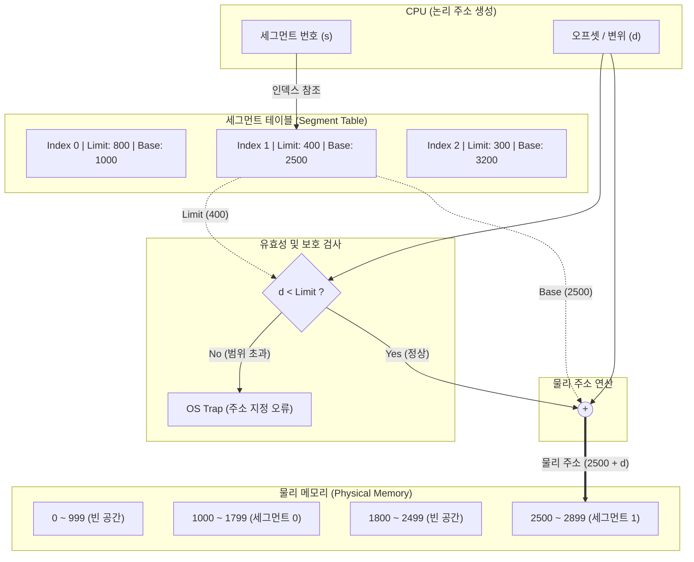

# 세그멘테이션 (Segmentation)

---

## I. 논리적 단위의 메모리 할당, 세그멘테이션의 개요

* **정의**: 메모리를 같은 크기의 블록으로 나누는 대신, 프로그램과 데이터를 논리적 의미 단위(세그먼트: 코드, 데이터, 스택 등)인 가변 크기로 분할하여 메모리에 할당하는 관리 기법
* **배경 및 특징**:
* **등장 배경**: 고정 분할(페이징) 기법의 내부 [[단편화]] 문제와, 논리적 단위의 메모리 보호 및 공유 제어의 한계를 극복하기 위해 도입
* **주요 특징**: 논리적 연관성 기반의 가변 크기 할당, 외부 단편화(External Fragmentation) 발생, 세그먼트 테이블을 통한 주소 매핑 및 접근 제어

---

## II. 세그멘테이션의 개념도 및 핵심 기술 요소

### 가. 세그멘테이션의 개념도 및 주소 변환 원리

* 논리 주소는 `(s: 세그먼트 번호, d: 변위)`로 구성되며, 세그먼트 테이블을 조회하여 한계값(Limit) 검사 후 기준 주소(Base)에 변위를 더해 [[물리 주소]] 산출
* 변위(d)가 한계값(Limit)을 초과할 경우 세그먼트 범위를 벗어난 잘못된 접근으로 간주하여 OS가 트랩(Trap)을 발생시킴

### 나. 세그멘테이션의 핵심 구성 요소

| 구분 | 핵심 기술(키워드) | 세부 설명 |
| --- | --- | --- |
| **주소 체계** | [[논리 주소]] (s, d) | 사용자 및 [[프로세스]] 관점의 주소로, 세그먼트 번호(s)와 세그먼트 내 오프셋(d)으로 구성 |
| **매핑 구조** | 세그먼트 테이블 | 각 세그먼트가 물리 메모리의 어느 위치에 있는지(Base)와 그 크기(Limit) 정보를 저장하는 자료구조 |
| **테이블 레지스터** | STBR (Base Register) | 세그먼트 테이블이 물리 메모리 내에 저장된 시작 주소를 가리키는 레지스터 |
| **테이블 레지스터** | STLR (Length Register) | 프로세스가 사용하는 전체 세그먼트의 개수를 저장하여 잘못된 세그먼트 번호 참조 방지 |
| **보안 및 제어** | 한계 레지스터 (Limit) | 각 세그먼트의 최대 크기를 정의하여, 허용된 범위를 벗어난 메모리 침범 방지 |
| **[[메모리 단편화]]** | 외부 단편화 (External) | 가변 크기 할당으로 인해 메모리에 적재 및 제거가 반복되면서 발생하는 자투리 빈 공간 현상 |
| **공간 효율화** | 통합 및 압축 (Compaction) | 외부 단편화 해결을 위해 인접한 빈 공간을 합치거나(통합), 사용 중인 영역을 한곳으로 모으는(압축) 기법 |
| **자원 관리** | 공유 및 보호 (Sharing/Protection) | 코드, 데이터 단위로 분할되므로 읽기/쓰기 권한(Protection bit) 부여 및 공통 라이브러리 공유 용이 |

---

## III. 세그멘테이션과 페이징 비교 및 활용 동향

### 가. 세그멘테이션과 페이징(Paging) 기법 비교

| 비교 항목 | 세그멘테이션 (Segmentation) | 페이징 (Paging) |
| --- | --- | --- |
| **분할 방식** | 가변 크기 분할 (사용자/논리적 관점) | 고정 크기 분할 ([[OS(운영체제)|운영체제]]/물리적 관점) |
| **분할 단위** | 세그먼트 (Segment) | 페이지 (Page) / 프레임 (Frame) |
| **단편화 문제** | **외부 단편화** 발생 (빈 공간 낭비) | **내부 단편화** 발생 (페이지 내 낭비) |
| **테이블 구성** | Base (시작 주소) + Limit (크기) | 프레임 번호 (물리적 블록 위치) |
| **보호 및 공유** | 논리적 단위이므로 적용 **매우 용이** | 물리적 단위이므로 적용 어려움 |
| **관리 복잡도** | 메모리 할당/해제 [[알고리즘]](Best-fit 등) 복잡 | 크기가 동일하여 빈 프레임 관리가 단순 |

### 나. 메모리 관리 기법의 발전 동향 (세그먼테이션 위 페이징)

* **Paged Segmentation (세그먼트화된 페이징) 도입**: 순수 세그멘테이션의 치명적인 외부 단편화 문제와 순수 페이징의 보호/공유 어려움을 동시에 해결하기 위해 현대 OS는 두 기법을 혼합하여 사용
* **작동 원리**: 프로그램을 먼저 논리적 의미 단위인 세그먼트로 분할(보호 및 공유 이점 취득)한 뒤, 각 세그먼트를 다시 고정 크기의 페이지로 분할(외부 단편화 제거)하여 물리 메모리에 적재하는 2단계 [[메모리 관리]] 아키텍처(예: MULTICS, Intel x86 아키텍처) 채택 보편화

---

### 🔗 연관 토픽

- **소속 도메인**: [[00_컴퓨터구조_MOC|💻 컴퓨터구조]]
- **세부 분류**: `2. 캐시 & 메모리 계층 구조 · 스토리지`
- **핵심 연관 토픽**:
  - [[메모리 관리]]
  - [[메모리 단편화|메모리 단편화 (Fragmentation)]]
  - [[OS(운영체제)]]
  - [[단편화]]
  - [[물리 주소]]
