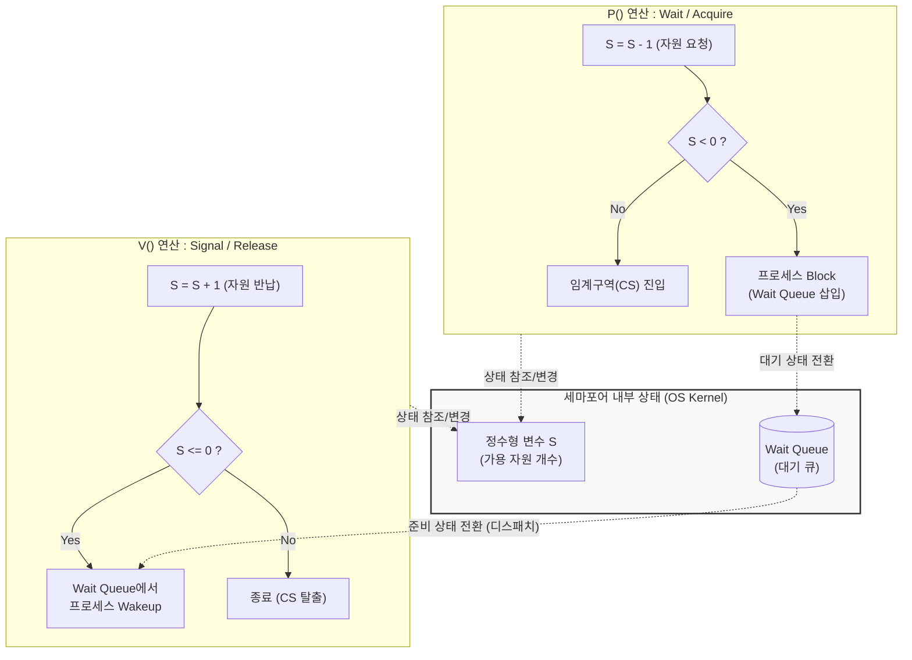

# 세마포어 (Semaphore)

---

## I. 공유 자원의 동시성 제어, 세마포어의 개요

* **정의**: 멀티프로그래밍 환경에서 여러 프로세스나 스레드가 공유 자원에 접근할 때, 정수형 변수(S)와 원자적 연산(P, V)을 통해 상호배제(Mutual Exclusion)와 동기화를 구현하는 [[OS(운영체제)|운영체제]] 기법임.
* **등장배경 및 특징**:
* **Busy Waiting 해소**: 임계구역 진입 불가 시 무한 루프를 도는 [[스핀락]](Spinlock)의 한계를 극복하기 위해 Block & Wakeup 메커니즘 도입.
* **유연한 자원 관리**: 1개의 자원(Binary)뿐만 아니라, N개의 동일한 자원(Counting)에 대한 접근 통제 기능 제공.
* **원자성 보장**: P연산과 V연산은 OS [[커널]] 단에서 인터럽트되지 않는 불가분(Indivisible) 연산으로 실행됨.

---

## II. 세마포어의 개념도 및 핵심 기술 요소

### 가. 세마포어의 개념도 및 동작 원리

* 프로세스는 임계구역 진입 전 P연산을 수행하여 자원을 차감하고, 가용 자원이 없으면 대기 큐에서 Block됨.
* 임계구역 작업 완료 후 V연산을 수행하여 자원을 반납하고, 대기 중인 프로세스가 있다면 Wakeup 시켜 실행 상태로 전환함.

### 나. 세마포어의 핵심 기술 요소

| 구분 | 요소기술(키워드) | 세부 설명 |
| --- | --- | --- |
| **핵심 변수** | **정수형 변수 (S)** | 사용 가능한 공유 자원의 개수를 나타내는 변수 (음수일 경우 대기 중인 [[프로세스]] 수를 의미함) |
| **진입 연산** | **P 연산 (Wait/Down)** | 네덜란드어 Proberen(시도하다). 자원을 획득하는 원자적 연산으로, S값을 1 감소시킴 |
| **반납 연산** | **V 연산 (Signal/Up)** | 네덜란드어 Verhogen(증가하다). 자원을 반납하는 원자적 연산으로, S값을 1 증가시킴 |
| **구현 방식** | **Block & Wakeup** | 자원이 없을 때 Busy Waiting 대신 프로세스를 Sleep(Block) 상태로 큐에 넣고, 자원 반납 시 깨움 |
| **유형** | **Binary Semaphore** | S값이 0과 1만 가질 수 있는 세마포어로, 상호배제(Mutex)와 유사한 역할 수행 |
| **유형** | **Counting Semaphore** | S값이 0 이상인 양의 정수를 가질 수 있어, 동일한 자원이 여러 개일 경우의 동기화 제어 |
| **대기 구조** | **Wait [[Queue]]** | P연산 수행 후 자원을 할당받지 못한 프로세스들의 PCB([[PCB(Process Control Block)|Process Control Block]])를 저장하는 큐 |
| **필수 조건** | **원자성 (Atomicity)** | P, V 연산 수행 중에는 Context Switching이 발생하지 않도록 하드웨어적 또는 OS 차원에서 보장 |

---

## III. 세마포어와 뮤텍스(Mutex) 비교 및 향후 동향

### 가. 세마포어와 뮤텍스의 비교

| 비교 항목 | 세마포어 (Semaphore) | 뮤텍스 (Mutex, Mutual Exclusion) |
| --- | --- | --- |
| **자원 제어 개수** | 여러 개 지원 (Counting 기준 최대 N개) | 오직 1개 (Binary 상태만 가짐) |
| **소유권 (Ownership)** | **없음** (자원을 획득하지 않은 다른 스레드도 V연산으로 해제 가능함) | **있음** (Lock을 획득한 스레드만이 Unlock을 수행할 수 있음) |
| **목적** | 상호배제 및 스레드 간 실행 순서 **동기화(Event 관점)** | 오직 단일 자원에 대한 **상호배제(Lock 관점)** |
| **발생 가능한 문제** | Deadlock, 우선순위 역전(Priority Inversion) | Deadlock, 우선순위 역전 (우선순위 상속으로 완화 가능) |

### 나. 동시성 제어 기술의 최신 동향 및 한계 극복

* **비차단 [[알고리즘]](Lock-free) 확산**: 컨텍스트 스위칭 오버헤드가 큰 세마포어 대신, 하드웨어 수준의 원자적 명령어인 CAS(Compare-And-Swap)를 활용한 Non-blocking 자료구조(ConcurrentHashMap 등) 활용 증가.
* **하이브리드 동기화(Futex 적용)**: 리눅스의 Futex(Fast Userspace Mutex)처럼 경합이 없을 때는 유저 공간에서 빠르게 처리(Lock-free)하고, 경합 발생 시에만 커널에 진입(Block)하여 성능을 최적화하는 기법이 최신 OS에 기본 탑재됨.
* **멀티코어 환경의 스핀락 재조명**: 짧은 임계구역을 가지는 멀티코어 커널 환경에서는 프로세스를 Block/Wakeup 하는 비용보다, 잠시 [[CPU]]를 점유하며 루프를 도는 Spinlock이 오히려 성능상 유리하여 적재적소에 혼용됨.

---

### 🔗 연관 토픽

- **소속 도메인**: [[00_컴퓨터구조_MOC|💻 컴퓨터구조]]
- **세부 분류**: `3. 고성능 AI 가속기 & 입출력 시스템`
- **핵심 연관 토픽**:
  - [[프로세스]]
  - [[커널|커널(Kernel)]]
  - [[OS(운영체제)]]
  - [[PCB(Process Control Block)]]
  - [[스핀락|스핀락 (Spin Lock)]]
