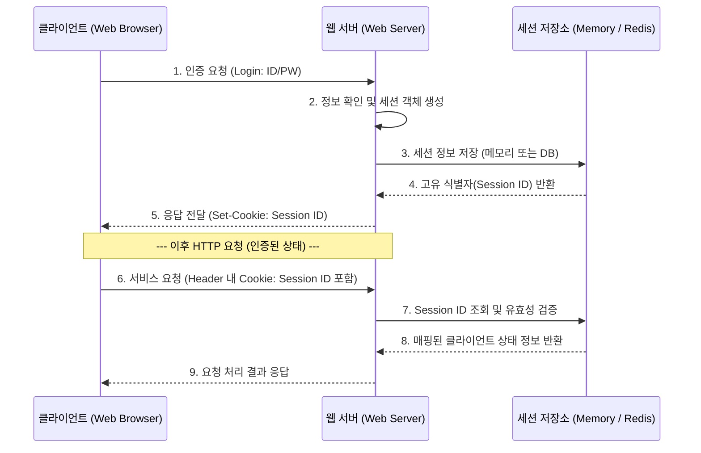

# 세션 (Session)

---

## I. HTTP 무상태성 한계 극복, 세션(Session)의 개요

### 가. 세션의 정의

* HTTP 프로토콜의 비연결성(Connectionless) 및 무상태성(Stateless)을 극복하기 위해, 클라이언트의 상태 정보를 서버 측에 저장하고 유지하는 논리적 연결 상태 관리 기술
* 서버가 클라이언트에게 고유한 식별자([[Session Layer|Session]] ID)를 부여하고, 이를 [[쿠키]](Cookie)를 통해 교환하며 사용자를 식별함

### 나. 세션의 등장배경 및 특징

* **등장배경**: 로그인 유지, 장바구니 등 다중 요청 간의 사용자 상태(State)를 지속적으로 식별할 필요성 대두
* **주요특징**:
* **보안성**: 실제 민감 데이터는 서버에 저장되므로 클라이언트 측 위변조 및 유출 위험 감소
* **서버 종속성(Stateful)**: 동시 접속자가 많을수록 서버 메모리 부하 가중 및 확장성(Scale-out) 제약 발생

---

## II. 세션의 개념도 및 핵심 기술 요소

### 가. 세션의 아키텍처 및 동작 원리

* 클라이언트 로그인 시 서버는 세션을 생성해 고유 Session ID를 쿠키에 담아 반환(Set-Cookie)함
* 이후 클라이언트는 요청마다 Session ID를 쿠키로 전송하여 서버가 기존 상태를 식별하게 함

### 나. 세션의 핵심 기술 및 보안 요소

| 구분 | 요소기술(키워드) | 세부 설명 |
| --- | --- | --- |
| **식별자** | **Session ID** | 클라이언트를 식별하기 위해 서버가 발급하는 고유한 난수 문자열 (예: JSESSIONID, PHPSESSID) |
| **전달 매개체** | **Cookie** | 발급된 Session ID를 클라이언트 브라우저에 저장하고 HTTP 헤더에 담아 전송하는 매개체 |
| **저장소** | **Session Storage** | 서버의 메모리(In-Memory), 파일 시스템, 또는 Redis/Memcached와 같은 외부 인메모리 DB 활용 |
| **분산 환경** | **Session Clustering** | 다중 서버(Scale-out) 환경에서 서버 간 세션 불일치 방지를 위해 세션 정보를 동기화 및 외부망 공유 |
| **보안 위협** | **Session Hijacking** | 네트워크 패킷 스니핑(Sniffing) 등을 통해 정상 사용자의 Session ID를 탈취하여 권한을 도용하는 공격 |
| **보안 위협** | **Session Fixation** | 공격자가 서버로부터 정상 발급받은 Session ID를 희생자에게 강제로 주입하여 세션을 탈취하는 공격 |
| **보안 대응** | **HttpOnly / Secure** | JS 접근을 차단하여 [[XSS]] 공격 방어(HttpOnly) 및 HTTPS 통신 구간에서만 쿠키를 전송(Secure) |
| **생명주기** | **Session [[Timeout]]** | 리소스 낭비 및 탈취 위험 최소화를 위해, 일정 시간 동안 요청이 없을 시 세션을 자동 만료(파기) 처리 |

---

## III. 세션(Session)과 토큰(JWT) 비교 및 최신 동향

### 가. 세션 기반 인증과 토큰(JWT) 기반 인증 비교

| 비교 항목 | 세션 (Session) | 토큰 (JWT - [[JSON]] Web Token) |
| --- | --- | --- |
| **상태 관리 구조** | **Stateful** (서버가 클라이언트 상태 저장) | **Stateless** (상태 정보를 토큰 자체에 내장) |
| **데이터 저장 위치** | 서버 메모리 또는 세션 전용 DB | 클라이언트 로컬 (Local Storage, Cookie) |
| **확장성 (Scale-out)** | 낮음 (세션 클러스터링/Sticky Session 구성 필수) | 높음 (서버 간 세션 공유 불필요, [[MSA (Micro Service Architecture)|MSA]] 환경 최적) |
| **보안 통제 (무효화)** | 우수 (서버에서 세션 삭제로 즉시 강제 로그아웃 가능) | 미흡 (탈취 시 토큰 만료 전까지 서버에서 통제 불가) |
| **네트워크 트래픽** | 적음 (Session ID 자체는 길이가 짧음) | 많음 (Header, Payload, Signature로 인해 크기가 큼) |

### 나. 세션 관리 기술의 최신 동향 및 향후 전망

* **인메모리 기반 세션 외부화 (External Session Management)**: [[클라우드 네이티브]] 및 MSA 환경에서 기존 WAS 종속적인 메모리 세션의 한계를 극복하기 위해, **Redis, Hazelcast** 등의 외부 인메모리 데이터 그리드(IMDG)를 활용한 중앙 집중식 글로벌 세션 저장소 아키텍처 채택 보편화
* **세션-토큰 하이브리드 모델 (Opaque Token)**: JWT의 '강제 무효화 불가' 단점과 세션의 '확장성 한계'를 상호 보완하기 위해, 내부 MSA 서비스 간 통신은 JWT를 사용하되 [[API Gateway]]나 외부 접점에서는 식별 불가능한 참조 토큰(Opaque Token)과 Redis 세션을 매핑하여 활용하는 하이브리드(Hybrid) 아키텍처 적용 확대

---

### 🔗 연관 토픽

- **소속 도메인**: [[00_네트워크_MOC|🌐 네트워크]]
- **세부 분류**: `1. OSI 7계층 & 데이터링크 계층 (L1/L2)`
- **핵심 연관 토픽**:
  - [[쿠키]]
  - [[Session Layer|Session]]
  - [[XSS]]
  - [[스위치 (Layer 7 Switch)]]
  - [[OSI 7 Layer|OSI 7 Layer (ISO 7498)]]
