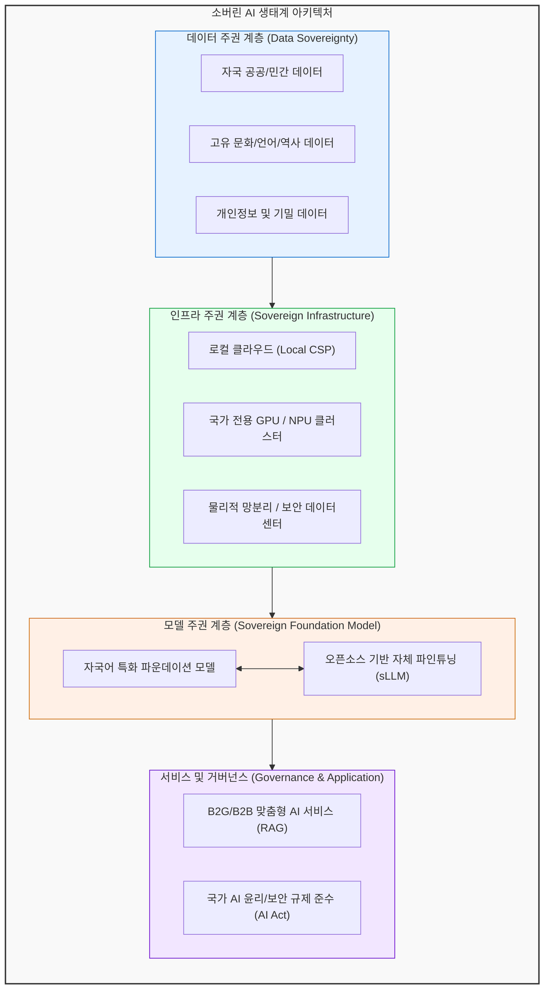

# 소버린 AI (Sovereign AI)

---

## I. 국가적 AI 독립과 데이터 주권, 소버린 AI의 개요

* **정의**: 국가 또는 기업이 자국의 인프라, 데이터, 인력을 활용하여 물리적·법적 통제력을 갖추고 독립적으로 AI 모델을 개발 및 운영하는 [[인공지능]] 주권 체계
* **등장배경**: 글로벌 빅테크(미국, 중국 등)의 AI 기술 독점에 따른 종속성 우려, 자국의 문화적·역사적 맥락과 가치관을 반영한 AI 필요성 증대, EU AI Act 등 글로벌 AI 규제 및 데이터 보호주의 강화
* **특징**: 데이터 및 인프라 주권 확보, 자국어 및 지역 문화 특화 모델 개발, 국가 안보 및 프라이버시 보호 강화

---

## II. 소버린 AI의 아키텍처 및 핵심 기술 요소

### 가. 소버린 AI의 개념도 및 아키텍처

* 자국의 데이터를 기반으로 독립된 로컬 인프라 위에서 파운데이션 모델을 학습하고, 자국 법규 및 윤리 기준을 준수하는 통제 가능한 AI 생태계를 구축함

### 나. 소버린 AI의 핵심 기술 요소

| 구분 | 요소기술(키워드) | 세부 설명 |
| --- | --- | --- |
| **데이터 처리** | 데이터 로컬라이제이션 | 데이터의 물리적 저장 위치를 자국 내로 제한하여 국외 반출 통제 |
| **인프라** | 소버린 클라우드 | 외산 퍼블릭 클라우드 의존을 배제하고 자국 보안 법규를 준수하는 인프라 |
| **인프라** | AI 반도체 ([[NPU]] 등) | 특정 글로벌 [[GPU]] 제조사 종속성 탈피를 위한 자국산 AI 가속기 및 클러스터 구축 |
| **모델 학습** | 로컬 [[파운데이션 모델]] | 자국의 언어, 문화, 사회적 맥락을 고도로 이해하도록 처음부터 사전학습(Pre-training)된 거대 모델 |
| **모델 최적화** | [[PEFT]] / [[LoRA(Low-rank adaptation)|LoRA]] | 비용 효율적인 소버린 AI 구축을 위해 오픈소스 모델을 자국 데이터로 미세조정([[Fine-Tuning]]) |
| **보안/프라이버시** | 연합학습 (Federated Learning) | 원본 데이터의 이동 없이 로컬에서 분산 학습하여 보안 유지 및 데이터 주권 확보 |
| **활용 기술** | RAG (검색 증강 생성) | 모델 내부 유출이 우려되는 국가/기업 기밀 데이터를 외부 연동 기반으로 안전하게 생성 |
| **거버넌스** | AI 안전성 검증 (Red Teaming) | 자국 윤리 가이드라인 및 문화적 편향성 검증을 위한 모델 취약점 평가 체계 |

---

## III. 소버린 AI와 글로벌 범용 AI 비교 및 향후 전망

### 가. 소버린 AI와 글로벌 범용 AI 비교

| 비교 항목 | 소버린 AI ([[Sovereign AI (소버린 AI)|Sovereign AI]]) | 글로벌 범용 AI (Global AI) |
| --- | --- | --- |
| **주도 주체** | 국가 단위 연합, 로컬 대표 IT 기업 | 글로벌 빅테크 (미국, 중국 등) |
| **주요 목적** | 데이터 주권 확보, 문화적/가치관 독립 | 범용적 지능 구현, 글로벌 시장 장악 및 수익화 |
| **데이터 범위** | 자국어, 로컬 문화, 국가 민감 데이터 중심 | 전 세계 웹 데이터, 다국어 코퍼스 (영어 중심) |
| **인프라 환경** | 로컬 데이터센터, 망분리, 온프레미스 | 하이퍼스케일 글로벌 클라우드 (Multi-Region) |
| **규제 준수** | 해당 국가의 엄격한 보안 및 법적 규제 100% 준수 | 범용적 가이드라인 준수 (국지적 규제 충돌 가능성 존재) |
| **대표 사례** | 하이퍼클로바X(한국), Mistral(프랑스), Krutrim(인도) | GPT-4(OpenAI), Gemini(Google), Claude(Anthropic) |

### 나. 소버린 AI의 산업 동향 및 향후 전망

* **AI 인프라의 국가 단위 무기화**: 엔비디아(NVIDIA) 등 글로벌 칩 벤더들이 각국의 소버린 AI 구축을 지원하는 'AI 팩토리' 전략을 추진하며, 컴퓨팅 파워 확보가 국가 경쟁력의 핵심으로 대두됨
* **버티컬 [[sLLM (Smaller Large Language Model)|sLLM]] 기반의 B2B/B2G 시장 개화**: 막대한 자본이 드는 범용 [[AGI]] 경쟁 대신, 행정, 국방, 법률, 금융 등 국가 필수 인프라에 적용 가능한 온프레미스 기반의 작고 효율적인 sLLM(Small [[초거대 언어 모델|LLM]]) 시장 급성장
* **글로벌 AI 규제 블록화 대응**: 주요국들의 'AI 안전성 연구소(AI Safety Institute)' 설립 등 거버넌스 체계가 강화됨에 따라, 소버린 AI는 단순한 기술 독립을 넘어 AI 기술 패권 시대의 필수적 생존 전략으로 자리매김할 전망

---

### 🔗 연관 토픽

- **소속 도메인**: [[00_인공지능_MOC|🤖 인공지능]]
- **세부 분류**: `6. 설명가능한 AI (XAI) & AI 윤리 · 거버넌스`
- **핵심 연관 토픽**:
  - [[Sovereign AI (소버린 AI)]]
  - [[초거대 언어 모델|초거대 언어 모델(Large Language Model)]]
  - [[인공지능]]
  - [[Fine-Tuning]]
  - [[sLLM (Smaller Large Language Model)]]
