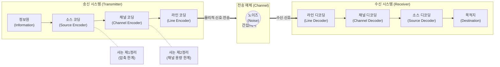

# 소스코딩, 채널코딩, 라인코딩, 샤논 정리

---

## I. 디지털 통신의 한계 극복, 소스/채널/라인 코딩 및 샤논 정리의 개요

### 가. 코딩 이론과 샤논 정리의 정의

* **샤논 정리(Shannon's Theorem)**: 데이터 압축의 이론적 한계(엔트로피)와 노이즈 채널 환경에서의 오류 없는 최대 전송 속도(채널 용량)를 수학적으로 증명한 정보 이론의 근간
* **3대 코딩(Source/Channel/Line)**: 샤논 정리를 기반으로 통신의 **효율성**(소스코딩), **[[신뢰성]]**(채널코딩), **전송 적합성**(라인코딩)을 확보하기 위해 데이터를 변환하는 일련의 부호화 과정

### 나. 3대 코딩 및 샤논 정리의 특징

* **효율성 극대화 (샤논 제1정리)**: 잉여 정보(Redundancy) 제거를 통한 데이터 압축 (소스코딩)
* **신뢰성 확보 (샤논 제2정리)**: 잉여 정보 추가를 통한 전송 중 오류 탐지 및 정정 (채널코딩)
* **물리적 전송 최적화**: 0과 1의 디지털 비트를 전송 매체 특성에 맞는 전기적/광학적 신호로 변환 (라인코딩)

---

## II. 디지털 통신 코딩의 아키텍처 및 핵심 기술 요소

### 가. 통신 시스템 코딩 구성도 및 동작 원리

* 송신측은 정보의 압축(소스) $\rightarrow$ 오류제어 비트 추가(채널) $\rightarrow$ 전기적 신호 변환(라인) 순으로 코딩 수행
* 수신측은 역순(디코딩)으로 처리하며, 샤논 정리는 소스와 채널 코딩의 수학적 기준과 한계치를 제시함

### 나. 3대 코딩 및 샤논 정리의 핵심 기술 요소

| 구분 | 요소기술(키워드) | 세부 설명 |
| --- | --- | --- |
| **이론적 배경** | 샤논 제1정리 (소스코딩 정리) | $R \ge H(X)$, 데이터 전송률(R)은 정보원의 엔트로피(H)보다 크거나 같아야 무손실 압축이 가능함을 증명 |
| **이론적 배경** | 샤논 제2정리 (채널코딩 정리) | $C = W \log_2(1 + S/N)$, 채널 용량(C) 이하의 전송률에서는 오류 확률을 '0'으로 만드는 코딩이 존재함 |
| **소스 코딩** | 무손실/손실 압축 | 허프만(Huffman), 런렝스(Run-Length), LZW (무손실) 및 JPEG, MPEG (손실) 등 데이터 중복성 제거 |
| **소스 코딩** | 엔트로피 (Entropy) | 정보의 불확실성을 나타내는 척도로, 소스코딩이 도달할 수 있는 압축의 최대 이론적 한계치 |
| **채널 코딩** | FEC (전진 에러 수정) | 송신측에서 잉여 비트(Parity)를 추가하여, 수신측이 재전송(ARQ) 없이 스스로 오류를 탐지 및 정정 |
| **채널 코딩** | LDPC / Polar Code | 5G NR(New Radio) 통신에 적용된 최신 채널 코딩 기술 (데이터 채널: LDPC, 제어 채널: Polar) |
| **라인 코딩** | Baseband 전송 파형 | NRZ(Non-Return to Zero), RZ, Manchester, Bipolar 등 직류 편향성 제거 및 클럭 동기화를 위한 변환 |
| **라인 코딩** | PAM4 (다중 진폭 변조) | 차세대 초고속 이더넷(400G/800G)을 위해 4개의 진폭 레벨을 사용하여 1개 심볼에 2bit를 전송하는 기술 |

---

## III. 3대 코딩 방식의 상세 비교 및 최신 동향

### 가. 소스, 채널, 라인 코딩 상세 비교

| 비교 항목 | 소스코딩 (Source Coding) | 채널코딩 (Channel Coding) | 라인코딩 (Line Coding) |
| --- | --- | --- | --- |
| **핵심 목적** | 대역폭 효율성 (데이터 압축) | 전송 신뢰성 (오류 탐지/정정) | 물리적 전송 (신호 매핑) |
| **잉여 정보(Redundancy)** | **제거 (Remove)** 최소화 | **추가 (Add)** 패리티 비트 | **변형 (Shape)** 특성에 맞춤 |
| **샤논 정리 매핑** | 제1정리 (엔트로피의 한계) | 제2정리 (채널 용량의 한계) | 연관성 낮음 (나이퀴스트 대역폭 연관) |
| **적용 계층 (OSI 7)** | 표현 계층 (Presentation) | 데이터링크 계층 (Data Link) | 물리 계층 (Physical) |
| **대표 기술** | H.265/HEVC, VVC, MP3 | Reed-Solomon, Turbo, LDPC | AMI, CMI, Manchester, PAM4 |

### 나. 코딩 기술의 향후 전망 및 산업 동향

* **PAM4 기반 차세대 데이터센터 네트워크 고도화**: 대규모 AI 클러스터([[GPU]]) 간의 초고속 데이터 전송을 위해 기존 NRZ 대신 PAM4(Pulse Amplitude Modulation 4-level) 라인 코딩 기반의 800G/1.6T 광트랜시버 도입 가속화
* **JSCC (Joint Source-Channel Coding) 연구 활발**: 소스코딩과 채널코딩을 분리하는 기존 샤논의 분리 정리(Separation Theorem) 한계를 극복하고, AI/딥러닝을 활용하여 압축과 오류 제어를 동시에 최적화하는 6G 통신 핵심 기술로 연구 진행 중

---

### 🔗 연관 토픽

- **소속 도메인**: [[00_네트워크_MOC|🌐 네트워크]]
- **세부 분류**: `3. 전송 계층 & 트래픽 / 혼잡 제어 (L4)`
- **핵심 연관 토픽**:
  - [[신뢰성]]
  - [[GPU]]
  - [[CDN|CDN(Contents Delivery Network)]]
  - [[Point-to-Point]]
  - [[백홀 트래픽]]
