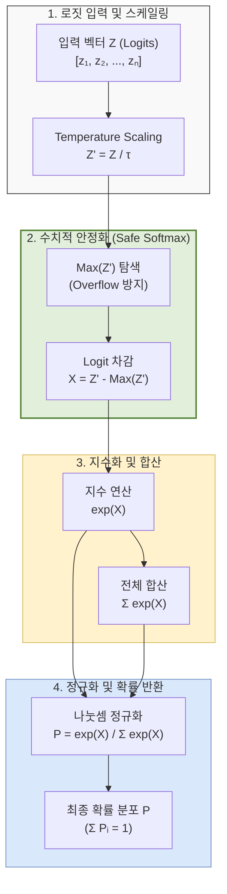

# 소프트맥스 정규화(Softmax Normalization)

---

## I. 다중 분류 및 LLM 어텐션의 핵심, 소프트맥스 정규화의 개요

### 가. 소프트맥스 정규화의 정의

* 인공신경망의 최종 출력(Logit)이나 Transformer의 어텐션 스코어를 지수화(Exponential)한 후 전체 합으로 나누어, **총합이 1인 0~1 사이의 확률 분포(Probability Distribution)로 변환**하는 수학적 정규화 함수
* 입력값 간의 상대적 크기를 극대화(Soft-argmax)하여 다중 [[클래스]] 분류 및 시퀀스 데이터 간의 가중치(Attention Weight)를 산출하는 기술

### 나. 소프트맥스 정규화의 필요성 및 특징

* **확률적 해석 제공**: 모델의 연속적인 출력값을 직관적인 확률값으로 변환하여 Cross-Entropy 손실 함수와 결합 가능
* **미분 가능성 (Differentiability)**: 매끄러운(Smooth) 곡선 형태로 [[역전파|역전파(Backpropagation)]] 시 자코비안(Jacobian) 행렬 기반의 기울기(Gradient) 계산 용이
* **비선형성 확보**: 지수 함수(Exp)를 사용하여 큰 값은 더 크게, 작은 값은 0에 가깝게 억제하는 상호 배제적 특성 부여

---

## II. 소프트맥스 정규화의 개념도 및 핵심 기술 요소

### 가. 소프트맥스 정규화의 연산 흐름 및 동작 원리

* 입력 로짓의 지수 연산 시 발생하는 오버플로우(Overflow)를 방지하기 위해 최대값을 빼는 **LogSumExp(Safe Softmax)** 트릭을 적용함
* Temperature 파라미터(τ)를 통해 최종 산출되는 확률 분포의 엔트로피(Sharpness/Softness)를 조절함

### 나. 소프트맥스 정규화의 핵심 기술 요소

| 분류 | 요소기술(키워드) | 세부 설명 |
| --- | --- | --- |
| **기본 연산** | 기본 Softmax 수식 | $P_i = \frac{e^{z_i}}{\sum_{j} e^{z_j}}$, 입력 벡터를 확률값으로 매핑하는 기본 [[알고리즘]] |
| **수치 안정화** | Safe Softmax | $P_i = \frac{e^{z_i - z_{max}}}{\sum_{j} e^{z_j - z_{max}}}$, 오버플로우 방지를 위해 최대값을 차감하는 기법 |
| **분포 제어** | Temperature Scaling | 분모에 온도 인자(τ) 적용, τ>1이면 분포가 완만(다양성), τ<1이면 날카로워(결정론적)짐 |
| **메모리 최적화** | Online Softmax | 전체 시퀀스를 한 번에 연산하지 않고, 블록(Tiling) 단위로 분모/분자를 점진적(Online) 갱신 |
| **연산 가속화** | FlashAttention 통합 | Transformer 구조에서 Attention의 QK^T 결과와 Softmax 연산을 SRAM 내에서 융합(Fusion) |
| **비용 최적화** | 하드웨어 가속기([[NPU]]) 지원 | 지수(Exp) 연산의 높은 H/W 비용 절감을 위한 Look-up Table(LUT) 기반 근사치 계산 |
| **손실 함수** | Cross-Entropy Loss | Softmax 출력과 원-핫(One-Hot) 인코딩된 정답 라벨 간의 오차를 계산하여 최적화 수행 |
| **희소성 확보** | Sparsemax | Softmax의 결과가 0이 나오지 않는 한계(Dense)를 극복하여 덜 중요한 값을 완벽히 0으로 출력 |

---

## III. 소프트맥스 연산의 한계 및 최신 최적화 동향

### 가. 전통적 Softmax와 최신 Online Softmax(FlashAttention) 구조 비교

| 비교 항목 | 전통적 Softmax (Standard Softmax) | Online Softmax (FlashAttention 기반) |
| --- | --- | --- |
| **메모리 접근** | **Global Memory([[HBM]])**에 읽기/쓰기 반복 (Pass 3회 이상) | 타일링(Tiling)을 통해 **On-chip SRAM**에서 해결 (융합 연산) |
| **시퀀스 길이** | 시퀀스 길이(N)의 제곱($O(N^2)$) 비례 메모리 사용 | 시퀀스 길이에 독립적인 선형적 $O(N)$ 메모리 사용량 |
| **확장성** | 긴 문맥(Long Context) 처리 시 Memory Wall(병목) 발생 | 1M(백만) 토큰 이상의 초장문 컨텍스트([[초거대 언어 모델|LLM]]) 처리 가능 |
| **적용 동향** | 과거 단순 [[CNN]] 분류기 및 초기 Transformer | GPT-4, Llama 3 등 최신 거대언어모델(LLM)의 핵심 엔진 |

### 나. 향후 전망 및 산업 응용 동향

* **LLM 추론 다양성 제어의 핵심**: ChatGPT 등 생성형 AI 서비스에서 Temperature 파라미터를 동적으로 조절(Top-P, Top-K 결합)하여 창의적 글쓰기와 팩트 기반 질의응답 간의 톤 앤 매너 튜닝에 필수적으로 활용됨
* **SRAM 바운드 극복 기술 진화**: 모델 사이즈와 컨텍스트 길이가 기하급수적으로 증가함에 따라, 단순히 HBM 대역폭을 늘리는 하드웨어적 접근을 넘어 Online Softmax와 같은 수학적·알고리즘적 최적화(FlashAttention-3 등)가 AI 인프라 경쟁력의 핵심으로 대두됨

---

### 🔗 연관 토픽

- **소속 도메인**: [[00_인공지능_MOC|🤖 인공지능]]
- **세부 분류**: `1. 수학 · 통계학 & 데이터 전처리`
- **핵심 연관 토픽**:
  - [[CNN|CNN (Convolutional Neural Network)]]
  - [[역전파|역전파(Backpropagation)]]
  - [[초거대 언어 모델|초거대 언어 모델(Large Language Model)]]
  - [[서포트 벡터 머신|서포트 벡터 머신 SVM(Support Vector Machine)]]
  - [[비지도 학습]]
