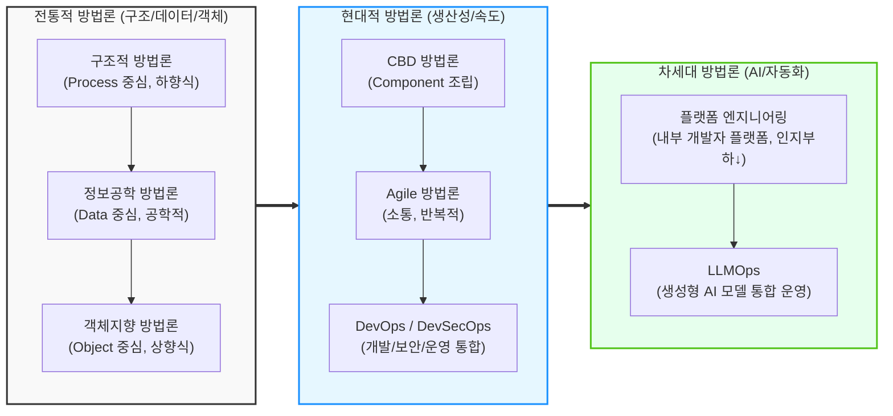

# 소프트웨어 개발 방법론
## I. 비즈니스 가치 창출의 기반, 소프트웨어 개발 방법론의 개요

### 가. 소프트웨어 개발 방법론의 정의

* 소프트웨어 개발 생명주기([[SDLC]]) 전 과정에 걸쳐 작업 절차, 방법, 산출물, 기법, 도구 등을 체계적으로 정리하고 표준화한 공학적 기법
* 주먹구구식 개발(Build & Fix)로 인한 소프트웨어 위기(Software Crisis)를 극복하고 고품질의 소프트웨어를 적기에 인도하기 위한 체계적 접근법

### 나. 소프트웨어 개발 방법론의 필요성 및 특징

* **필요성**: 프로젝트 가시성 확보, 개발 생산성 향상, 일정 및 비용의 예측 가능성 증대, 산출물 표준화를 통한 유지보수성 강화
* **특징**: 기술 패러다임 변화에 따라 [[프로세스]] 중심(구조적)에서 객체/컴포넌트 중심([[객체지향]]/CBD)을 거쳐, 속도와 협업 중심([[Agile]]/[[DevOps]]), 최근에는 AI 및 플랫폼 중심([[LLMOps]]/Platform Engineering)으로 지속 진화함

---

## II. 소프트웨어 개발 방법론의 진화 과정 및 핵심 기술 요소

### 가. 소프트웨어 개발 방법론의 진화 과정 (개념도)

* 하드웨어 제약 극복에서 시작하여, 비즈니스 환경 변화에 신속히 대응하기 위한 속도 중심(Agile)으로 발전했으며, 최근 AI 기술과 개발자 경험(DX)을 중시하는 형태로 진화함

### 나. 소프트웨어 개발 방법론별 핵심 구성 요소

| 분류 | 방법론(키워드) | 세부 설명 |
| --- | --- | --- |
| **1세대** | **구조적 방법론** | 정형화된 분석 절차에 따라 사용자 요구사항을 파악, 하향식 함수 분할 (DFD, DD 활용) |
| **2세대** | **정보공학 방법론** | 정보시스템 구축을 위해 전사적 관점에서 데이터 중심으로 설계 ([[ISP (Information Strategy Plan)|ISP]], ERD 활용) |
| **3세대** | **객체지향 방법론** | 데이터와 프로세스를 캡슐화하여 객체 단위로 분할 및 상향식 조립 ([[UML]], 재사용성) |
| **4세대** | **CBD 방법론** | 독립적인 비즈니스 기능을 수행하는 컴포넌트(Component)를 식별 및 조립하여 생산성 극대화 |
| **5세대** | **Agile 방법론** | 문서보다 작동하는 SW, 계획 준수보다 변화 대응을 중시하는 점진적/반복적 개발 ([[SCRUM|Scrum]], Kanban) |
| **6세대** | **[[DevSecOps]]** | 개발(Dev), 보안(Sec), 운영(Ops)의 사일로를 허물고 CI/CD 파이프라인을 통한 자동화 및 지속 배포 |
| **최신** | **플랫폼 엔지니어링** | 내부 개발자 플랫폼(IDP)을 구축하여 개발자의 인지 부하를 줄이고 셀프서비스 기반의 개발 환경 제공 |
| **최신** | **LLMOps / AIOps** | 대규모 언어 모델([[초거대 언어 모델|LLM]])의 프롬프트 관리, 파인튜닝, RAG 통합 및 토큰 비용 최적화를 자동화하는 운영 체계 |

---

## III. 전통적 방법론과 최신 방법론의 비교 및 향후 전망

### 가. 폭포수(Waterfall), 애자일(Agile), LLMOps 개발 방법론 비교

| 비교 항목 | [[워터폴]] (Waterfall) | 애자일 (Agile) | LLMOps (차세대 AI 기반) |
| --- | --- | --- | --- |
| **핵심 가치** | 철저한 사전 계획, 완벽한 문서화 | 변화 대응, 고객 가치 조기 전달 | AI 모델 최적화, [[프롬프트 엔지니어링]] |
| **개발 주기** | 순차적, 일회성 배포 (수개월~수년) | 스프린트 단위 반복적 배포 (1~4주) | 데이터 실시간 유입 및 지속적 미세조정 |
| **주요 산출물** | 요구사항 정의서, 상세 설계서 | 동작하는 소프트웨어 모듈 | 파인튜닝된 가중치, 최적화된 프롬프트 템플릿 |
| **리스크 관리** | 후반부 테스트 집중으로 리스크 큼 | 매 이터레이션 리뷰를 통해 리스크 분산 | 환각(Hallucination) 모니터링, 토큰 비용 통제 |

### 나. 소프트웨어 개발 방법론의 향후 전망 및 도입 전략

* **AI 주도 개발(AI-Driven Development)의 가속화**: GitHub Copilot 등 AI 코딩 어시스턴트의 대중화로 단순 코딩 중심에서 아키텍처 설계 및 프롬프트 엔지니어링 중심으로 개발자 역할 변화 예상
* **개발자 경험(DevEx) 향상**: 복잡해지는 [[클라우드 네이티브]] 환경([[MSA (Micro Service Architecture)|MSA]], K8s)에서 개발자의 인지 부하(Cognitive Load)를 줄이기 위해, 표준화된 툴체인을 제공하는 플랫폼 엔지니어링(Platform Engineering) 도입이 필수 기업 경쟁력으로 대두됨
* **지속적 규제 준수(Continuous Compliance)**: LLM 등 AI 모델 활용 시 데이터 프라이버시, 저작권, 보안 취약점 문제가 대두됨에 따라, 파이프라인 내에 AI 거버넌스와 자동화된 보안 검증(DevSecOps)을 내재화하는 융합 방법론으로 발전 중

---

### 🔗 연관 토픽

- **소속 도메인**: [[00_소프트웨어공학_MOC|🏗️ 소프트웨어공학]]
- **세부 분류**: `1. 소프트웨어 개발 생명주기(SDLC) & 방법론`
- **핵심 연관 토픽**:
  - [[Agile]]
  - [[SDLC]]
  - [[클라우드 네이티브]]
  - [[DevOps|데브옵스 (DevOps)]]
  - [[DevSecOps]]
