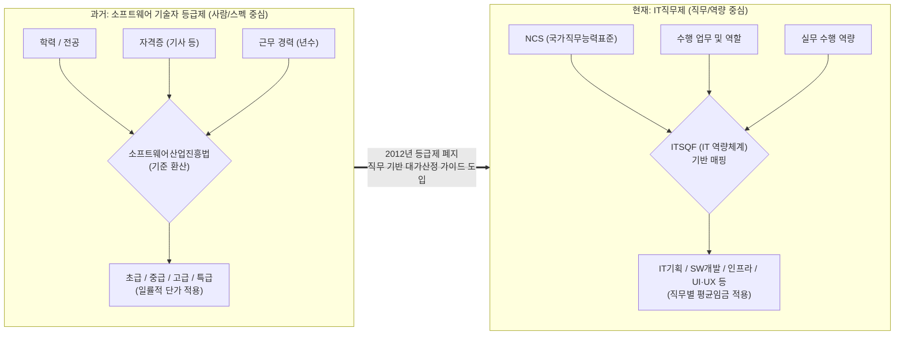

# 소프트웨어 기술자 등급제와 IT직무제

---

## I. SW 역량 평가 패러다임 전환, 소프트웨어 기술자 등급제와 IT직무제의 개요

### 가. 기술자 등급제와 IT직무제의 정의

* **기술자 등급제**: SW 기술자의 역량을 학력, 경력, 자격증만을 기준으로 초급, 중급, 고급, 특급으로 일률적으로 분류하여 대가를 산정하던 폐지된 제도
* **IT직무제**: ITSQF(IT분야 역량체계) 및 NCS(국가직무능력표준)를 기반으로, 기술자가 실제 수행하는 '업무 내용(직무)'과 '역량 수준'을 기준으로 평가하고 정당한 대가를 산정하는 체계

### 나. 패러다임 전환 배경 및 특징

* **등장배경**: 기존 등급제가 가진 실제 실무 능력과의 괴리 한계 극복, 스펙(학위/자격) 중심의 불합리한 임금 체계 개편, 전문성 기반의 공정한 시장 환경 조성 필요
* **특징**: '사람(Who)'의 스펙 중심에서 '업무(What)' 중심의 가치 평가로 전환, 한국소프트웨어산업협회(KOSA)의 직무별 평균임금 공표 체계 적용

---

## II. 등급제에서 IT직무제로의 전환 구조 및 핵심 요소

### 가. 평가 체계 전환 개념도

* 스펙을 기계적으로 환산하여 등급을 매기던 방식에서, 기술자가 프로젝트 내에서 실제로 어떤 역할을 수행하는지에 따라 대가를 지급하는 직무 기반 모델로 전환됨

### 나. IT직무제의 핵심 구성 요소

| 구분 | 요소기술(키워드) | 세부 설명 |
| --- | --- | --- |
| **기준 체계** | **ITSQF** | IT분야 산업현장의 직무를 능력 단위로 분류하고 수준별로 체계화한 IT분야 역량체계 |
| **기준 체계** | **NCS 매핑** | 국가직무능력표준(NCS)과 연계하여 직무별 요구되는 지식, 기술, 태도를 객관화 |
| **직무 분류** | **SW 직무 정의서** | IT기획, SW아키텍트, UI/UX, 정보보안, IT컨설턴트 등 산업계 기반의 세분화된 직무 분류 |
| **대가 산정** | **직무별 평균임금** | KOSA(한국소프트웨어산업협회)에서 매년 실태조사를 거쳐 공표하는 직무별 1일 평균임금 |
| **적용 기준** | **[[SW사업 대가산정 가이드]]** | 공공 및 민간 프로젝트 발주 시, 투입 인력의 직무를 기준으로 M/M(Man/Month) 및 인건비를 산정하는 지침 |
| **경력 개발** | **CDP (경력개발경로)** | 단순 연차 누적이 아닌, 직무 전문성 향상 및 타 직무로의 전환을 위한 역량 중심의 성장 경로 제시 |

---

## III. 등급제와 IT직무제 비교 및 성공적 정착 방안

### 가. 기술자 등급제와 IT직무제 비교

| 비교 항목 | 소프트웨어 기술자 등급제 (과거) | IT직무제 (현재/미래) |
| --- | --- | --- |
| **평가 기준** | 학력, 자격증, 근무 경력 (스펙) | 프로젝트 내 실제 수행 역할 및 업무 역량 |
| **분류 체계** | 초급, 중급, 고급, 특급 | IT기획, SW개발, 인프라 구축 등 세부 직무 |
| **포커스** | **Who** (어떤 스펙을 가진 사람인가?) | **What** (어떤 업무를 수행하는가?) |
| **대가 산정** | 등급별 획일적 기준 단가 곱하기 투입 기간 | 직무별 평균임금 기반의 난이도/전문성 반영 |
| **한계점** | 실무 능력 미반영, 고졸/비전공자 차별 발생 | 현장(발주자)의 과거 등급제 관행(초/중/고급) 잔존 |

### 나. IT직무제의 향후 과제 및 정착 방안

* **신기술 직무의 신속한 현행화**: AI 엔지니어, 프롬프트 엔지니어, 클라우드 아키텍트 등 급변하는 IT 트렌드를 반영한 신규 직무 신설 및 ITSQF 편입 지속 추진 필요
* **공공발주 관행 개선 및 민간 확산**: 공공사업 제안요청서(RFP) 상에 여전히 남아있는 '고급 N명' 등의 편법적 요구사항을 강력히 통제하고, 직무 기반 제안 및 평가 모니터링 강화
* **역량 검증 체계 고도화**: 자격증이나 연차가 아닌, 코딩 테스트, 포트폴리오, 직무 수행 이력 중심의 객관적이고 다각적인 역량 검증 체계(오픈 배지 등) 정착 유도

---

### 🔗 연관 토픽

- **소속 도메인**: [[00_프로젝트관리_MOC|📋 프로젝트관리]]
- **세부 분류**: `3. 소프트웨어 원가 산정 & 성과 관리 (Cost & EVM)`
- **핵심 연관 토픽**:
  - [[SW사업 대가산정 가이드]]
  - [[01_IT Tech/MVP]]
  - [[품질관리]]
  - [[페어 프로그래밍|페어 프로그래밍 (Pair Programming)]]
  - [[경제성 분석 기법]]
