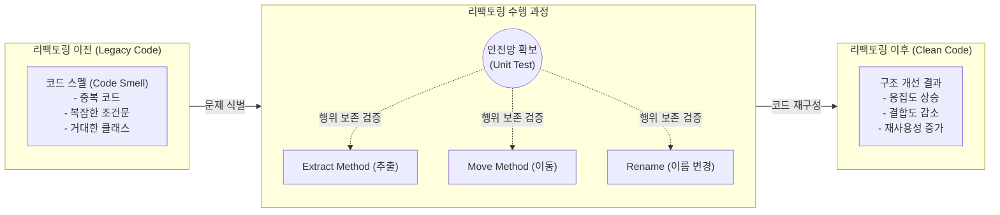

# 소프트웨어 리팩토링

---

## I. 기술 부채 상환의 핵심, 소프트웨어 리팩토링의 개요

### 가. 소프트웨어 리팩토링의 정의

* 소프트웨어의 외부 동작(기능)은 그대로 유지하면서 내부 구조를 개선하여 코드의 가독성, 이해도, 유지보수성을 향상시키는 소프트웨어 공학 기법
* 나쁜 냄새(Code Smell)가 나는 코드를 찾아 [[결합도]](Coupling)를 낮추고 [[응집도]](Cohesion)를 높여 클린 코드(Clean Code)로 변환하는 점진적 개선 과정

### 나. 소프트웨어 리팩토링의 등장배경 및 특징

* **등장배경**: 지속적인 기능 추가에 따른 시스템 복잡도 증가, 코드 부패(Code Decay) 및 [[기술 부채]](Technical Debt) 누적, 애자일([[Agile]]) 개발 확산
* **특징**: 외부 행위 불변([[단위 테스트]] 기반 검증), 점진적 구조 개선, 코드 스멜 제거, 소프트웨어 수명 연장 및 [[유지보수]] 비용 절감

---

## II. 소프트웨어 리팩토링의 개념도 및 핵심 기술 요소

### 가. 소프트웨어 리팩토링의 개념도 및 동작 원리

* **동작 원리**: 단위 테스트(Unit Test)를 안전망(Safety Net)으로 구축하여 외부 기능 변경이 없음을 보장한 상태에서, 설계상 결함(Code Smell)을 식별하고 개선 기법을 적용함

### 나. 소프트웨어 리팩토링의 핵심 기술 요소

| 분류 | 요소기술(키워드) | 세부 설명 |
| --- | --- | --- |
| **식별 대상(Code Smell)** | **Duplicated Code** | 동일하거나 유사한 코드 구조가 여러 곳에 반복적으로 존재하는 현상 |
| **식별 대상(Code Smell)** | **Long Method/Class** | 메서드나 클래스의 길이가 너무 길어 단일 책임 원칙(SRP)을 위배하는 상태 |
| **주요 기법** | **Extract Method** | 코드의 일부분을 논리적으로 묶어 별도의 새로운 메서드로 추출하여 가독성 확보 |
| **주요 기법** | **Replace Conditionalwith [[다형성|Polymorphism]]** | 복잡한 조건문(if-else, switch)을 객체지향의 다형성(Polymorphism)을 활용해 재구성 |
| **주요 기법** | **Pull Up / Push Down** | 상속 구조에서 공통 필드나 메서드를 상위 클래스로 올리거나(Pull Up) 하위로 내림(Push Down) |
| **주요 기법** | **Rename Variable** | 변수, 메서드, 클래스의 목적과 의도가 명확히 드러나도록 직관적인 이름으로 변경 |
| **검증 도구** | **xUnit (JUnit 등)** | 리팩토링 전후의 기능이 동일함을 보장하기 위한 자동화된 단위 테스트 [[프레임워크]] |
| **통합 도구** | **Static Analysis** | SonarQube 등을 활용하여 소스코드의 취약점, 버그, 코드 스멜을 정적 분석으로 자동 식별 |

---

## III. 소프트웨어 리팩토링과 재공학 비교 및 최신 동향

### 가. 소프트웨어 리팩토링과 재공학(Re-engineering) 비교

| 비교 항목 | 소프트웨어 리팩토링 (Refactoring) | 소프트웨어 재공학 (Re-engineering) |
| --- | --- | --- |
| **주요 목적** | **내부 구조 개선** 및 코드 가독성 향상 | **전체 시스템의 현대화** (아키텍처, 플랫폼 전환) |
| **외부 동작** | 절대 변하지 않음 (기능 불변) | 시스템 현대화 과정에서 기능 변경/추가 가능 |
| **수행 규모** | 마이크로(Micro) 수준 (메서드, [[클래스]] 단위) | 매크로(Macro) 수준 (시스템, 아키텍처 단위) |
| **수행 주기** | 개발 과정 중 지속적, 반복적 (상시 수행) | 프로젝트 단위의 일회성, 대규모 수행 |
| **적용 기법** | 메서드 추출, 변수명 변경, [[디자인 패턴]] 적용 | 역공학(Reverse Eng.), 순공학(Forward Eng.) |

### 나. 소프트웨어 리팩토링의 향후 전망 및 트렌드

* **AI/[[초거대 언어 모델|LLM]] 기반 리팩토링 자동화**: GitHub Copilot, ChatGPT 등 생성형 AI를 활용하여 레거시 코드의 악취(Code Smell)를 자동 분석하고, 모던 언어 및 프레임워크에 맞는 리팩토링 코드를 즉시 제안받는 **AI-Assisted Refactoring** 트렌드 가속화
* **CI/CD 파이프라인 내 Shift-Left 내재화**: [[정적 분석 도구]](SonarQube)와 CI/CD 도구(Jenkins, GitHub Actions)를 결합하여 코드 커밋(Commit) 단계에서 기술 부채 증가를 자동 차단하고 지속적 코드 품질 개선(Continuous Code Quality)을 강제하는 문화 확산

---

### 🔗 연관 토픽

- **소속 도메인**: [[00_소프트웨어공학_MOC|🏗️ 소프트웨어공학]]
- **세부 분류**: `4. 아키텍처 스타일 & 객체지향 설계 원리`
- **핵심 연관 토픽**:
  - [[프레임워크]]
  - [[결합도]]
  - [[다형성|다형성 (Polymorphism)]]
  - [[응집도]]
  - [[단위 테스트]]
