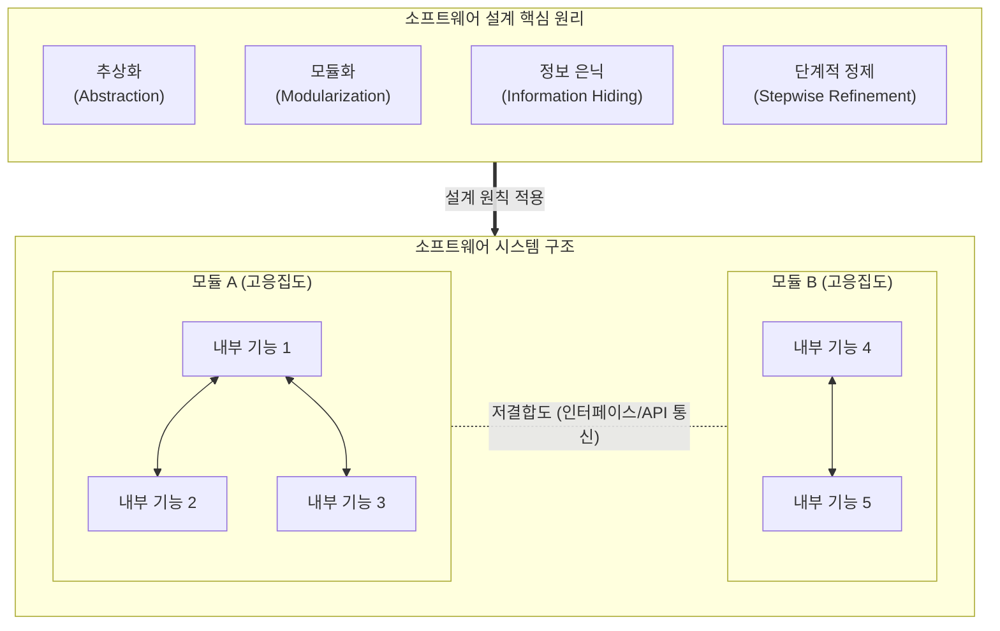

# 소프트웨어 설계의 원리

---

## I. 고품질 SW 구현의 이정표, 소프트웨어 설계의 원리의 개요

### 가. 소프트웨어 설계의 원리의 정의

* 사용자 요구사항을 충족하는 고품질의 소프트웨어를 구현하기 위해, 복잡도를 통제하고 유지보수성을 극대화하기 위한 공학적 설계 지침 및 기준
* '분할과 정복(Divide and Conquer)' 철학을 바탕으로 시스템을 독립적인 모듈로 분리하고 상호작용을 최소화하는 아키텍처 구성 원칙

### 나. 소프트웨어 설계 원리의 필요성 및 특징

* **필요성**: 시스템 복잡성 통제, 코드 가독성 향상, 장애 전파(Cascading Failure) 방지, 요구사항 변경에 대한 유연한 대응(Agility) 확보
* **특징**: [[모듈화]] 중심(고응집도/저결합도), 추상화 및 정보 은닉을 통한 보안/독립성 확보, 최신 [[MSA (Micro Service Architecture)|MSA]] 및 [[DDD (Domain Driven Design)|DDD]](Domain-Driven Design) 아키텍처 설계의 근간으로 진화

---

## II. 소프트웨어 설계 원리의 개념도 및 핵심 기술 요소

### 가. 소프트웨어 설계 원리의 개념도 및 동작 원리

* 시스템 전체를 관통하는 핵심 설계 원리를 적용하여, 모듈 내부의 관련성은 극대화(High Cohesion)하고 모듈 간의 의존성은 최소화(Low Coupling)하는 독립적 구조 완성

### 나. 소프트웨어 설계의 핵심 구성 요소

| 구분 | 요소기술(키워드) | 세부 설명 |
| --- | --- | --- |
| **복잡도 제어** | **[[추상화|추상화 (Abstraction)]]** | 복잡한 문제나 시스템을 핵심적인 개념(제어, 데이터, 과정)만 추출하여 단순화하는 기법 |
| **보안/독립성** | **정보 은닉 (Info. Hiding)** | 모듈 내부의 데이터와 상세 구현을 외부로부터 숨기고, 제한된 인터페이스만 노출 (블랙박스화) |
| **구조 분할** | **모듈화 (Modularization)** | 전체 시스템을 독립적으로 컴파일 및 실행 가능한 모듈 단위로 나누는 분할과 정복 기법 |
| **상호 의존성** | **[[결합도]] (Coupling)** | 모듈 간 상호 의존하는 정도 (낮을수록 좋음: 자료 < 스탬프 < 제어 < 외부 < 공통 < 내용 결합도) |
| **내부 연관성** | **[[응집도]] (Cohesion)** | 모듈 내부 구성 요소 간의 밀접한 연관 정도 (높을수록 좋음: 기능 > 순차 > 교환 > 절차 > 시간 > 논리 > 우연 응집도) |
| **구체화** | **단계적 정제 (Refinement)** | 상위의 추상적 개념에서 하위의 구체적 사항으로 하향식(Top-Down) 분할 및 구체화 수행 |
| **[[객체지향]] 설계** | **SOLID 원칙** | 단일책임(SRP), 개방폐쇄(OCP), 리스코프치환(LSP), 인터페이스분리([[ISP (Information Strategy Plan)|ISP]]), 의존성역전(DIP)의 5대 설계 원칙 |
| **생산성** | **재사용성 (Reusability)** | 검증된 기존 모듈(함수, [[클래스]], 컴포넌트)을 새로운 설계에 적용하여 개발 시간 단축 및 품질 확보 |

---

## III. 소프트웨어 설계 패러다임의 진화 및 최신 동향

### 가. 전통적 설계 원리와 현대적(Cloud-Native) 설계 원리 비교

| 비교 항목 | 전통적 설계 원리 (구조적/객체지향) | 현대적 설계 원리 (Cloud-Native / MSA) |
| --- | --- | --- |
| **핵심 사상** | 탑다운(Top-down) 분할, 클래스/함수 [[재사용]] | 마이크로서비스 간의 독립성, 분산 시스템 |
| **모듈 단위** | 함수 (Function), 객체 (Object), 컴포넌트 | [[컨테이너|컨테이너 (Container)]], 서비스 (Service) |
| **통신 방식** | [[프로세스]] 내부 호출, 공유 메모리 | API 기반 네트워크 통신 (REST, gRPC) |
| **설계 방법론** | 구조적 프로그래밍, CBD | 도메인 주도 설계 (DDD: Domain-Driven Design) |
| **결합도/응집도** | 코드 레벨의 의존성 관리 | DB 분리 및 서비스 간의 독립적 배포 단위 관리 |

### 나. 설계 원리의 향후 전망 및 산업 적용 방향

* **DDD(Domain-Driven Design)의 보편화**: 비즈니스 도메인 중심으로 응집도를 극대화하고 Bounded Context를 통해 모듈 간 결합도를 최소화하여 마이크로서비스(MSA) 설계의 표준 지침으로 활용됨
* **AI-Assisted Design (AI 주도 설계)**: 단순한 코드 생성을 넘어, [[초거대 언어 모델|LLM]] 및 생성형 AI를 활용하여 [[소프트웨어 아키텍처]] 초안 작성, 의존성(Coupling) 분석, 안티패턴(Anti-pattern) 자동 식별 등 설계 자동화 패러다임 확산
* **보안 내재화 설계 (Secure by Design)**: 제로 트러스트([[제로 트러스트 보안모델|Zero Trust]]) 환경에 맞추어 기획 및 설계 단계부터 [[위협 모델링]](Threat Modeling)을 적용하고 프라이버시를 고려하는 Shift-Left 기반 설계 원칙 부각

---

### 🔗 연관 토픽

- **소속 도메인**: [[00_소프트웨어공학_MOC|🏗️ 소프트웨어공학]]
- **세부 분류**: `3. 요구사항 공학 & UML 객체지향 분석/설계`
- **핵심 연관 토픽**:
  - [[클래스]]
  - [[추상화|추상화 (Abstraction)]]
  - [[객체지향]]
  - [[MSA (Micro Service Architecture)]]
  - [[재사용]]
