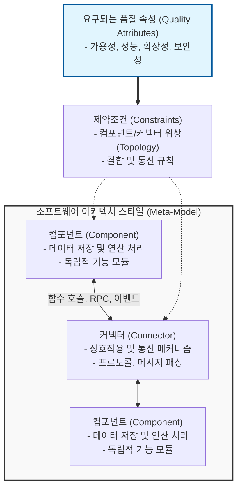

# 소프트웨어 아키텍처 스타일

---

## I. 시스템 설계의 나침반, 소프트웨어 아키텍처 스타일의 개요

* **정의**: 소프트웨어 시스템의 구조를 체계적으로 구성하기 위해 반복적으로 나타나는 설계 문제를 해결하는 검증된 추상적 아키텍처 패턴이자 구조적 틀
* 목표 시스템의 품질 속성(Quality Attribute)을 달성하기 위해 시스템을 구성하는 요소(컴포넌트, 커넥터)와 이들 간의 위상(Topology), 제약조건을 명세함
* **특징**: 품질 속성 보장(성능, 보안, 유지보수성 등), 설계 재사용성 증대, 이해관계자 간 의사소통 기준 제공, 시스템 복잡도 통제 및 관심사의 분리(SoC)

---

## II. 소프트웨어 아키텍처 스타일의 개념도 및 핵심 유형

### 가. 소프트웨어 아키텍처 메타 모델 및 구성도

* 요구되는 품질 속성을 기반으로 제약조건을 수립하고, 이에 맞춰 컴포넌트와 커넥터의 결합 위상을 결정하여 최적의 목표 아키텍처 도출

### 나. 주요 소프트웨어 아키텍처 스타일 유형 및 특징

| 분류 | 아키텍처 스타일(키워드) | 세부 설명 |
| --- | --- | --- |
| **데이터 중심** | 리포지토리 (Repository) | - 중앙 집중형 데이터 저장소를 여러 서브시스템이 공유하여 통신 ([[DBMS]] 중심) |
| **데이터 중심** | 블랙보드 (Blackboard) | - 미해결 복잡 문제(음성인식, AI 등) 해결을 위해 다수의 지식 소스가 협력 및 데이터 공유 |
| **데이터 흐름** | 파이프-필터 (Pipe & Filter) | - 데이터 스트림을 필터(연산/가공)와 파이프(데이터 전달)를 통해 순차적으로 처리 |
| **데이터 흐름** | 일괄 순차 (Batch Sequential) | - 독립적인 서브시스템들이 순차적으로 실행되며, 디스크 파일 형태로 데이터를 전달 |
| **호출-반환** | 계층형 (Layered Architecture) | - 시스템을 N개의 계층으로 분할하여 관심사를 분리하고, 인접 계층 간에만 통신 허용 |
| **호출-반환** | MVC (Model-View-Controller) | - 데이터(M), UI(V), 제어(C)로 분리하여 사용자 인터페이스 상호작용과 비즈니스 로직 분리 |
| **독립 컴포넌트** | 이벤트 기반 (Event-Driven) | - 직접 호출 없이 이벤트 발행(Publish)과 구독(Subscribe)을 통한 비동기적 디커플링 통신 |
| **분산 서비스** | 마이크로서비스 ([[MSA (Micro Service Architecture)|MSA]]) | - 독립적 배포가 가능한 소규모 비즈니스 도메인 중심 서비스의 조합 (REST API 등 활용) |

---

## III. 주요 아키텍처 스타일 비교 및 발전 동향

### 가. 주요 아키텍처 스타일 간 비교

| 비교 항목 | 계층형 (Layered) | 파이프-필터 (Pipe & Filter) | 이벤트 기반 (Event-Driven) | 마이크로서비스 (MSA) |
| --- | --- | --- | --- | --- |
| **설계 패러다임** | 관심사의 수직적 분리 | 데이터의 순차적 가공 | 비동기 상태 변화 반응 | 비즈니스 도메인 분리 |
| **[[결합도]]** | 인접 계층 간 강결합 | 파이프라인 간 약결합 | 발행-구독 간 초약결합 | 서비스 간 API 약결합 |
| **확장성** | 수직 확장(Scale-up) 용이 | 단위 필터별 병렬 확장 | 이벤트 브로커 기반 확장 | 수평 확장(Scale-out) 최적화 |
| **주요 적용 사례** | 전통적 모놀리식 웹 서버 | 컴파일러, 빅데이터 ETL | 실시간 IoT, 금융 [[트랜잭션]] | 대용량 [[클라우드 네이티브]] 서비스 |

### 나. 소프트웨어 아키텍처 스타일의 발전 동향 및 고려사항

* **클라우드 네이티브 아키텍처로의 진화**: 단일 아키텍처 스타일의 한계를 극복하기 위해 MSA, Event-Driven, Serverless 스타일을 융합한 복합 아키텍처(Hybrid Architecture) 도입 가속화
* **컴포저블 비즈니스(Composable Business) 대응**: 변화하는 비즈니스 환경에 민첩하게 대응하기 위해, [[재사용]] 가능한 팩키지형 비즈니스 역량(PBC) 단위로 아키텍처를 조립하는 API 중심 설계 부상
* **아키텍처 선정 시 고려사항**: 시스템의 비즈니스 목적(Time-to-Market 등), 조직의 기술 성숙도(Conway's Law), 트랜잭션 규모를 종합적으로 평가하여 아키텍처 트레이드오프(Trade-off) 분석([[ATAM]] 등) 선행 필수

---

### 🔗 연관 토픽

- **소속 도메인**: [[00_소프트웨어공학_MOC|🏗️ 소프트웨어공학]]
- **세부 분류**: `4. 아키텍처 스타일 & 객체지향 설계 원리`
- **핵심 연관 토픽**:
  - [[MSA (Micro Service Architecture)]]
  - [[결합도]]
  - [[재사용]]
  - [[ATAM]]
  - [[프레임워크]]
