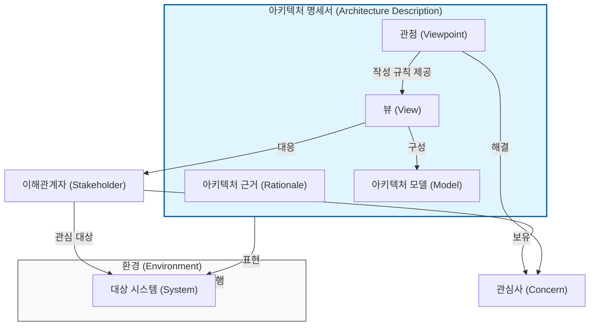

# 소프트웨어 아키텍처

---

## I. 비즈니스와 IT 정렬의 청사진, 소프트웨어 아키텍처의 개요

### 가. 소프트웨어 아키텍처의 정의

* 시스템을 구성하는 주요 소프트웨어 컴포넌트, 이들 간의 관계(Connector), 외부 환경과의 상호작용 및 설계/진화 원칙을 정의한 최고 수준의 시스템 구조
* 다양한 이해관계자(Stakeholder)의 품질 속성(Quality Attribute) 요구사항을 충족하기 위한 초기 설계 결정의 집합체 (관련 표준: ISO/IEC 42010)

### 나. 소프트웨어 아키텍처의 역할 및 특징

* **의사소통 수단**: 복잡한 시스템에 대해 다양한 이해관계자 간의 원활한 합의 및 의사소통 도구 제공
* **초기 설계 결정**: 성능, [[HA(High Availability)|가용성]], 보안 등 비기능적 요구사항(NFR) 달성 여부를 결정짓는 가장 중요한 설계 단계
* **재사용성 및 제약**: 컴포넌트, [[프레임워크]], 패턴의 재사용성을 높이고 하위 설계 및 구현에 대한 구조적 제약(Constraint) 제시

---

## II. 소프트웨어 아키텍처 프레임워크 및 핵심 구성요소

### 가. 소프트웨어 아키텍처 메타모델 개념도 (ISO/IEC 42010 기반)

* 이해관계자의 다양한 관심사(성능, 보안, 기능 등)를 식별하고, 관점(Viewpoint)에 따라 뷰(View)와 모델(Model)을 생성하여 전체 시스템 구조를 명세함

### 나. 소프트웨어 아키텍처의 핵심 구성요소

| 구분 | 핵심 요소(키워드) | 세부 설명 |
| --- | --- | --- |
| **개념적 요소** | **이해관계자 (Stakeholder)** | 사용자, 개발자, 관리자 등 시스템 개발에 직/간접적인 이해관계를 갖는 개인이나 그룹 |
| **개념적 요소** | **관심사 (Concern)** | 성능, 유지보수성, 보안 등 이해관계자가 시스템에 대해 중요하게 생각하는 비기능적/기능적 목표 |
| **명세 요소** | **관점 (Viewpoint)** | 특정 관심사를 다루기 위해 뷰를 구성하는 규칙, 패턴, 템플릿의 집합 (예: 4+1 View Model의 논리/물리 관점) |
| **명세 요소** | **뷰 (View)** | 특정 관점(Viewpoint)에 따라 전체 시스템 아키텍처를 표현한 결과물 (예: 배포 다이어그램, [[클래스 다이어그램]]) |
| **구조 요소** | **컴포넌트 (Component)** | 명확한 인터페이스를 가지며 독립적으로 배포 및 실행 가능한 소프트웨어 구성 단위 |
| **구조 요소** | **커넥터 (Connector)** | 컴포넌트 간의 데이터 흐름, 제어 흐름, [[프로토콜]] 등 상호작용 및 통신 메커니즘을 [[추상화]] |
| **설계 원칙** | **품질 속성 (Quality Attribute)** | 가용성, 확장성, 보안성 등 아키텍처가 반드시 달성해야 하는 정량적/정성적 목표 기준 |
| **설계 원칙** | **근거 (Rationale)** | 여러 아키텍처 대안 중 특정 설계 결정(Design Decision)을 선택한 이유와 트레이드오프(Trade-off) 분석 결과 |

---

## III. 아키텍처 패러다임 진화 및 최신 동향

### 가. 소프트웨어 아키텍처 패러다임의 진화 비교

| 비교 항목 | 모놀리식 (Monolithic) | 마이크로서비스 ([[MSA (Micro Service Architecture)|MSA]]) | 컴포저블 아키텍처 (MACH) |
| --- | --- | --- | --- |
| **아키텍처 구조** | 단일 코드베이스 및 배포 단위 | 비즈니스 도메인 단위 분산 서비스 | [[재사용]] 가능한 PBC(패키지형 비즈니스 역량) 조립 |
| **[[결합도]]** | 내부 모듈 간 강결합 | API 기반 약결합 | API-First 기반 초약결합(Decoupled) |
| **확장 방식** | 시스템 전체 스케일 아웃(Scale-out) | 특정 서비스 단위 개별 스케일 아웃 | [[클라우드 네이티브]] 기반 동적 확장 |
| **주요 특징** | 개발 초기 속도 빠름, 복잡도 증가 | 장애 격리(Fault Tolerance), 폴리글랏 | 헤드리스(Headless) 프론트엔드, 민첩성 극대화 |

### 나. 소프트웨어 아키텍처 최신 동향 및 향후 전망

* **진화적 아키텍처 (Evolutionary Architecture)**: 비즈니스 변화에 맞춰 아키텍처가 지속적으로 진화할 수 있도록, 피트니스 함수(Fitness Function)를 도입하여 아키텍처의 품질 속성(성능, 결합도 등)을 자동화된 테스트로 상시 검증
* **아키텍처 코드화 (AaC, Architecture as Code)**: C4 Model, Structurizr 등을 활용하여 아키텍처 다이어그램과 명세서를 코드로 작성하여 CI/CD 파이프라인에 통합 및 버전 관리(GitOps) 수행
* **AI 기반 아키텍처 설계 (AI-Assisted Architecture)**: 생성형 AI([[초거대 언어 모델|LLM]])를 활용하여 도메인 지식을 바탕으로 초기 아키텍처 후보를 자동 생성하고, 보안 취약점 및 안티패턴(Anti-pattern)을 식별하는 아키텍트 보조 도구 활용 가속화

---

### 🔗 연관 토픽

- **소속 도메인**: [[00_소프트웨어공학_MOC|🏗️ 소프트웨어공학]]
- **세부 분류**: `1. 소프트웨어 개발 생명주기(SDLC) & 방법론`
- **핵심 연관 토픽**:
  - [[프레임워크]]
  - [[MSA (Micro Service Architecture)]]
  - [[재사용]]
  - [[추상화|추상화 (Abstraction)]]
  - [[결합도]]
