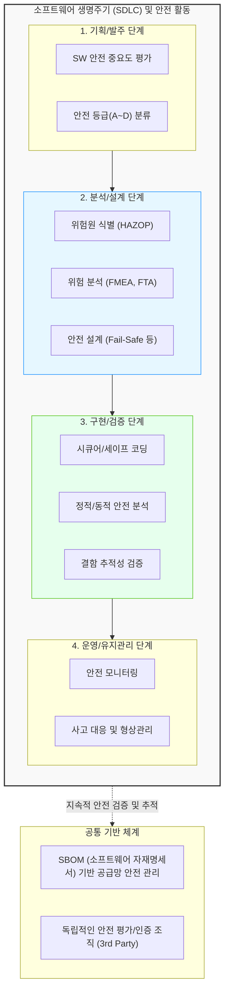

# 소프트웨어 안전 확보를 위한 지침

---

## I. 국민의 생명과 재산 보호, 소프트웨어 안전 확보를 위한 지침의 개요

### 가. 소프트웨어 안전 확보를 위한 지침의 정의

* 공공 및 산업 분야에서 소프트웨어 결함이나 오작동으로 인한 인명, 신체, 재산상의 피해를 예방하기 위해 [[SDLC]](소프트웨어 생명주기) 전반에 걸쳐 준수해야 할 기준과 절차를 규정한 가이드라인
* 법적 근거: 「소프트웨어 진흥법」 제30조(소프트웨어의 안전 확보) 및 과학기술정보통신부 고시

### 나. 지침의 등장배경 및 특징

* **등장배경**: 모빌리티, 의료, 항공 등 사이버 물리 시스템([[CPS]]) 확산으로 SW 결함이 물리적 대형 참사로 직결되는 위험성 증가
* **특징**: SW 안전 등급 부여, 생명주기(기획-설계-구현-운영)별 안전 활동 의무화, 위험원 분석([[FMEA (Failure Mode and Effects Analysis)|FMEA]]/[[FTA (Fault Tree Analysis)|FTA]]) 기반의 선제적 결함 통제체계 확립

---

## II. 소프트웨어 안전 확보 체계 및 핵심 기술 요소

### 가. 소프트웨어 안전 확보 개념도 및 동작 원리

* 기획 단계에서 안전 등급을 산정하고, 위험 분석을 통한 안전 설계 지표를 구현 및 테스트 단계에서 양방향 추적성(Traceability) 맵을 통해 검증함

### 나. 소프트웨어 안전 확보 핵심 기술 및 구성 요소

| 구분 | 요소기술(키워드) | 세부 설명 |
| --- | --- | --- |
| **안전 등급** | **안전 중요도 분류** | 피해 규모(생명, 재산 등)에 따라 시스템을 4단계(특급, 고급, 중급, 초급)로 분류하여 안전 관리 수준 결정 |
| **위험 분석** | **FMEA / FTA** | 고장 유형 영향 분석(FMEA, 상향식) 및 결함 수 분석(FTA, 하향식)을 통한 잠재적 위험원 식별 |
| **안전 설계** | **Fail-Safe** | 부품이나 모듈에 결함이 발생하더라도 시스템이 안전한 상태(Safe State)를 유지하도록 설계 |
| **안전 설계** | **Fool-Proof** | 사용자의 비정상적인 조작이나 실수(Human Error)에도 치명적인 오작동이 발생하지 않도록 방어 설계 |
| **안전 구현** | **[[무결성]] 코딩 규칙** | MISRA-C 등 고신뢰성 코딩 표준 준수 및 안전에 위협이 되는 런타임 오류(오버플로우, 분모 0) 원천 차단 |
| **안전 검증** | **양방향 추적성 매트릭스** | 요구사항-설계-코드-테스트케이스 간 상호 추적성(Traceability Matrix)을 확보하여 안전 누락 방지 |
| **공급망 안전** | **[[SBOM]] (SW Bill of Materials)** | 오픈소스 및 서드파티 라이브러리의 취약점을 투명하게 관리하기 위한 소프트웨어 명세서 도입 |
| **운영 안전** | **형상 및 변경 통제** | 시스템 패치 및 업데이트 시 안전성에 미치는 영향을 재평가하는 [[리그레션 테스트|회귀 테스트]] 및 [[형상 관리]] |

---

## III. 소프트웨어 안전(Safety)과 보안(Security) 비교 및 향후 전망

### 가. 소프트웨어 안전(Safety)과 보안(Security)의 비교

| 비교 항목 | 소프트웨어 안전 (SW Safety) | 소프트웨어 보안 (SW Security) |
| --- | --- | --- |
| **핵심 목적** | 시스템의 결함으로부터 **사람과 환경을 보호** | 외부의 공격으로부터 **데이터와 시스템을 보호** |
| **위협의 주체** | 내부 결함, HW/SW 고장, 우발적 실수 (Accidental) | 해커, 악성코드 등 외부의 악의적 공격자 (Malicious) |
| **주요 기법** | 결함 허용(Fault Tolerance), 이중화, 기능 안전 | [[암호화]], 접근 통제, 침입 탐지, 시큐어 코딩 |
| **관련 표준** | [[IEC 61508]], [[ISO 26262]], SW 안전 확보 지침 | ISO 27001, [[ISMS-P]], SW 개발보안 가이드 |

### 나. 향후 전망 및 도입 동향

* **Safety와 Security의 융합 ([[DevSecOps]] + Safety)**: 지능형 커넥티드 카, 스마트 의료 기기 등에서는 해킹(보안 문제)이 곧 생명 위협(안전 문제)으로 직결되므로, 두 영역을 통합 설계하는 SAE J3061, ISO/SAE 21434 표준 적용 가속화
* **AI 기반 안전성 검증 자동화**: 생성형 AI와 정적 분석 툴을 결합하여, 방대한 코드 베이스에서 잠재적 안전 결함(Safety Flaws)을 예측하고 수정안을 자동 제시하는 AI-Assisted QA 기술 도입 확대
* **SBOM 기반 공급망 안전망 의무화**: 로그4j(Log4j) 사태 이후 공공 및 금융 핵심 시스템을 중심으로 SBOM 제출이 점진적 의무화되며, 외부 소프트웨어 의존성에서 비롯되는 안전 리스크 원천 차단 추진

---

### 🔗 연관 토픽

- **소속 도메인**: [[00_소프트웨어공학_MOC|🏗️ 소프트웨어공학]]
- **세부 분류**: `1. 소프트웨어 개발 생명주기(SDLC) & 방법론`
- **핵심 연관 토픽**:
  - [[형상 관리]]
  - [[SDLC]]
  - [[ISMS-P]]
  - [[SBOM]]
  - [[정적 분석 도구]]
