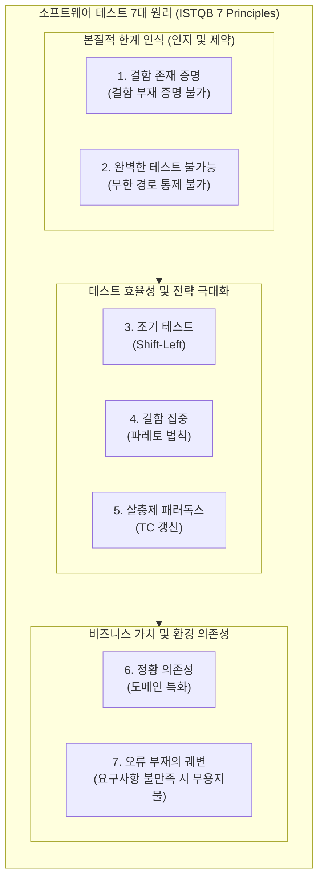

# 소프트웨어 테스트 원리 (Software Testing Principles)

---

## I. 고품질 소프트웨어 확보를 위한 결함 예방 및 검증의 기준, 테스트 원리의 개요

* **정의**: 소프트웨어 테스팅을 효과적이고 효율적으로 수행하기 위해, 수십 년간의 실무 경험과 이론을 바탕으로 ISTQB(국제 소프트웨어 테스팅 자격 검정 위원회)에서 제정한 7가지 핵심 가이드라인
* **필요성 및 배경**: 소프트웨어 복잡도 증가에 따른 완벽한 테스트의 현실적 불가능성 대두, 제한된 자원(시간, 비용) 내에서 테스트 효율성 극대화 및 결함 발견 확률 향상 요구
* **특징**: 테스터의 인지적 [[편향]] 방지, 리스크 기반 테스트(RBT)의 근거 제공, [[워터폴|폭포수]] 모델부터 애자일([[Agile]]) 환경까지 적용 가능한 보편적 [[프레임워크]]

---

## II. 소프트웨어 테스트 7대 원리의 개념도 및 핵심 구성 요소

### 가. 테스트 7대 원리의 아키텍처 및 연관 관계

* 소프트웨어 테스팅은 완벽함의 불가능성을 인정하는 것(한계 인식)에서 출발하며, 최적의 효율성을 위한 기법을 적용하고(전략 극대화), 최종적으로 사용자의 비즈니스 환경과 가치를 고려(정황 및 가치)해야 함

### 나. 소프트웨어 테스트 7대 핵심 원리

| 분류 | 원리명(키워드) | 세부 설명 |
| --- | --- | --- |
| **본질/한계** | 결함 존재 증명 | 테스트는 시스템에 결함이 '존재함'을 밝히는 활동이며, 테스트를 통과했다고 해서 결함이 100% 없음을 증명할 수는 없음 |
| **본질/한계** | 완벽한 테스트 불가능 | 모든 입력값의 조합과 실행 경로를 무한히 테스트하는 것은 불가능하므로, 리스크 분석과 우선순위를 통한 통제가 필요함 |
| **수행/시점** | 조기 테스트 (Early) | [[SDLC]](소프트웨어 생명주기) 초기 단계부터 테스트를 시작하여, 설계/요구사항 결함을 조기에 발견하고 수정 비용을 획기적으로 절감 |
| **분석/전략** | 결함 집중 (Clustering) | 발견된 결함의 대부분(80%)은 소수의 특정 핵심 모듈(20%)에 집중되어 발생함 (파레토 80:20 법칙 적용) |
| **설계/운영** | 살충제 패러독스 | 동일한 테스트 케이스(TC)를 반복 실행하면 새로운 결함을 찾을 수 없으므로, 정기적으로 TC를 리뷰하고 개선해야 함 |
| **환경/조직** | 정황 의존성 (Context) | 안전-필수 시스템(의료, 항공)과 일반 웹 시스템은 서로 다른 정황과 비중, 방법론으로 테스트해야 함 |
| **평가/가치** | 오류-부재의 궤변 | 시스템에 결함이 전혀 없더라도, 사용자의 비즈니스 요구사항과 목적을 충족하지 못하면 실패한 소프트웨어임 |

---

## III. 최신 개발 환경에서의 테스트 원리 적용 동향 및 시사점

### 가. 애자일 및 DevOps 환경에서의 테스트 원리 진화

| 원리명 | 기존 전통적(폭포수) 적용 방식 | 최신(Agile/[[DevOps]]/AI) 적용 동향 |
| --- | --- | --- |
| **조기 테스트** | 요구사항 명세 완료 후 테스트 계획 수립 | **Shift-Left 테스팅**: CI/CD 파이프라인 내 정적 분석 및 [[TDD]](테스트 주도 개발) 통합으로 즉각적 피드백 제공 |
| **살충제 패러독스** | QA 팀의 주기적인 수동 TC 리뷰 및 업데이트 | **AI 기반 TC 자동 생성 및 뮤테이션 테스팅**: [[초거대 언어 모델|LLM]] 및 기계학습을 활용하여 변형된 테스트 케이스를 자동 생성 및 실행 |
| **결함 집중** | 과거 경험 기반의 취약 모듈 수동 선별 테스트 | **예측적 결함 분석(Predictive Analytics)**: 코드 커밋 히스토리와 복잡도 지표를 AI로 분석하여 결함 발생 가능성 높은 모듈 자동 식별 |

### 나. 현장 적용을 위한 실무적 시사점

* **리스크 기반 테스팅(RBT) 체계의 내재화**: 완벽한 테스트 불가능 원리와 결함 집중 원리를 결합하여, 비즈니스 임팩트(Impact)와 발생 확률(Probability)이 높은 영역에 테스트 리소스를 최우선 할당
* **V&V (Verification and Validation)의 균형**: 명세서대로 만들어졌는지를 확인하는 검증(Verification)뿐만 아니라, '오류 부재의 궤변'을 막기 위해 실제 사용자의 의도를 충족하는지 확인하는 확인(Validation) 과정을 [[탐색적 테스트]] 등을 통해 강화해야 함

---

### 🔗 연관 토픽

- **소속 도메인**: [[00_소프트웨어공학_MOC|🏗️ 소프트웨어공학]]
- **세부 분류**: `2. 애자일(Agile) & 지속적 통합/배포(CI/CD)`
- **핵심 연관 토픽**:
  - [[TDD|TDD (Test Driven Development)]]
  - [[탐색적 테스트]]
  - [[소프트웨어 테스트|소프트웨어 테스트 (Software Test)]]
  - [[DevOps|데브옵스 (DevOps)]]
  - [[SDLC]]
