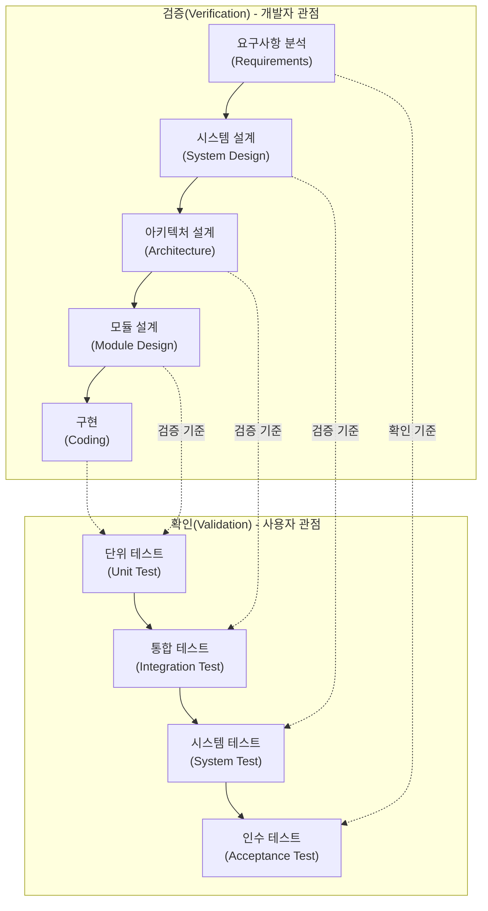

# 소프트웨어 테스트 (Software Test)

---

## I. 품질 확보를 위한 핵심 활동, 소프트웨어 테스트의 개요

* **정의**: 소프트웨어의 숨겨진 결함을 발견하고, 사용자 요구사항을 만족하는지 검증(Verification) 및 확인(Validation)하여 품질을 보증하는 일련의 엔지니어링 활동
* **목적 및 필요성**: 결함 조기 발견을 통한 수정 비용 최소화, 고품질 소프트웨어 인도, 사용자 [[신뢰성]] 확보 및 비즈니스 리스크 경감
* **최신 특징**: CI/CD 파이프라인과 결합된 지속적 테스트(Continuous Testing), 개발 초기 단계부터 개입하는 Shift-Left 테스팅, 생성형 AI를 활용한 테스트 자동화 도입

---

## II. 소프트웨어 테스트의 개념도 및 핵심 기술 요소

### 가. 소프트웨어 테스트 개념도 (V-모델 기반 V&V 체계)

* 개발 단계별 산출물을 기준으로 테스트 단계를 매핑하여, 개발자 관점의 검증(Verification)과 사용자 요구사항 관점의 확인(Validation)을 수행

### 나. 소프트웨어 테스트 핵심 기술 및 구성 요소

| 분류 | 핵심 기술 / 키워드 | 세부 설명 |
| --- | --- | --- |
| **테스트 기법 (명세)** | [[블랙박스 테스트]] (Black-box) | 내부 구조를 보지 않고 요구사항 명세 기반 테스트 (동등 분할, 경계값 분석, 상태 전이 등) |
| **테스트 기법 (구조)** | [[화이트박스 테스트]] (White-box) | 소스코드의 논리적 내부 구조를 검증 (구문, 결정, 조건, 다중 조건 커버리지 등) |
| **테스트 기법 (경험)** | [[탐색적 테스트]] (Exploratory) | 테스터의 경험과 직관(Heuristic)을 바탕으로 테스트 설계와 실행을 동시에 수행 |
| **[[소프트웨어 테스트 원리|테스트 원리]]** | 결함 집중 (Defect Clustering) | 파레토 법칙(80:20), 적은 수의 모듈에 대다수의 결함이 집중됨 |
| **테스트 원리** | 살충제 패러독스 (Pesticide Paradox) | 동일한 테스트 케이스 반복 시 새로운 결함 발견 불가, 주기적 리뷰 및 개선 필요 |
| **테스트 단계** | V-모델 테스트 레벨 | 단위(모듈) → 통합(인터페이스) → 시스템(기능/비기능) → 인수(알파/베타/사용자) |
| **소프트웨어 특성** | [[리그레션 테스트|회귀 테스트]] ([[Regression Test]]) | 오류 수정 또는 코드 변경 후, 기존 기능에 부작용(Side-effect)이 없는지 검증 |
| **테스트 자동화** | [[TDD]] / BDD | 테스트 주도 개발(TDD) 및 행위 주도 개발(BDD)을 통한 애자일([[Agile]]) 환경 품질 확보 |

---

## III. 소프트웨어 테스트 최신 트렌드 및 향후 전망

| 구분 | 주요 동향 및 기술 | 세부 설명 및 적용 방안 |
| --- | --- | --- |
| **[[프로세스]] 혁신** | Shift-Left 테스트 | 개발 생명주기([[SDLC]]) 초기 단계(요구사항, 설계)로 테스트를 앞당겨 결함 수정 비용을 획기적으로 절감 |
| **파이프라인 통합** | 지속적 테스트 (Continuous Testing) | [[DevSecOps]] 및 CI/CD 파이프라인에 테스트 자동화 도구(Selenium, JUnit 등)를 통합하여 상시 검증 |
| **AI 및 지능화** | 생성형 AI 기반 테스트 자동화 | [[초거대 언어 모델|LLM]](Large Language Model)을 활용하여 [[요구사항 명세서]] 기반 테스트 케이스, 자동화 스크립트, 더미 데이터 자동 생성 |
| **아키텍처 검증** | [[카오스 엔지니어링|카오스 엔지니어링 (Chaos Engineering)]] | 마이크로서비스([[MSA (Micro Service Architecture)|MSA]]) 환경에서 시스템에 의도적인 장애(결함)를 주입하여 회복 탄력성(Resiliency) 검증 (예: Chaos Monkey) |

* 단순 버그 발견을 넘어, AI 주도의 자율 테스트(Autonomous Testing) 및 코드 보안 취약점 조기 탐지(DevSecOps)로 테스트 패러다임 진화 중

---

### 🔗 연관 토픽

- **소속 도메인**: [[00_소프트웨어공학_MOC|🏗️ 소프트웨어공학]]
- **세부 분류**: `2. 애자일(Agile) & 지속적 통합/배포(CI/CD)`
- **핵심 연관 토픽**:
  - [[Regression Test]]
  - [[리그레션 테스트|리그레션(회귀, Regression) 테스트]]
  - [[탐색적 테스트]]
  - [[소프트웨어 테스트 원리|테스트 원리]]
  - [[TDD|TDD (Test Driven Development)]]
