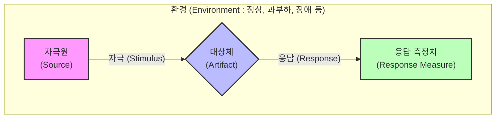

# 소프트웨어 품질 속성 시나리오

---
## I. 아키텍처 평가의 핵심 기준, 소프트웨어 품질 속성 시나리오의 개요

* **정의**: 시스템이 충족해야 하는 품질 속성(성능, 보안, [[HA(High Availability)|가용성]] 등) 요구사항을 구체적이고 측정 가능한 6가지 요소로 명세한 정형화된 아키텍처 평가 시나리오
* 모호한 비기능적 요구사항을 이해관계자가 합의할 수 있도록 정량적 수치로 구체화(예: "시스템이 빨라야 한다" -> "피크 타임에 [[응답시간]] 2초 이내")
* 특징: 비기능 요구사항의 정량화, [[ATAM]]/[[CBAM]] 등 아키텍처 평가의 핵심 기준 제공, 아키텍처 설계의 트레이드오프(Trade-off) 식별 도구

---

## II. 품질 속성 시나리오의 개념도 및 핵심 구성요소

### 가. 품질 속성 시나리오의 개념도 및 동작 원리

* 특정 환경에서 자극원이 대상체에 자극을 가했을 때, 아키텍처가 어떻게 응답하는지를 정량적인 측정치로 검증하는 메커니즘

### 나. 품질 속성 시나리오의 핵심 구성 요소

| 구분 | 핵심 기술(요소) | 세부 설명 |
| --- | --- | --- |
| **핵심 6요소** | 자극원 (Source) | 시스템에 자극을 발생시키는 주체 (예: 사용자, 외부 시스템, 해커 등) |
| **핵심 6요소** | 자극 (Stimulus) | 시스템에 도달하는 조건이나 이벤트 (예: [[트랜잭션]] 요청, 장애 발생, 악의적 공격) |
| **핵심 6요소** | 대상체 (Artifact) | 자극을 수신하고 처리하는 대상 (예: 전체 시스템, 특정 컴포넌트, 서버) |
| **핵심 6요소** | 환경 (Environment) | 자극이 발생했을 때 시스템의 상태 조건 (예: 평상시, 트래픽 과부하 시, 네트워크 단절 시) |
| **핵심 6요소** | 응답 (Response) | 자극이 도달한 후 시스템이 수행하는 반응 (예: [[프로세스]] 처리, 오류 로그 기록, 시스템 페일오버) |
| **핵심 6요소** | 응답 측정치 (Measure) | 응답의 달성 여부를 판단하는 정량적 평가 기준 (예: 응답시간 1초 이내, 가용성 99.9%, 복구시간 3분 이내) |
| **도출 기법** | [[유틸리티 트리|유틸리티 트리 (Utility Tree)]] | 시스템의 품질 속성을 최상위 노드로 하여 세부 시나리오로 구체화하는 계층적 구조 매핑 트리 |
| **활용 평가** | ATAM / CBAM | 도출된 시나리오를 바탕으로 아키텍처의 적합성을 평가(ATAM)하고 경제성/비용을 분석(CBAM) |

---

## III. 품질 속성 시나리오 vs 유스케이스(Use Case) 비교 및 최신 동향

### 가. 품질 속성 시나리오와 일반 요구사항(유스케이스) 비교

| 비교 항목 | 품질 속성 시나리오 (Quality Attribute Scenario) | 유스케이스 (Use Case) |
| --- | --- | --- |
| **명세 대상** | 비기능적 요구사항 (Non-functional) | 기능적 요구사항 (Functional) |
| **관심점** | 시스템이 **'얼마나 잘' (How well)** 동작하는가 | 시스템이 **'무엇을' (What)** 하는가 |
| **주요 구성** | 자극원, 자극, 대상체, 환경, 응답, 응답측정치 | 액터(Actor), 사전/사후조건, 기본/대안 흐름 |
| **검증 및 평가** | ATAM 평가, 스트레스 테스트, [[성능 테스트]] | 기능 [[단위 테스트]], [[인수 테스트]](UAT) |
| **아키텍처 영향** | 시스템 아키텍처 구조 결정에 지대한 영향을 미침 | 개별 컴포넌트 내부 로직 구현에 주로 영향 |

### 나. 품질 속성 시나리오의 최신 활용 동향

* **[[클라우드 네이티브]] 아키텍처 적용**: 마이크로서비스([[MSA (Micro Service Architecture)|MSA]]) 환경에서 탄력성(Resiliency)과 확장성(Scalability) 검증을 위한 [[카오스 엔지니어링]](Chaos Engineering) 시나리오 작성에 활용
* **AI/[[초거대 언어 모델|LLM]] 시스템 평가**: AI 기반 시스템 특성을 반영하여 응답 지연(Latency), 모델 정확도 유지율, 환각(Hallucination) 방어율 등을 응답 측정치로 하는 신규 품질 속성 시나리오 도입 확대

---

### 🔗 연관 토픽

- **소속 도메인**: [[00_소프트웨어공학_MOC|🏗️ 소프트웨어공학]]
- **세부 분류**: `3. 요구사항 공학 & UML 객체지향 분석/설계`
- **핵심 연관 토픽**:
  - [[ATAM]]
  - [[성능 테스트]]
  - [[유틸리티 트리|유틸리티 트리 (Utility Tree)]]
  - [[인수 테스트]]
  - [[카오스 엔지니어링|카오스 엔지니어링 (Chaos Engineering)]]
