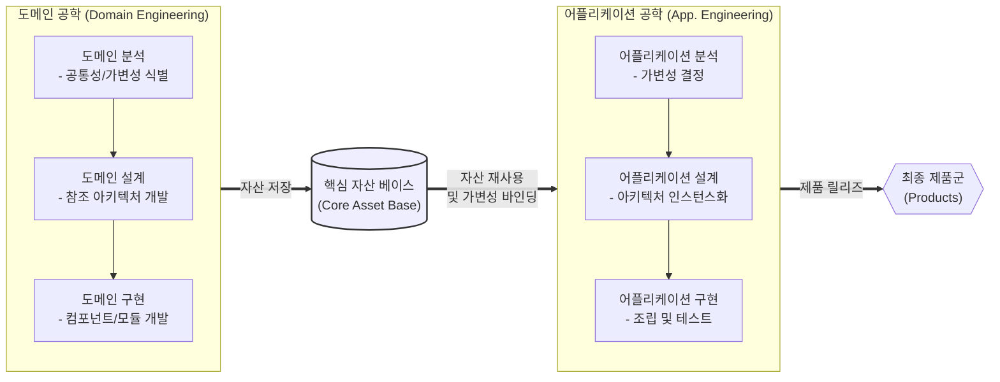

# 소프트웨어 프로덕트 라인 (Software Product Line, SPL)

---

## I. 대규모 재사용 기반 소프트웨어 공학 패러다임, 소프트웨어 프로덕트 라인(SPL)의 개요

### 가. 소프트웨어 프로덕트 라인(SPL)의 정의

* 특정 시장이나 업무의 요구사항을 충족하는 소프트웨어 제품군(Family)을 공통된 핵심 자산(Core Asset)을 이용하여 체계적으로 도출, 조립, 생산하는 소프트웨어 공학 패러다임

### 나. SPL의 필요성 및 특징

* **필요성**: Time-to-Market 단축, 개발 및 [[유지보수]] 비용 절감, 제품군의 전반적인 품질 향상, 대규모 소프트웨어 재사용성 극대화
* **특징**: 공통성(Commonality) 및 가변성(Variability) 분석, 도메인 공학(Domain)과 어플리케이션 공학(Application)으로 분리된 이중 생명주기(Two-Life Cycle) 적용

---

## II. SPL의 개념도 및 핵심 기술 요소

### 가. SPL의 개념도 및 동작원리 (Two-Life Cycle)

* 도메인 공학을 통해 공통 및 가변 요소가 반영된 핵심 자산(Core Asset)을 선행 구축함
* 어플리케이션 공학에서 개별 제품의 요구사항에 맞춰 핵심 자산을 인스턴스화하고 가변성(Variability)을 바인딩하여 최종 제품을 조립함

### 나. SPL의 핵심 기술 및 구성 요소

| 구분 | 요소기술(키워드) | 세부 설명 |
| --- | --- | --- |
| **생명주기** | 도메인 공학 (Domain Eng.) | 여러 제품에서 재사용될 수 있는 공통 자산(Core Asset) 및 참조 아키텍처를 식별하고 개발하는 과정 |
| **생명주기** | 어플리케이션 공학 (App. Eng.) | 도메인 자산을 기반으로 가변 요소를 특화/결합하여 개별 어플리케이션(Product)을 개발하는 과정 |
| **핵심 분석** | 공통성 (Commonality) | 프로덕트 라인 내의 모든 제품 혹은 다수의 제품이 공통적으로 가지는 기능적/비기능적 특성 |
| **핵심 분석** | 가변성 (Variability) | 개별 제품별 특화 및 차별화를 위해 변경, 확장, 생략이 가능한 특성 (고객 맞춤형 요구사항) |
| **자산 관리** | 핵심 자산 (Core Asset) | 아키텍처, 컴포넌트, 코드, 테스트 케이스, [[요구사항 명세서]] 등 [[재사용]] 대상이 되는 모든 공통 산출물 |
| **모델링** | 특성 모델 (Feature Model) | 제품군의 공통성과 가변성을 계층적 트리 구조(Mandatory, Optional, Alternative 등)로 시각화한 모델 |
| **가변성 기법** | 가변점 (Variation Point) | 시스템 아키텍처나 설계 산출물 내에서 가변성(선택, 변경)이 실제로 발생하는 특정 위치 |
| **가변성 기법** | 바인딩 타임 (Binding Time) | 컴파일 타임, 링크 타임, 런타임 등 소프트웨어 생명주기 상에서 가변성이 결정되고 결합되는 시점 |

---

## III. SPL과 CBD(Component Based Development)의 비교 및 향후 전망

### 가. 체계적 재사용 관점의 SPL과 CBD 비교

| 비교 항목 | 소프트웨어 프로덕트 라인 (SPL) | 컴포넌트 기반 개발 (CBD) |
| --- | --- | --- |
| **재사용 범위 및 단위** | 제품군(Product Family) 전반, 아키텍처 및 자산 중심 | 개별 어플리케이션, 독립적인 컴포넌트 단위 |
| **재사용 대상 산출물** | 기획, 요구사항, 설계, 코드, 테스트 등 생명주기 전반의 산출물 | 주로 소스 코드, 실행 모듈(Binary), 인터페이스 |
| **개발 및 재사용 방식** | 선행(Planned) 계획에 의한 하향식(Top-Down) 아키텍처 설계 | 후행(Ad-hoc) 요구에 의한 상향식(Bottom-Up) 조립 |
| **핵심 설계 초점** | 공통성/가변성 분석 기반의 대량 맞춤 생산 (Mass Customization) | 컴포넌트 간 [[응집도]] 향상 및 [[결합도]] 최소화 (블랙박스) |

* **향후 전망 및 동향**:
* 기존 온프레미스 기반의 제품군([[Product Line (Software Product Line)|Product Line]]) 중심에서 클라우드 SaaS 환경의 멀티테넌트(Multi-tenant) 기반 서비스 프로덕트 라인(Service Product Line)으로 개념이 확장 중임.
* 마이크로서비스 아키텍처([[MSA (Micro Service Architecture)|MSA]]) 및 데브옵스([[DevOps]]) 파이프라인과 결합하여 가변성을 런타임 환경에 동적으로 바인딩(Dynamic Binding)하는 동적 SPL(DSPL) 연구가 활발히 진행됨.

---

### 🔗 연관 토픽

- **소속 도메인**: [[00_소프트웨어공학_MOC|🏗️ 소프트웨어공학]]
- **세부 분류**: `3. 요구사항 공학 & UML 객체지향 분석/설계`
- **핵심 연관 토픽**:
  - [[Product Line (Software Product Line)]]
  - [[결합도]]
  - [[응집도]]
  - [[재사용]]
  - [[MSA (Micro Service Architecture)]]
