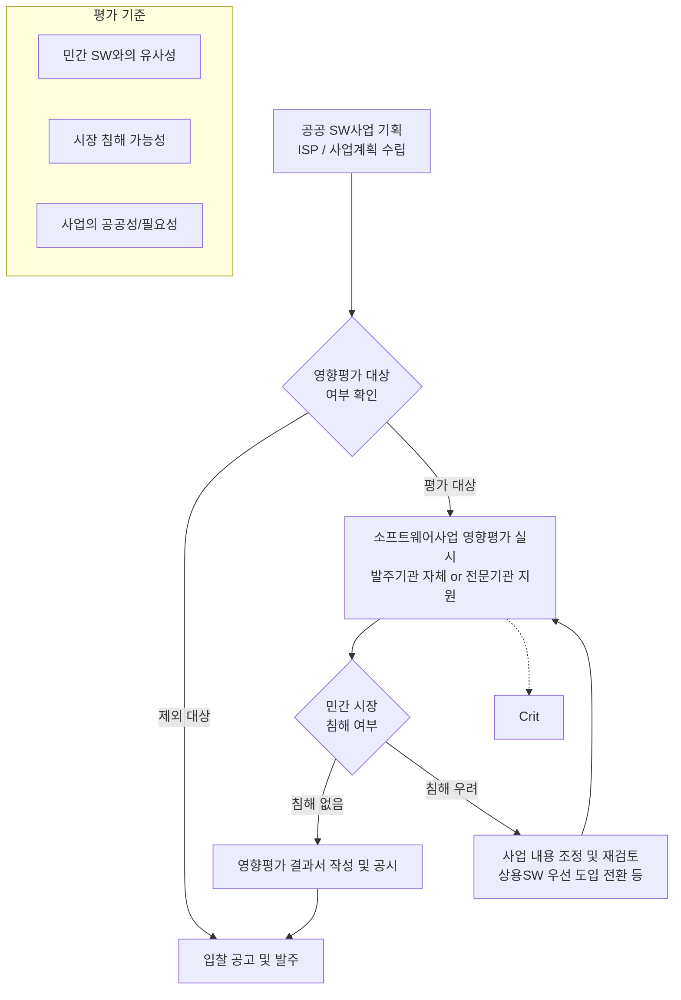

# 소프트웨어사업 영향평가

---

## I. 민간 시장 보호 및 SW산업 육성, 소프트웨어사업 영향평가의 개요

* **정의**: 국가기관 등이 공공 SW사업을 추진할 때, 민간 상용 SW 시장에 미치는 영향을 사전에 분석하여 민간 시장 침해를 방지하는 법률적 사전 진단 제도
* **필요성 및 등장배경**:
* 생태계 보호: 공공기관의 무분별한 SW 자체 개발(SI)에 따른 민간 상용 SW 시장 위축 방지
* 투자 효율성: 공공과 민간의 중복 투자 방지 및 우수 상용 SW 우선 도입 촉진

* **특징**: 입찰공고 전 사전 수행 의무화, 상용 SW 기능 유사성 진단, 과기정통부(NIPA) 기술지원 및 결과 공시

---

## II. 소프트웨어사업 영향평가 개념도 및 핵심 구성요소

### 가. 소프트웨어사업 영향평가 프로세스 및 동작원리

* 공공 SW사업 입찰 공고일 기준 30일(긴급 발주의 경우 10일) 전까지 사전 영향평가를 완료해야 함
* 평가 결과 침해 우려 시 사업 내용 의무 재검토 진행, 이해관계자(SW사업자) 이의 제기 시 재평가를 수행하여 시장 보호 실효성 확보

### 나. 소프트웨어사업 영향평가의 핵심 구성 요소

| 구분 | 핵심 요소 (키워드) | 세부 설명 |
| --- | --- | --- |
| **법적 근거** | 소프트웨어 진흥법 제43조 | 공공 SW사업 추진 전 민간 SW 시장 영향 사전 분석 법적 의무 규정 |
| **평가 대상** | [[ISP (Information Strategy Plan)|ISP]]/BPR, 신규 구축 사업 | 정보화전략계획(ISP), 신규 SW 구축, 기능 개선이 포함된 유지관리 사업 |
| **제외 대상** | 상용 SW 구매, 내부 사용 | 상용 SW 구매, 단일기관 내부 사용, 단순 유지관리/운영, DB구축 사업 등 |
| **수행 시기** | 입찰공고 전 사전 완료 | 일반 사업은 입찰공고 30일 전, 긴급 사업은 10일 전까지 평가 결과 도출 |
| **평가 기준 1** | 상용 SW 유사성 | 발주할 시스템 기능과 기존 민간 상용 SW 제품 간의 기능적·목적성 [[유사도]] 진단 |
| **평가 기준 2** | 시장 침해 가능성 | 사업 추진에 따른 민간 SW 기업의 수익 감소, 시장 진입 장벽 형성 우려 등 검토 |
| **평가 기준 3** | 공공성 및 필요성 | 국가 안보, 치안, 외교 등 민간 영역에서 서비스하기 부적합한 공공 목적 필수성 |
| **사후 관리** | 결과 공시 및 재평가 | 부적합 시 사업내용 의무 조정, 평가 결과 공개 및 SW사업자 요청 시 재평가 절차 |

---

## III. 소프트웨어사업 영향평가의 한계점 및 향후 발전 방향

* **현행 제도의 한계점**:
* 객관성 한계: 발주기관의 형식적인 자체 평가 위주 진행으로 인한 민간 침해 여부 판단의 [[신뢰성]] 저하 우려
* 예산 확보 제약: 상용 SW 별도 도입 시 예산 증가 우려 및 기존 레거시 시스템과의 연동성 문제로 인한 도입 기피 현상

* **향후 발전 방향 및 동향**:
* **SaaS First 정책 연계**: 공공 클라우드 전환 사업 정책과 연계하여 커스텀 구축(SI) 대신 민간 SaaS(서비스형 SW) 최우선 도입 제도화
* **전문기관 검증 강화**: NIPA(정보통신산업진흥원) 등 외부 전문기관의 사전 검토 비중을 확대하여 평가의 객관성 및 실효성 제고
* **공공 조달 생태계 확대**: 조달청 디지털서비스몰 내 우수 상용 SW 등록 확대 및 분리발주 강화를 통한 상용 SW 구매 유도 촉진

---

### 🔗 연관 토픽

- **소속 도메인**: [[00_소프트웨어공학_MOC|🏗️ 소프트웨어공학]]
- **세부 분류**: `6. 소프트웨어 테스팅 & 품질 보증 (QA/QC)`
- **핵심 연관 토픽**:
  - [[신뢰성]]
  - [[유사도|유사도(Similarity)]]
  - [[ISP (Information Strategy Plan)]]
  - [[코드 커버리지|코드 커버리지(Code Coverage)]]
  - [[Debugging]]
