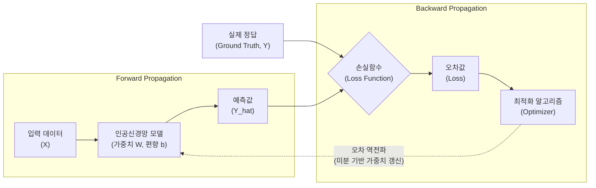

# 손실함수 (Loss Function)

---

## I. 모델 최적화 방향을 결정하는 지표, 손실함수의 개요

* **정의**: 기계학습 및 [[딥러닝]] 모델이 추론한 예측값(Prediction)과 실제 정답(Ground Truth) 간의 차이(오차)를 정량적으로 계산하여, 모델의 가중치를 갱신하기 위한 기준이 되는 목적 함수(Objective Function)
* **필요성 및 핵심 특징**:
* **최적화 방향 제시**: [[경사하강법]](Gradient Descent) 기반 최적화 과정에서 오차를 최소화하는 방향으로 학습 유도
* **오차 [[역전파]](Backpropagation)의 기준**: 산출된 오차값을 역방향으로 전파하여 신경망 내부의 가중치(W)와 [[편향]](b)을 미분 연산으로 업데이트
* **태스크 의존성**: 회귀(Regression), 분류(Classification) 등 해결하고자 하는 문제 유형에 따라 적합한 함수 선택 필수

---

## II. 손실함수의 개념도 및 핵심 유형

### 가. 손실함수의 산출 및 가중치 갱신 동작 원리

* 순전파(Forward)를 통해 예측값을 산출하고, 손실함수로 정답과의 오차를 계산한 뒤, 역전파(Backward)를 통해 모델 파라미터를 최적화하는 순환 구조임

### 나. 손실함수의 핵심 기술 및 세부 유형

| 분류 | 요소기술(키워드) | 세부 설명 |
| --- | --- | --- |
| **회귀 (Regression)** | **MSE (Mean Squared Error)** | - 오차 제곱의 평균 계산- 오차가 클수록 패널티가 커지며 [[이상치]](Outlier)에 민감함 |
| **회귀 (Regression)** | **MAE (Mean Absolute Error)** | - 오차 절대값의 평균 계산- 모든 오차에 동일한 가중치를 부여하여 이상치에 강건함(Robust) |
| **회귀 (Regression)** | **Huber Loss** | - 오차가 작을 때는 MSE, 클 때는 MAE를 적용하는 하이브리드 함수- 미분 불가능한 MAE의 단점과 이상치에 민감한 MSE의 단점 보완 |
| **분류 (Classification)** | **Cross-Entropy** | - 두 [[확률분포]](예측 확률과 실제 정답 확률) 간의 정보량 차이(K-L Divergence 기반)를 계산 |
| **분류 (Classification)** | **BCE (Binary Cross-Entropy)** | - 0 또는 1의 이진 분류 문제에 적용- 출력층의 Sigmoid 활성화 함수와 결합하여 사용 |
| **분류 (Classification)** | **CCE (Categorical Cross-Entropy)** | - 3개 이상의 다중 [[클래스]] 분류 문제에 적용- 출력층의 Softmax 활성화 함수와 결합하여 사용 |
| **기타 (Margin/Ranking)** | **Hinge Loss** | - SVM([[서포트 벡터 머신|Support Vector Machine]]) 알고리즘에서 주로 사용- 정답 클래스와 오답 클래스 간의 마진(Margin)을 최대화하는 목적 |
| **확장 개념** | **Cost Function (비용함수)** | - 단일 데이터 포인트의 오차가 아닌, 전체 학습 데이터셋에 대한 손실함수 값들의 평균 |

---

## III. 주요 손실함수의 비교 및 활용 사례

### 가. 대표적 손실함수 비교 (MSE vs Cross-Entropy)

| 비교 항목 | MSE (Mean Squared Error) | Cross-Entropy Loss |
| --- | --- | --- |
| **목적 및 적용 분야** | 연속형 수치 예측 (회귀 모델) | 이산형 클래스 예측 (분류 모델, [[초거대 언어 모델|LLM]] 다음 단어 예측) |
| **출력층 활성화 함수** | Linear (항등 함수) | Sigmoid (이진분류), Softmax (다중분류) |
| **학습(최적화) 특성** | 예측값과 정답의 차이가 수치적으로 반영됨 | 오차가 클수록 기울기(Gradient)가 커져 학습 속도가 빠름 |
| **대표 수식 특징** | $\frac{1}{n} \sum (Y - \hat{Y})^2$ | $-\sum Y \log(\hat{Y})$ |
| **주요 한계점** | 딥러닝 분류 문제 적용 시 기울기 소실(Vanishing Gradient) 발생 우려 | 정답 레이블이 원-핫 인코딩(One-Hot Encoding) 형태로 제공되어야 함 |

### 나. 손실함수 관련 최신 동향 및 향후 전망

* **복합 손실함수 적용**: 객체 탐지(Object Detection) 모델(YOLO 등)에서는 바운딩 박스 위치 회귀(MSE 기반)와 객체 클래스 분류(Cross-Entropy 기반) 손실을 결합한 다중 작업 오차(Multi-task Loss) 활용
* **LLM과 Cross-Entropy**: GPT 등 대규모 언어 모델(LLM)의 사전학습 과정에서는 다음 토큰을 예측하기 위해 CCE(Categorical Cross-Entropy)가 핵심 최적화 지표로 활용됨
* **[[강화학습]] 기반 오차 보정**: 단순 정답 비교를 넘어 RLHF(인간 피드백 기반 강화학습)의 보상 모델(Reward Model)을 손실함수와 결합하여 모델의 편향 및 환각(Hallucination) 현상 완화 추세

---

### 🔗 연관 토픽

- **소속 도메인**: [[00_인공지능_MOC|🤖 인공지능]]
- **세부 분류**: `1. 수학 · 통계학 & 데이터 전처리`
- **핵심 연관 토픽**:
  - [[서포트 벡터 머신|서포트 벡터 머신 SVM(Support Vector Machine)]]
  - [[이상치]]
  - [[이항분포|이항분포 (Binomial Distribution)]]
  - [[딥러닝]]
  - [[강화학습]]
