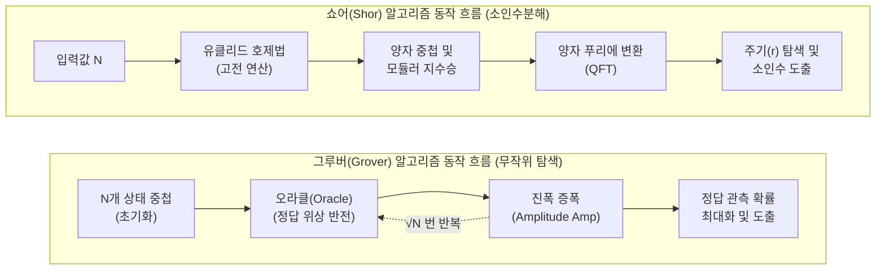

# 쇼어(Shor) 및 그루버(Grover) 알고리즘

---

## I. 양자 컴퓨팅의 암호화 체계 위협, 쇼어 및 그루버 알고리즘의 개요

* **정의**: 양자 컴퓨터의 중첩(Superposition)과 얽힘(Entanglement) 특성을 활용하여, 기존 공개키(소인수분해) 및 대칭키(무작위 검색) 암호 체계를 무력화할 수 있는 대표적인 양자 컴퓨팅 [[알고리즘]]
* **등장배경 및 특징**:
* **양자 우월성(Quantum Supremacy) 증명**: 고전 컴퓨터의 연산 한계(지수 시간)를 돌파하여 다항 시간 및 2차적 가속 제공
* **현대 암호체계의 붕괴 위협**: [[RSA (Rivest Shamir Adleman)|RSA]], [[ECC]] 등 공개키 기반 보안 체계 및 [[AES]], SHA 기반 보안 시스템의 해독 가능성 대두
* **차세대 보안 패러다임 촉발**: 양자 내성 암호(PQC) 표준화 및 양자 키 분배(QKD) 기술 발전의 핵심 동인으로 작용

---

## II. 쇼어 및 그루버 알고리즘의 개념도 및 핵심 기술 요소

### 가. 쇼어 및 그루버 알고리즘의 동작 원리 개념도

* 쇼어 알고리즘은 양자 푸리에 변환(QFT)을 통해 주기를 고속 탐색하며, 그루버 알고리즘은 오라클과 진폭 증폭을 반복하여 $O(\sqrt{N})$의 탐색 속도 향상을 제공함

### 나. 쇼어 및 그루버 알고리즘의 핵심 기술 요소

| 구분 | 요소기술(키워드) | 세부 설명 |
| --- | --- | --- |
| **쇼어** | **QFT (양자 푸리에 변환)** | - 양자 상태의 진폭을 주파수 도메인으로 변환하여 함수 주기(Period) 고속 탐색- 고전적 이산 푸리에 변환(DFT) 대비 기하급수적 속도 향상 |
| **쇼어** | **다항 시간 (Polynomial Time)** | - 지수 시간($O(\exp(N))$)이 소요되는 소인수분해를 다항 시간($O((\log N)^3)$)으로 단축 |
| **쇼어** | **주기 찾기 (Period Finding)** | - 양자 위상 추정(Quantum Phase Estimation) 알고리즘을 활용한 모듈러 연산의 주기 검출 |
| **그루버** | **오라클 (Oracle)** | - 탐색하고자 하는 정답 데이터의 양자 상태 위상(Phase)만 음(-)으로 반전시키는 블랙박스 함수 |
| **그루버** | **진폭 증폭 (Amplitude Amp)** | - 평균 진폭을 기준으로 반전시켜, 오답의 진폭은 감쇄하고 정답의 진폭을 키우는 확률 극대화 기법 |
| **그루버** | **2차적 가속 (Quadratic Speedup)** | - 고전적 탐색의 $O(N)$ 시간 복잡도를 $O(\sqrt{N})$으로 대폭 단축 |
| **공통** | **양자 얽힘 (Entanglement)** | - 두 개 이상의 큐비트 상태가 상호 종속적으로 강하게 연결되어 대규모 동시 병렬 처리 지원 |
| **공통** | **양자 중첩 (Superposition)** | - 0과 1의 상태가 확률적으로 동시에 존재하는 양자역학적 특성으로, 대용량 연산 공간 제공 |

---

## III. 쇼어 및 그루버 알고리즘 비교 및 보안 대응 동향

### 가. 쇼어 알고리즘 vs 그루버 알고리즘 비교

| 비교 항목 | 쇼어(Shor) 알고리즘 | 그루버(Grover) 알고리즘 |
| --- | --- | --- |
| **주요 목적** | 소인수분해, 이산대수 문제 해결 | 비정형 [[데이터베이스]] 무작위 탐색 및 역함수 계산 |
| **시간 복잡도 향상** | **지수적 가속** (고전: 지수 시간 $\rightarrow$ 양자: 다항 시간) | **이차적 가속** (고전: $O(N) \rightarrow$ 양자: $O(\sqrt{N})$) |
| **위협 대상 암호** | 공개키 [[암호 알고리즘]] (RSA, [[DSA]], ECC, DH 등) | 대칭키 암호 (AES, [[DES]] 등), 해시 함수 (SHA-2, SHA-3) |
| **현존하는 위험도** | **매우 높음** (현행 인증서 및 키 교환 체계 붕괴 위험) | **비교적 낮음** (키 길이 확장을 통한 선제적 방어 가능) |
| **해킹 방어 대책** | 양자 내성 암호(PQC) 체계로 전면 전환 | 키 길이 2배 연장 (예: AES-128 $\rightarrow$ AES-256) 및 해시 길이 확장 |

### 나. 양자 알고리즘 위협에 따른 보안 대응 및 최신 동향

* **NIST PQC 표준화 완료**: 양자 알고리즘 위협에 대비하여 미국 국립표준기술연구소(NIST)에서 양자 내성 암호([[FIPS (Federal Information Processing Standards)|FIPS]] 203, 204, 205) 최종 표준 승인 (2024년 8월)
* **암호 민첩성(Crypto Agility) 확보**: 기존 레거시 암호에서 PQC로 유연하고 신속하게 전환할 수 있는 하이브리드 [[암호화]] 아키텍처 도입 및 인프라 설계 필수
* **QKD망(양자 키 분배망) 상용화 확대**: 절대적 보안성을 보장하는 [[양자 암호]] 통신망을 공공, 국방, 금융 등 국가 주요 핵심 인프라 영역에 우선 적용 및 확산 추진

---

### 🔗 연관 토픽

- **소속 도메인**: [[00_보안_MOC|🛡️ 보안]]
- **세부 분류**: `1. 정보보안 원칙 & 거버넌스 · 인증`
- **핵심 연관 토픽**:
  - [[암호화|암호화 (Encryption)]]
  - [[암호 알고리즘]]
  - [[DSA]]
  - [[DES]]
  - [[RSA (Rivest Shamir Adleman)]]
