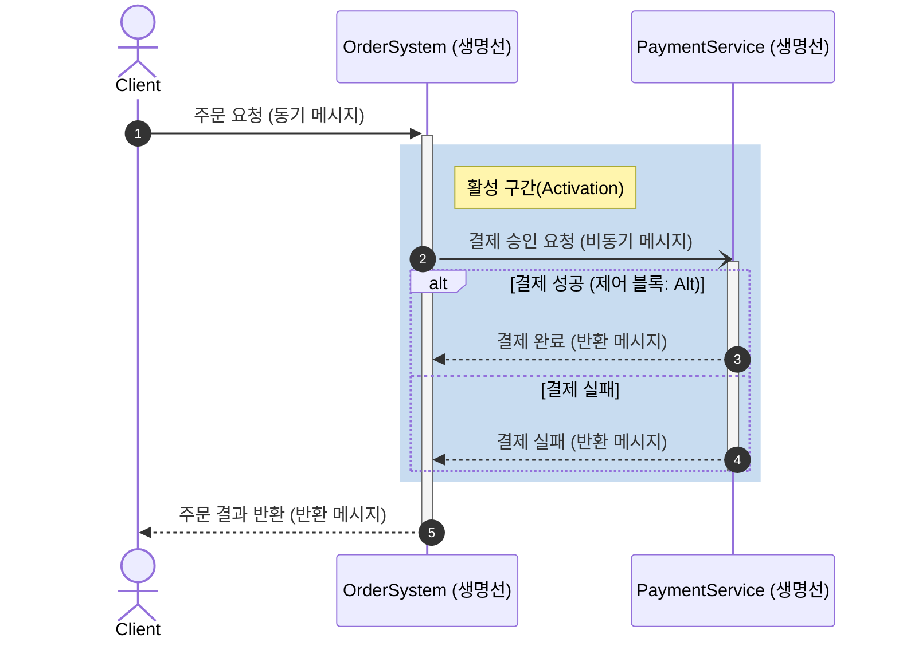

# 순차 다이어그램 (Sequence Diagram)

---

## I. 객체 간 상호작용의 시각화, 순차 다이어그램의 개요

* **정의**: 시스템의 동적 특성을 모델링하기 위해 객체들 간에 교환되는 메시지의 흐름을 시간의 경과에 따라 시각적으로 표현하는 [[UML]] 동적(행위) 다이어그램
* **필요성 및 특징**:
* **유스케이스 실체화**: 요구사항(Use Case)을 시스템 내부의 객체 간 상호작용 로직으로 구체화 및 검증
* **동적 제어 흐름 표현**: 동기/비동기 호출 방식 및 복합 프래그먼트(조건, 반복, 병렬 등)를 통한 직관적 제어 흐름 모델링
* **분산 환경 설계**: [[MSA (Micro Service Architecture)|MSA]](Microservices Architecture) 환경에서 서비스 간 복잡한 API 호출 및 분산 [[트랜잭션]] 흐름 설계 도구로 활용

---

## II. 순차 다이어그램의 개념도 및 핵심 구성 요소

### 가. 순차 다이어그램의 개념도 및 동작 원리

* 시간 흐름(위에서 아래)에 따른 객체의 생명선(Lifeline) 상에서 활성 구간(Activation)을 통해 제어권을 표시하고, 메시지(동기/비동기/반환) 교환 및 조건 분기(Alt)를 수행함

### 나. 순차 다이어그램의 핵심 구성 요소

| 구분 | 요소기술(키워드) | 세부 설명 |
| --- | --- | --- |
| **객체/노드** | **객체 (Object)** | 메시지를 주고받는 주체 (사각형 안의 밑줄 친 이름으로 표기) |
| **객체/노드** | **생명선 (Lifeline)** | 객체의 생성부터 소멸까지의 존재 기간을 수직 점선으로 표현 |
| **객체/노드** | **활성 구간 (Activation)** | 객체가 메모리에 적재되어 실제 연산을 수행 중임을 나타내는 직사각형 |
| **메시지** | **동기 (Synchronous)** | 요청 후 응답을 받을 때까지 대기하는 메시지 (꽉 찬 화살표) |
| **메시지** | **비동기 (Asynchronous)** | 요청 후 대기 없이 다음 작업을 수행하는 메시지 (열린 화살표) |
| **메시지** | **반환 (Return)** | 처리 결과를 호출자에게 반환하는 메시지 (점선 열린 화살표) |
| **제어/조건** | **복합 프래그먼트 (Alt/[[OPT|Opt]])** | - **Alt**: 조건에 따른 상호 배타적 분기 처리 (if-else 구조)- **Opt**: 특정 조건 만족 시에만 내부 로직 실행 (if 구조) |
| **제어/조건** | **복합 프래그먼트 (Loop/Par)** | - **Loop**: 조건 만족 기간 동안 내부 상호작용 반복 (for, while)- **Par**: 병렬로 동시에 수행되는 상호작용 표현 (Parallel) |

---

## III. UML 상호작용 다이어그램 비교 및 최근 활용 동향

### 가. UML 상호작용 다이어그램 비교 (순차 다이어그램 vs 통신 다이어그램)

| 비교 항목 | 순차 다이어그램 (Sequence Diagram) | 통신 다이어그램 (Communication Diagram) |
| --- | --- | --- |
| **핵심 관점** | **시간의 흐름 (Time-ordering) 중심** | **객체 간의 관계 (Organization) 중심** |
| **메시지 표현 방식** | 수직적 시간 축을 따라 하향식으로 순서 배치 | 객체들을 연결하는 링크(Link) 위에 순차 번호(1, 1.1 등) 부여 |
| **장점/파악 용이성** | 전체 시스템의 동적 실행 순서와 로직 파악 용이 | 객체 간의 정적 연결 구조와 상호작용 경로 파악 용이 |
| **UML 버전 변경** | UML 1.x 및 2.x 동일 명칭 유지 | UML 1.x의 협력(Collaboration) 다이어그램에서 명칭 변경됨 |

### 나. 순차 다이어그램의 최신 활용 동향 (Docs as Code 및 MSA)

* **Docs as Code 패러다임 확산**: 아키텍처 문서를 그래픽 툴이 아닌 코드(Mermaid, PlantUML 등)로 작성하여 Git과 같은 형상관리 시스템(옵시디언, GitHub)에 통합하고 지속적인 산출물 최신화 유지
* **분산 트랜잭션 추적(Distributed Tracing) 시각화**: MSA 환경에서 Jaeger, Zipkin 등의 분산 추적 시스템이 캡처한 서비스 간 호출 흐름(Span)을 순차 다이어그램 형태로 시각화하여 병목 구간 및 장애 포인트 신속 식별

---

### 🔗 연관 토픽

- **소속 도메인**: [[00_소프트웨어공학_MOC|🏗️ 소프트웨어공학]]
- **세부 분류**: `3. 요구사항 공학 & UML 객체지향 분석/설계`
- **핵심 연관 토픽**:
  - [[클래스 다이어그램|클래스 다이어그램 (Class Diagram)]]
  - [[UML|UML (정적, 동적 다이어그램)]]
  - [[MSA (Micro Service Architecture)]]
  - [[상태 머신 다이어그램|상태 머신 다이어그램 (State Machine Diagram)]]
  - [[트랜잭션]]
