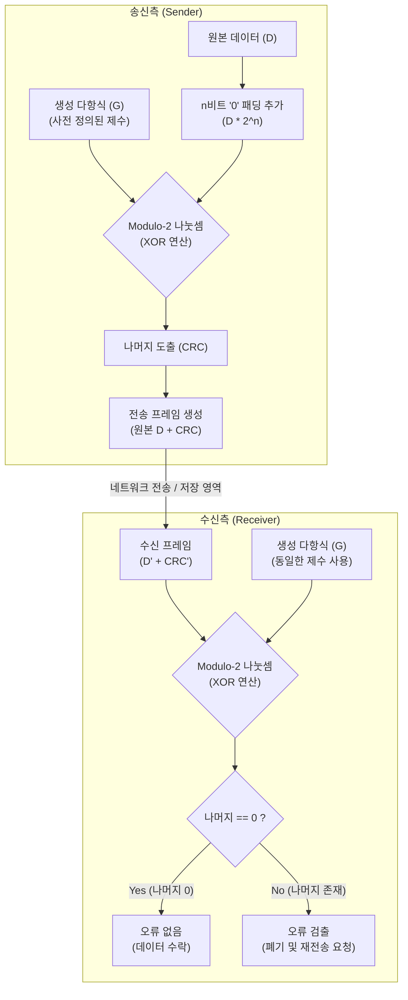

# 순환중복검사(CRC)

---

## I. 네트워크 데이터 무결성 검증, 순환중복검사(CRC)의 개요

* **정의**: 네트워크 통신 및 데이터 저장 과정에서 발생할 수 있는 비트 에러를 다항식 연산(Modulo-2 나눗셈)을 통해 검출하는 높은 신뢰성의 데이터 오류 검출 기법
* **필요성 및 특징**:
* 버스트 에러(Burst Error) 검출 탁월: 연속적으로 발생하는 다중 비트 오류 검출에 매우 효과적임
* 하드웨어 구현 용이성: 시프트 레지스터(Shift Register)와 배타적 논리합(XOR) 게이트만으로 고속 처리 가능
* 범용성 확보: 이더넷(Ethernet)의 FCS(Frame Check Sequence), 무선랜, 스토리지(NVMe, SATA) 등 다양한 인프라 표준에 적용

---

## II. 순환중복검사(CRC)의 개념도 및 핵심 기술 요소

### 가. 순환중복검사(CRC)의 개념도 및 동작 원리

* 송신측은 데이터를 생성 다항식으로 나눈 나머지([[CRC]])를 원본에 덧붙여 전송하며, 수신측은 전체 데이터를 동일한 다항식으로 나누어 나머지가 0인지 확인하여 무결성을 검증함

### 나. 순환중복검사(CRC)의 핵심 기술 및 구성 요소

| 구분 | 요소기술(키워드) | 세부 설명 |
| --- | --- | --- |
| **연산 [[알고리즘]]** | **Modulo-2 연산** | 자리올림(Carry)이나 빌림(Borrow)이 발생하지 않는 배타적 논리합(XOR) 기반의 이진 나눗셈 기법 |
| **연산 알고리즘** | **생성 다항식 (Polynomial)** | 나눗셈의 제수(Divisor) 역할을 하는 이진수열 (예: CRC-16, CRC-32 등 국제 표준 규격 활용) |
| **프레임 구조** | **FCS (Frame Check Sequence)** | 생성된 CRC 나머지 값이 저장되어 데이터 프레임 트레일러(Trailer)에 첨부되는 필드 |
| **오류 검출** | **버스트 에러 (Burst Error)** | 낙뢰, 노이즈 등으로 인해 연속된 비트들이 한꺼번에 손상되는 현상을 높은 확률로 검출 |
| **하드웨어 구현** | **시프트 레지스터 (Shift Register)** | 플립플롭(Flip-flop)과 XOR 게이트의 조합으로 구성되어 1 클럭당 1비트씩 빠르게 나눗셈을 수행하는 논리 회로 |
| **표준 규격** | **CRC-32** | IEEE 802.3(이더넷), PKZIP 등에서 사용하는 32비트 다항식 체계 (다항식 차수: 32) |
| **보안적 한계** | **비 암호학적 해시** | 우발적 오류 검출에는 강하나, 악의적인 데이터 변조 방어 기능은 없어 [[MAC]](메시지 인증 코드)과 구분됨 |

---

## III. 오류 검출 기법 비교 및 CRC의 활용 전망

### 가. 주요 데이터 오류 검출 기법 비교

| 비교 항목 | 패리티 검사 (Parity Check) | 체크섬 (Checksum) | 순환중복검사 (CRC) |
| --- | --- | --- | --- |
| **검출 원리** | 데이터 내 '1'의 개수(짝수/홀수) 확인 | 데이터를 일정한 블록 단위로 분할하여 합산 | 생성 다항식 기반 Modulo-2 나눗셈 연산 |
| **구현 수준/오버헤드** | 구현 매우 단순 / 오버헤드 최소 | 소프트웨어적 구현 용이 / 오버헤드 낮음 | 하드웨어 기반 고속 처리 / 계산 복잡도 높음 |
| **오류 검출 능력** | **낮음** (단일 비트 오류만 검출) | **보통** (동일 위치의 복수 비트 변전 시 미검출) | **매우 높음** (버스트 오류 검출에 탁월) |
| **주요 활용 분야** | 시리얼 통신(UART), 기본 메모리(RAM) | [[TCP]]/IP 헤더, UDP 패킷 [[무결성]] 검증 | 이더넷 MAC 프레임, 스토리지(SATA/NVMe), 5G |

### 나. CRC의 최신 적용 동향 및 발전 방향

* **초고속 인터페이스 적용**: PCIe 5.0/6.0, 400G/800G 이더넷 등 초고대역폭 통신 환경에서 데이터 신뢰성을 보장하기 위해 하드웨어 가속(전용 명령어 세트, SIMD 활용) 기반의 고속 CRC 연산 적용 필수
* **보안 무결성과 결합 (MAC, [[HMAC]])**: CRC 단독으로는 의도적 위변조 공격(Tampering)을 방어할 수 없으므로, 금융 및 양자 내성 보안(PQC) 통신망에서는 해시 함수(SHA-256 등) 기반의 암호학적 무결성 검증 체계와 상호 보완적으로 결합하여 활용하는 추세

---

### 🔗 연관 토픽

- **소속 도메인**: [[00_네트워크_MOC|🌐 네트워크]]
- **세부 분류**: `1. OSI 7계층 & 데이터링크 계층 (L1/L2)`
- **핵심 연관 토픽**:
  - [[CRC|CRC(Cyclic Redundancy Check)]]
  - [[TCP]]
  - [[HMAC|HMAC (Hash-based Message Authentication Code)]]
  - [[BEC (Backward Error Correction)]]
  - [[스위치]]
